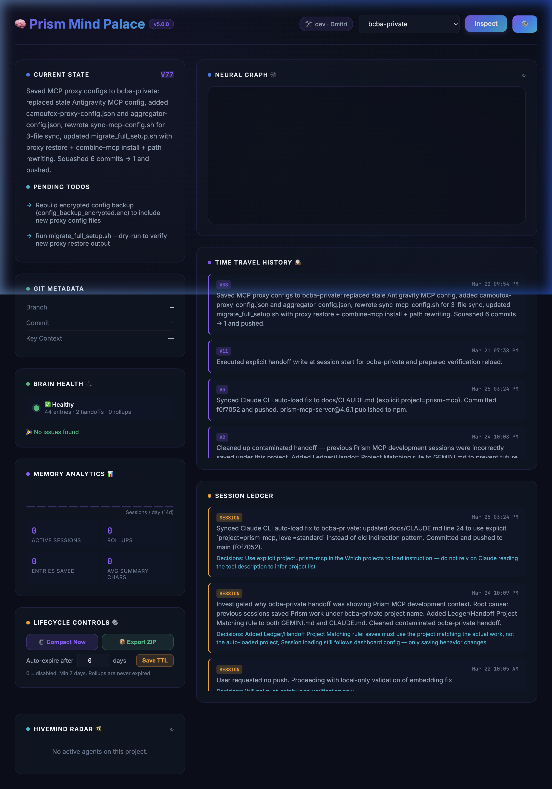

# 🧠 Prism MCP — The Mind Palace for AI Agents

[](https://www.npmjs.com/package/prism-mcp-server)
[](https://registry.modelcontextprotocol.io)
[](https://glama.ai/mcp/servers/dcostenco/prism-mcp)
[](https://smithery.ai)
[](LICENSE)
[](https://www.typescriptlang.org/)
[](CONTRIBUTING.md)



**Your AI agent forgets everything between sessions. Prism fixes that — then teaches it to think.**

Prism v8.0 is a true **Cognitive Architecture** inspired by human brain mechanics. The new **Synapse Engine** replaces flat vector search with pure multi-hop graph propagation — your agent now follows causal trains of thought across memory, forms principles from experience, and knows when it lacks information. **Your agents don't just remember; they think.**

```bash
npx -y prism-mcp-server
```

Works with **Claude Desktop · Claude Code · Cursor · Windsurf · Cline · Gemini · Antigravity** — **any MCP client.**

## Table of Contents

- [Why Prism?](#why-prism)
- [Quick Start](#quick-start)
- [The Magic Moment](#the-magic-moment)
- [Setup Guides](#setup-guides)
- [Universal Import: Bring Your History](#universal-import-bring-your-history)
- [What Makes Prism Different](#what-makes-prism-different)
- [Synapse Engine (v8.0)](#synapse-engine-v80)
- [Cognitive Architecture (v7.8)](#cognitive-architecture-v78)
- [Data Privacy & Egress](#data-privacy--egress)
- [Use Cases](#use-cases)
- [What's New](#whats-new)
- [How Prism Compares](#how-prism-compares)
- [Tool Reference](#tool-reference)
- [Environment Variables](#environment-variables)
- [Architecture](#architecture)
- [Scientific Foundation](#scientific-foundation)
- [Milestones & Roadmap](#milestones--roadmap)
- [Troubleshooting FAQ](#troubleshooting-faq)

---

## Why Prism?

Every time you start a new conversation with an AI coding assistant, it starts from scratch. You re-explain your architecture, re-describe your decisions, re-list your TODOs. Hours of context — gone.

**Prism gives your agent a brain that persists — and then teaches it to reason.** Save what matters at the end of each session. Load it back instantly on the next one. But Prism goes far beyond storage: it consolidates raw experience into lasting principles, traverses causal chains to surface root causes, and knows when to say *"I don't know."*

> 📌 **Terminology:** Throughout this doc, **"Prism"** refers to the MCP server and cognitive memory engine. **"Mind Palace"** refers to the visual dashboard UI at `localhost:3000` — your window into the agent's brain. They work together; the dashboard is optional.

Prism has three pillars:

1. **🧠 Cognitive Memory** — Memories are ranked like a human brain: recently and frequently accessed context surfaces first, while stale context fades naturally via ACT-R activation decay. Raw experience consolidates into semantic principles through Hebbian learning. The result is retrieval quality that no flat vector search can match. *(See [Cognitive Architecture](#cognitive-architecture-v78) and [Scientific Foundation](#scientific-foundation).)*

2. **⚡ Synapse Engine (GraphRAG)** — When your agent searches for "Error X", the Synapse Engine doesn't just find logs mentioning "Error X". Multi-hop energy propagation traverses the causal graph — dampened by fan effect, bounded by lateral inhibition — and surfaces "Workaround Y" connected to "Architecture Decision Z". Nodes discovered exclusively via graph traversal are tagged `[🌐 Synapse]` so you can *see* the engine working. *(See [Synapse Engine](#synapse-engine-v80).)*

3. **🏭 Autonomous Execution (Dark Factory)** — When you're ready, Prism can run coding tasks end-to-end with a fail-closed pipeline where an adversarial evaluator catches bugs the generator missed — before you ever see the PR. *(See [Dark Factory](#dark-factory--adversarial-autonomous-pipelines).)*

---

## Quick Start

### Prerequisites

- **Node.js v18+** (v20 LTS recommended; v23.x has [known `npx` quirk](#common-installation-pitfalls))
- Any MCP-compatible client (Claude Desktop, Cursor, Windsurf, Cline, etc.)
- No API keys required for core features (see [Capability Matrix](#capability-matrix))

### Install

Add to your MCP client config (`claude_desktop_config.json`, `.cursor/mcp.json`, etc.):

```json
{
  "mcpServers": {
    "prism-mcp": {
      "command": "npx",
      "args": ["-y", "prism-mcp-server"]
    }
  }
}
```

> ⚠️ **Windows / Restricted Shells:** If your MCP client complains that `npx` is not found, use the absolute path to your node binary (e.g. `C:\Program Files\nodejs\npx.cmd`).

**That's it.** Restart your client. All tools are available. The **Mind Palace Dashboard** (the visual UI for your agent's brain) starts automatically at `http://localhost:3000`. You don't need to keep a tab open — the dashboard runs in the background and the MCP tools work with or without it.

> 🔮 **Pro Tip:** Once installed, open **`http://localhost:3000`** in your browser to view the Mind Palace Dashboard — a beautiful, real-time UI of your agent's brain. Explore the Knowledge Graph, Intent Health gauges, and Session Ledger.

> 🔄 **Updating Prism:** `npx -y` caches the package locally. To force an update to the latest version, restart your MCP client — `npx -y` will fetch the newest release automatically. If you're stuck on a stale version, run `npx clear-npx-cache` (or `npm cache clean --force`) before restarting.

<details>
<summary>Port 3000 already in use? (Next.js / Vite / etc.)</summary>

Add `PRISM_DASHBOARD_PORT` to your MCP config env block:

```json
{
  "mcpServers": {
    "prism-mcp": {
      "command": "npx",
      "args": ["-y", "prism-mcp-server"],
      "env": { "PRISM_DASHBOARD_PORT": "3001" }
    }
  }
}
```

Then open `http://localhost:3001` instead.
</details>


### Capability Matrix

| Feature | Local (Offline) | Cloud (API Key) |
|:--------|:---:|:---:|
| Session memory & handoffs | ✅ | ✅ |
| Keyword search (FTS5) | ✅ | ✅ |
| Time travel & versioning | ✅ | ✅ |
| Mind Palace Dashboard | ✅ | ✅ |
| GDPR export (JSON/Markdown/Vault) | ✅ | ✅ |
| Semantic vector search | ❌ | ✅ `GOOGLE_API_KEY` |
| Morning Briefings | ❌ | ✅ `GOOGLE_API_KEY` |
| Auto-compaction | ❌ | ✅ `GOOGLE_API_KEY` |
| Web Scholar research | ❌ | ✅ [`BRAVE_API_KEY`](#environment-variables) + [`FIRECRAWL_API_KEY`](#environment-variables) (or `TAVILY_API_KEY`) |
| VLM image captioning | ❌ | ✅ Provider key |
| Autonomous Pipelines (Dark Factory) | ❌ | ✅ `GOOGLE_API_KEY` (or LLM override) |

> 🔑 The core Mind Palace works **100% offline** with zero API keys. Cloud keys unlock intelligence features. See [Environment Variables](#environment-variables).

> 💰 **API Cost Note:** `GOOGLE_API_KEY` (Gemini) has a generous free tier that covers most individual use. `BRAVE_API_KEY` offers 2,000 free searches/month. `FIRECRAWL_API_KEY` has a free plan with 500 credits. For typical solo development, expect **$0/month** on the free tiers. Only high-volume teams or heavy autonomous pipeline usage will incur meaningful costs.

---

## The Magic Moment

> **Session 1** (Monday evening):
> ```
> You: "Analyze this auth architecture and plan the OAuth migration."
> Agent: *deep analysis, decisions, TODO list*
> Agent: session_save_ledger → session_save_handoff ✅
> ```
>
> **Session 2** (Tuesday morning — new conversation, new context window):
> ```
> Agent: session_load_context → "Welcome back! Yesterday we decided to use PKCE
>        flow with refresh tokens. 3 TODOs remain: migrate the user table,
>        update the middleware, and write integration tests."
> You: "Pick up where we left off."
> ```
>
> **Your agent remembers everything.** No re-uploading files. No re-explaining decisions.

---

## Setup Guides

<details>
<summary><strong>Claude Desktop</strong></summary>

Add to `claude_desktop_config.json`:

```json
{
  "mcpServers": {
    "prism-mcp": {
      "command": "npx",
      "args": ["-y", "prism-mcp-server"]
    }
  }
}
```

</details>

<details>
<summary><strong>Cursor</strong></summary>

Add to `.cursor/mcp.json` (project) or `~/.cursor/mcp.json` (global):

```json
{
  "mcpServers": {
    "prism-mcp": {
      "command": "npx",
      "args": ["-y", "prism-mcp-server"]
    }
  }
}
```

</details>

<details>
<summary><strong>Windsurf</strong></summary>

Add to `~/.codeium/windsurf/mcp_config.json`:

```json
{
  "mcpServers": {
    "prism-mcp": {
      "command": "npx",
      "args": ["-y", "prism-mcp-server"]
    }
  }
}
```

</details>

<details>
<summary><strong>VS Code + Continue / Cline</strong></summary>

Add to your Continue `config.json` or Cline MCP settings:

```json
{
  "mcpServers": {
    "prism-mcp": {
      "command": "npx",
      "args": ["-y", "prism-mcp-server"],
      "env": {
        "PRISM_STORAGE": "local",
        "BRAVE_API_KEY": "your-brave-api-key"
      }
    }
  }
}
```

</details>


<details>
<summary><strong>Claude Code — Lifecycle Autoload (.clauderules)</strong></summary>

Claude Code naturally picks up MCP tools by adding them to your workspace `.clauderules`. Simply add:

```markdown
Always start the conversation by calling `mcp__prism-mcp__session_load_context(project='my-project', level='deep')`.
When wrapping up, always call `mcp__prism-mcp__session_save_ledger` and `mcp__prism-mcp__session_save_handoff`.
```

> **Format Note:** Claude automatically wraps MCP tools with double underscores (`mcp__prism-mcp__...`), while most other clients use single underscores (`mcp_prism-mcp_...`). Prism's backend natively handles both formats seamlessly.

</details>

<details id="antigravity-auto-load">
<summary><strong>Gemini / Antigravity — Prompt Auto-Load</strong></summary>

See the [Gemini Setup Guide](docs/SETUP_GEMINI.md) for the proven three-layer prompt architecture to ensure reliable session auto-loading.

</details>

<details>
<summary><strong>Supabase Cloud Sync</strong></summary>

To sync memory across machines or teams:

```json
{
  "mcpServers": {
    "prism-mcp": {
      "command": "npx",
      "args": ["-y", "prism-mcp-server"],
      "env": {
        "PRISM_STORAGE": "supabase",
        "SUPABASE_URL": "https://your-project.supabase.co",
        "SUPABASE_KEY": "your-supabase-anon-or-service-key"
      }
    }
  }
}
```

#### Schema Migrations

Prism auto-applies its schema on first connect — no manual step required. If you need to apply or re-apply migrations manually (e.g. for a fresh project or after a version bump), run the SQL files in `supabase/migrations/` in numbered order via the **Supabase SQL Editor** or the CLI:

```bash
# Via CLI (requires supabase CLI + project linked)
supabase db push

# Or apply a single migration via the Supabase dashboard SQL Editor
# Paste the contents of supabase/migrations/0NN_*.sql and click Run
```

> **Key migrations:**
> - `020_*` — Core schema (ledger, handoff, FTS, TTL, CRDT)
> - `033_memory_links.sql` — Associative Memory Graph (MemoryLinks) — required for `session_backfill_links`

> **Anon key vs. service role key:** The anon key works for personal use (Supabase RLS policies apply). Use the service role key for team deployments where multiple users share the same Supabase project — it bypasses RLS and allows Prism to manage all rows regardless of auth context. Never expose the service role key client-side.

</details>

<details>
<summary><strong>Clone & Build (Full Control)</strong></summary>

```bash
git clone https://github.com/dcostenco/prism-mcp.git
cd prism-mcp && npm install && npm run build
```

Then add to your MCP config:

```json
{
  "mcpServers": {
    "prism-mcp": {
      "command": "node",
      "args": ["/path/to/prism-mcp/dist/server.js"],
      "env": {
        "BRAVE_API_KEY": "your-key",
        "GOOGLE_API_KEY": "your-gemini-key"
      }
    }
  }
}
```

</details>

<details>
<summary><strong>Cloud Deployment (Render)</strong></summary>

Prism can be deployed natively to cloud platforms like [Render](https://render.com) so your agent's memory is always online and accessible across different machines or teams.

1. Fork this repository.
2. In the Render Dashboard, create a new **Web Service** pointing to your repository.
3. In the setup wizard, select **Docker** as the Runtime.
4. Set the Dockerfile path to `Dockerfile.smithery`.
5. Connect your local MCP client to your new cloud endpoint using the `sse` transport:

```json
{
  "mcpServers": {
    "prism-mcp-cloud": {
      "command": "npx",
      "args": ["-y", "supergateway", "--url", "https://your-prism-app.onrender.com/sse"]
    }
  }
}
```

> **Note:** The `Dockerfile.smithery` uses an optimized multi-stage build that compiles Typescript safely in a development environment before booting the server in a stripped-down production image. No NPM publishing required!

</details>

### Common Installation Pitfalls

> **❌ Don't use `npm install -g`:**
> Hardcoding the binary path (e.g. `/opt/homebrew/Cellar/node/23.x/bin/prism-mcp-server`) is tied to a specific Node.js version — when Node updates, the path silently breaks.
>
> **✅ Always use `npx` instead:**
> ```json
> {
>   "mcpServers": {
>     "prism-mcp": {
>       "command": "npx",
>       "args": ["-y", "prism-mcp-server"]
>     }
>   }
> }
> ```
> `npx` resolves the correct binary automatically, always fetches the latest version, and works identically on macOS, Linux, and Windows. Already installed globally? Run `npm uninstall -g prism-mcp-server` first.

> **❓ Seeing warnings about missing API keys on startup?**
> That's expected and not an error. `BRAVE_API_KEY` / `GOOGLE_API_KEY` warnings are informational only — core session memory works with zero keys. See [Environment Variables](#environment-variables) for what each key unlocks.

> 💡 **Do agents auto-load Prism?** Agents using Cursor, Windsurf, or other MCP clients will see the `session_load_context` tool automatically, but may not call it unprompted. Add this to your project's `.cursorrules` (or equivalent system prompt) to guarantee auto-load:
> ```
> At the start of every conversation, call session_load_context with project "my-project" before doing any work.
> ```
> Claude Code users can use the `.clauderules` auto-load hook shown in the [Setup Guides](#setup-guides). Prism also has a **server-side fallback** (v5.2.1+) that auto-pushes context after 10 seconds if no load is detected.

---

## Universal Import: Bring Your History

Switching to Prism? Don't leave months of AI session history behind. Prism can **ingest historical sessions from Claude Code, Gemini, and OpenAI** and give your Mind Palace an instant head start — no manual re-entry required.

Import via the **CLI** or directly from the Mind Palace Dashboard (**Import** tab → file picker + dry-run toggle).

### Supported Formats
* **Claude Code** (`.jsonl` logs) — Automatically handles streaming chunk deduplication and `requestId` normalization.
* **Gemini** (JSON history arrays) — Supports large-file streaming for 100MB+ exports.
* **OpenAI** (JSON chat completion history) — Normalizes disparate tool-call structures into the unified Ledger schema.

### How to Import

**Option 1 — CLI:**

```bash
# Ingest Claude Code history
npx -y prism-mcp-server universal-import --format claude --path ~/path/to/claude_log.jsonl --project my-project

# Dry run (verify mapping without saving)
npx -y prism-mcp-server universal-import --format gemini --path ./gemini_history.json --dry-run
```

**Option 2 — Dashboard:** Open `localhost:3000`, navigate to the **Import** tab, select the format and file, and click Import. Supports dry-run preview.

### Why It's Safe to Re-Run
* **Memory-Safe Streaming:** Processes massive log files line-by-line using `stream-json` to prevent Out-of-Memory (OOM) crashes.
* **Idempotent Dedup:** Content-hash prevents duplicate imports on re-run (`skipCount` reported).
* **Chronological Integrity:** Uses timestamp fallbacks and `requestId` sorting to preserve your memory timeline.
* **Smart Context Mapping:** Extracts `cwd`, `gitBranch`, and tool usage patterns into searchable metadata.

---

## What Makes Prism Different


### 🧠 Your Agent Learns From Mistakes
When you correct your agent, Prism tracks it. Corrections accumulate **importance** over time. High-importance lessons auto-surface as warnings in future sessions — and can even sync to your `.cursorrules` file for permanent enforcement. Your agent literally gets smarter the more you use it.

### 🕰️ Time Travel
Every save creates a versioned snapshot. Made a mistake? `memory_checkout` reverts your agent's memory to any previous state — like `git revert` for your agent's brain. Full version history with optimistic concurrency control.

### 🔮 Mind Palace Dashboard
A gorgeous glassmorphism UI at `localhost:3000` that lets you see exactly what your agent is thinking:

- **Current State & TODOs** — the exact context injected into the LLM's prompt
- **Intent Health Gauges** — per-project 0–100 health score with staleness decay, TODO load, and decision signals
- **Interactive Knowledge Graph** — force-directed neural graph with click-to-filter, node renaming, and surgical keyword deletion
- **Deep Storage Manager** — preview and execute vector purge operations with dry-run safety
- **Session Ledger** — full audit trail of every decision your agent has made
- **Time Travel Timeline** — browse and revert any historical handoff version
- **Visual Memory Vault** — browse VLM-captioned screenshots and auto-captured HTML states
- **Hivemind Radar** — real-time active agent roster with role, task, and heartbeat
- **Morning Briefing** — AI-synthesized action plan after 4+ hours away
- **Brain Health** — memory integrity scan with one-click auto-repair


### 🧬 10× Memory Compression
Powered by a pure TypeScript port of Google's TurboQuant (inspired by Google's ICLR research), Prism compresses 768-dim embeddings from **3,072 bytes → ~400 bytes** — enabling decades of session history on a standard laptop. No native modules. No vector database required.

### 🐝 Multi-Agent Hivemind
Multiple agents (dev, QA, PM) can work on the same project with **role-isolated memory**. Agents discover each other automatically, share context in real-time via Telepathy sync, and see a team roster during context loading. → [Multi-agent setup example](examples/multi-agent-hivemind/)

### 🚦 Task Router
Prism can score coding tasks and recommend whether to keep execution on the host model or delegate to a **local Claw agent** (a lightweight sub-agent powered by Ollama/vLLM for fast, local-safe edits). This enables faster handling of small edits while preserving host execution for complex work. In client startup/skill flows, use defensive delegation: route only coding tasks, call `session_task_route` only when available, delegate to `claw` only when executor tooling exists and task is non-destructive, and fallback to host when router/executor is unavailable. → [Task router real-life example](examples/router_real_life_test.ts)

### 🖼️ Visual Memory
Save UI screenshots, architecture diagrams, and bug states to a searchable vault. Images are auto-captioned by a VLM (Claude Vision / GPT-4V / Gemini) and become semantically searchable across sessions.

### 🔭 Full Observability
OpenTelemetry spans for every MCP tool call, LLM hop, and background worker. Route to Jaeger, Grafana, or any OTLP collector. Configure in the dashboard — zero code changes.

### 🌐 Autonomous Web Scholar
Prism researches while you sleep. A background pipeline searches the web, scrapes articles, synthesizes findings via LLM, and injects results directly into your semantic memory — fully searchable on your next session. Brave Search → Firecrawl scrape → LLM synthesis → Prism ledger. Task-aware, Hivemind-integrated, and zero-config when API keys are missing (falls back to Yahoo + Readability).

### Dark Factory — Adversarial Autonomous Pipelines
When you trigger a Dark Factory pipeline, Prism doesn't just run your task — it fights itself to produce high-quality output. A `PLAN_CONTRACT` step locks a machine-parseable rubric before any code is written. After execution, an **Adversarial Evaluator** (in a fully isolated context) scores the output against the rubric. It cannot pass the Generator without providing exact file and line evidence for every failing criterion. Failed evaluations inject the critique directly into the Generator's retry prompt so it's never flying blind. The result: security issues, regressions, and lazy debug logs caught autonomously — before you ever see the PR. → [See it in action](examples/adversarial-eval-demo/README.md)

---

## Synapse Engine (v8.0)

> *Standard RAG retrieves documents. GraphRAG traverses relationships. The Synapse Engine does both — a pure, storage-agnostic multi-hop propagation engine that turns your agent's memory into an associative reasoning network.*

The Synapse Engine (v8.0) replaces the legacy SQL-coupled spreading activation with a **pure functional graph propagation core** inspired by ACT-R cognitive architecture. It is Prism's native, low-latency GraphRAG solution — no external graph database required.

### Before vs After

| | **v7.x (Standard RAG)** | **v8.0 (Synapse Engine)** |
|---|---|---|
| **Query** | "Tell me about Project Apollo" | "Tell me about Project Apollo" |
| **Retrieval** | Returns the design doc (1 hop, cosine match) | Returns the design doc → follows `caused_by` edge to a developer's debugging session → discovers an old Slack thread about a critical auth bug |
| **Agent output** | Summarizes the design doc | Summarizes the design doc **and warns about the unresolved auth issue** |
| **Discovery tag** | — | `[🌐 Synapse]` marks the auth bug node, proving the engine found context the user didn't ask for |

### How It Works

```
  Query: "Project Apollo status"
              │
  ┌───────────┼───────────────┐
  ▼           ▼               ▼
[Design    [Sprint          [Deployment
  Doc]      Retro]            Log]
  │ 1.0       │ 0.8            │ 0.6    ← semantic anchors
  │           │                │
  ▼           ▼                ▼
[Dev       [Auth Bug      [Perf         ← Synapse discovered
  Profile    Thread  🌐]    Regression 🌐]   (multi-hop)
  0.42]      0.38]          0.31]
```

**Key design decisions:**

| Mechanism | Purpose |
|---|---|
| **Dampened Fan Effect** (`1/ln(degree+e)`) | Prevents hub nodes from flooding results |
| **Asymmetric Propagation** (fwd 100%, back 50%) | Preserves causal directionality |
| **Cyclic Loop Prevention** (`visitedEdges` set) | Prevents infinite energy amplification |
| **Sigmoid Normalization** | Structural scores can't overwhelm semantic base |
| **Lateral Inhibition** | Caps output to top-K most energized nodes |
| **Hybrid Scoring** (70% semantic / 30% structural) | Base relevance always matters |

> 💡 Synapse is **non-fatal** — if the graph traversal fails for any reason, search gracefully returns the original semantic matches. Zero risk of degraded search.

---

## Cognitive Architecture (v7.8)

> *Prism v7.8 is our biggest leap forward yet. We have moved beyond flat vector search and implemented a true Cognitive Architecture inspired by human brain mechanics. With the new ACT-R Spreading Activation Engine, Episodic-to-Semantic memory consolidation, and Uncertainty-Aware Rejection Gates, Prism doesn't just store logs anymore — it forms principles, follows causal trains of thought, and possesses the self-awareness to know when it lacks information.*

Standard RAG (Retrieval-Augmented Generation) is now a commodity. Everyone has vector search. What turns a memory *storage* system into a memory *reasoning* system is the cognitive layer between storage and retrieval. Here is what Prism v7.8 builds on top of the vector foundation:

### 1. The Agent Actually Learns (Episodic → Semantic Consolidation)

| | Standard RAG | Prism v7.8 |
|---|---|---|
| **Memory** | Giant, flat transcript of past events | Dual-memory: Episodic events + Semantic rules |
| **Recall** | Re-reads everything linearly | Retrieves distilled principles instantly |
| **Learning** | None — every session starts cold | Hebbian: confidence increases with repeated reinforcement |

**How it works:** When Prism compacts session history, it doesn't just summarize text — it extracts *principles*. Raw event logs ("We deployed v2.3 and the auth service crashed because the JWT secret was rotated") consolidate into a semantic rule ("JWT secrets must be rotated before deployment, not during"). These rules live in a dedicated `semantic_knowledge` table with `confidence` scores that increase every time the pattern is observed. **Your agent doesn't just remember what it did; it learns *how the world works* over time.** This is true Hebbian learning: neurons that fire together wire together.

### 2. "Train of Thought" Reasoning (Spreading Activation & Causality)

| | Standard RAG | Prism v7.8 |
|---|---|---|
| **Search** | Cosine similarity to the query | Multi-hop graph traversal with lateral inhibition |
| **Scope** | Only finds things that *look like* the prompt | Follows causal chains across memories |
| **Root cause** | Missed entirely | Surfaced via `caused_by` / `led_to` edges |

**How it works:** When compacting memories, Prism extracts causal links (`caused_by`, `led_to`) and persists them as edges in the knowledge graph. At retrieval time, ACT-R spreading activation propagates through these edges with a damped fan effect (`1 / ln(fan + e)`) to prevent hub-flooding, lateral inhibition to suppress noise, and configurable hop depth. If you search for "Error X", the engine traverses the graph and brings back "Workaround Y" → "Architecture Decision Z" — a literal train of thought instead of a static search result.

```
  Query: "Why does the API timeout?"
                    │
      ┌─────────────┼─────────────┐
      ▼             ▼             ▼
  [Memory: API     [Memory:      [Memory:       
   timeout error]   DB pool       rate limiter
                    exhaustion]   misconfigured]
      │                │
      ▼                ▼
  [Memory:         [Memory:
   caused_by →      led_to →
   connection       connection
   leak in v2.1]    pool patch
                    in v2.2]
```

### 3. Self-Awareness & The End of Hallucinations (The Rejection Gate)

| | Standard RAG | Prism v7.8 |
|---|---|---|
| **Bad query** | Returns top-5 garbage results | Returns `rejected: true` with reason |
| **Confidence** | Always 100% confident (even when wrong) | Measures gap-distance and entropy |
| **Hallucination risk** | High — LLM gets garbage context | Low — LLM told "you don't know" |

**How it works:** The **Uncertainty-Aware Rejection Gate** operates on two signals: *similarity floor* (is the best match even remotely relevant?) and *gap distance* (is there meaningful separation between the top results, or are they all equally mediocre?). When both signals indicate low confidence, Prism returns a structured rejection — telling the LLM "I searched my memory, and I confidently do not know the answer" — instead of feeding it garbage context that causes hallucinations. In the current LLM landscape, **an agent that knows its own boundaries is a massive competitive advantage.**

### 4. Block Amnesia Solved (Dynamic Fast Weight Decay)

| | Standard RAG | Prism v7.8 |
|---|---|---|
| **Decay** | Uniform (everything fades equally) | Dual-rate: episodic fades fast, semantic persists |
| **Core knowledge** | Forgotten over time | Permanently anchored via `is_rollup` flag |
| **Personality drift** | Common in long-lived agents | Prevented by Long-Term Context anchors |

**How it works:** Most memory systems decay everything at the same rate, meaning agents eventually forget their core system instructions as time passes. Prism applies ACT-R base-level activation decay (`B_i = ln(Σ t_j^(-d))`) with a **50% slower decay rate for semantic rollup nodes** (`ageModifier = 0.5` for `is_rollup` entries). The agent will naturally forget what it ate for breakfast (raw episodic chatter), but it will permanently remember its core personality, project rules, and hard-won architectural decisions. The result: Long-Term Context anchors that survive indefinitely.

---

## Data Privacy & Egress

**Where is my data stored?**

All data lives under `~/.prism-mcp/` on your machine:

| File | Contents |
|------|----------|
| `~/.prism-mcp/data.db` | All sessions, handoffs, embeddings, knowledge graph (SQLite + WAL) |
| `~/.prism-mcp/prism-config.db` | Dashboard settings, system config, API keys |
| `~/.prism-mcp/media/<project>/` | Visual memory vault (screenshots, HTML captures) |
| `~/.prism-mcp/dashboard.port` | Ephemeral port lock file |
| `~/.prism-mcp/sync.lock` | Sync coordination lock |

**Hard reset:** To completely erase your agent's brain, stop Prism and delete the directory:
```bash
rm -rf ~/.prism-mcp
```
Prism will recreate the directory with empty databases on next startup.

**What leaves your machine?**
- **Local mode (default):** Nothing. Zero network calls. All data is on-disk SQLite.
- **With `GOOGLE_API_KEY`:** Text snippets are sent to Gemini for embedding generation, summaries, and Morning Briefings. No session data is stored on Google's servers beyond the API call.
- **With `VOYAGE_API_KEY` / `OPENAI_API_KEY`:** Text snippets are sent to providers if selected as your embedding endpoints.
- **With `BRAVE_API_KEY` / `FIRECRAWL_API_KEY`:** Web Scholar queries are sent to Brave/Firecrawl for search and scraping.
- **With Supabase:** Session data syncs to your own Supabase instance (you control the Postgres database).

**GDPR compliance:** Soft/hard delete (Art. 17), full export in JSON, Markdown, or Obsidian vault `.zip` (Art. 20), API key redaction in exports, per-project TTL retention policies, and immutable audit trail. Enterprise-ready out of the box.

---

## Use Cases

- **Long-running feature work** — Save state at end of day, restore full context next morning. No re-explaining.
- **Multi-agent collaboration** — Dev, QA, and PM agents share real-time context without stepping on each other's memory.
- **Consulting / multi-project** — Switch between client projects with progressive loading: `quick` (~50 tokens), `standard` (~200), or `deep` (~1000+).
- **Autonomous execution (v7.4)** — Dark Factory pipeline: `plan → plan_contract → execute → evaluate → verify → finalize`. Generator and evaluator run in isolated roles — the evaluator cannot approve without evidence-bound findings scored against a pre-committed rubric.
- **Project health monitoring (v7.5)** — Intent Health Dashboard scores each project 0–100 based on staleness, TODO load, and decision quality — turning silent drift into an actionable signal.
- **Team onboarding** — New team member's agent loads the full project history instantly.
- **Behavior enforcement** — Agent corrections auto-graduate into permanent `.cursorrules` / `.clauderules` rules.
- **Offline / air-gapped** — Full SQLite local mode + Ollama LLM adapter. Zero internet dependency.
- **Morning Briefings** — After 4+ hours away, Prism auto-synthesizes a 3-bullet action plan from your last sessions.

### Claude Code: Parallel Explore Agent Workflows

When you need to quickly map a large auth system, launch multiple `Explore` subagents in parallel and merge their findings:

```text
Run 3 Explore agents in parallel.
1) Map auth architecture
2) List auth API endpoints
3) Find auth test coverage gaps
Research only, no code changes.
Return a merged summary.
```

Then continue a specific thread with a follow-up message to the selected agent, such as deeper refresh-token edge-case analysis.

---

## Adversarial Evaluation in Action

> **Split-Brain Anti-Sycophancy** — the signature feature of v7.4.0.

For the last year, the AI engineering space has struggled with one problem: **LLMs are terrible at grading their own homework.** Ask an agent if its own code is correct and you'll get *"Looks great!"* — because its context window is already biased by its own chain-of-thought.

**v7.4.0 solves this by splitting the agent's brain.** The `GENERATOR` and the `ADVERSARIAL EVALUATOR` are completely walled off. The Evaluator never sees the Generator's scratchpad or apologies — only the pre-committed rubric and the final output. And it **cannot fail the Generator without receipts** (exact file and line number).

Here is a complete run-through using a real scenario: *"Add a user login endpoint to `auth.ts`."*

---

### Step 1 — The Contract (`PLAN_CONTRACT`)

Before a single line of code is written, the pipeline generates a locked scoring rubric:

```json
// contract_rubric.json  (written to disk and hash-locked before EXECUTE runs)
{
  "criteria": [
    { "id": "SEC-1", "description": "Must return 401 Unauthorized on invalid passwords." },
    { "id": "SEC-2", "description": "Raw passwords MUST NOT be written to console.log." }
  ]
}
```

---

### Step 2 — First Attempt (`EXECUTE` rev 0)

The **Generator** takes over in an isolated context. Like many LLMs under time pressure, it writes working auth logic but leaves a debug statement:

```typescript
// src/auth.ts  (Generator's first output)
export function login(req: Request, res: Response) {
  const { username, password } = req.body;
  console.log(`[DEBUG] Login attempt for ${username} with pass: ${password}`); // ← leaked credential
  const user = db.findUser(username);
  if (!user || !bcrypt.compareSync(password, user.hash)) {
    return res.status(401).json({ error: 'Unauthorized' });
  }
  res.json({ token: signJwt(user) });
}
```

---

### Step 3 — The Catch (`EVALUATE` rev 0)

The context window is **cleared**. The **Adversarial Evaluator** is summoned with only the rubric and the output. It catches the violation immediately and returns a strict, machine-parseable verdict — no evidence, no pass:

```json
{
  "pass": false,
  "plan_viable": true,
  "notes": "CRITICAL SECURITY FAILURE. Generator logged raw credentials.",
  "findings": [
    {
      "severity": "critical",
      "criterion_id": "SEC-2",
      "pass_fail": false,
      "evidence": {
        "file": "src/auth.ts",
        "line": 3,
        "description": "Raw password variable included in console.log template string."
      }
    }
  ]
}
```

The `evidence` block is **required** — `parseEvaluationOutput` rejects any finding with `pass_fail: false` that lacks a structured file/line pointer. The Evaluator cannot bluff.

---

### Step 4 — The Fix (`EXECUTE` rev 1)

Because `plan_viable: true`, the pipeline loops back to `EXECUTE` and bumps `eval_revisions` to `1`. The Generator's **retry prompt is not blank** — the Evaluator's critique is injected directly:

```
=== EVALUATOR CRITIQUE (revision 1) ===
CRITICAL SECURITY FAILURE. Generator logged raw credentials.
Findings:
- [critical] Criterion SEC-2: Raw password variable included in console.log template string. (src/auth.ts:3)

You MUST correct all issues listed above before submitting.
```

The Generator strips the `console.log`, resubmits, and the next `EVALUATE` returns `"pass": true`. The pipeline advances to `VERIFY → FINALIZE`.

---

### Why This Matters

| Property | What it means |
|----------|---------------|
| **Fully autonomous** | You didn't review the PR to catch the credential leak. The AI fought itself. |
| **Evidence-bound** | The Evaluator had to prove `src/auth.ts:3`. "Code looks bad" is not accepted. |
| **Cost-efficient** | `plan_viable: true` → retry EXECUTE only. No full re-plan, no wasted tokens. |
| **Fail-closed on parse** | Malformed LLM output defaults `plan_viable: false` → escalate to PLAN rather than burn revisions on a broken response format. |

> 📄 **Full worked example:** [`examples/adversarial-eval-demo/README.md`](examples/adversarial-eval-demo/README.md)

---

## What's New

> **Current release: v8.0.0 — Synapse Engine**

- ⚡ **v8.0.0 — Synapse Engine:** Pure, storage-agnostic multi-hop graph propagation engine replaces the legacy SQL-coupled spreading activation. O(T × M) bounded ACT-R energy propagation with dampened fan effect, asymmetric bidirectional flow, cyclic loop prevention, and sigmoid normalization. Full integration into both SQLite and Supabase backends. 5 new config knobs. Battle-hardened with NaN guards, config clamping, non-fatal enrichment, and 16 passing tests. **Memory search now follows the causal graph, not just keywords.** → [Synapse Engine](#synapse-engine-v80)
- 🧠 **v7.8.x — Cognitive Architecture:** Episodic-to-Semantic consolidation (Hebbian learning), ACT-R Spreading Activation with multi-hop causal reasoning, Uncertainty-Aware Rejection Gate, and Dynamic Fast Weight Decay. Validated by **LoCoMo-Plus benchmark**. → [Cognitive Architecture](#cognitive-architecture-v78)
- 🌐 **v7.7.0 — Cloud-Native SSE Transport:** Full unauthenticated and authenticated Server-Sent Events MCP support for seamless network deployments.
- 🩺 **v7.5.0 — Intent Health Dashboard + Security Hardening:** Real-time 0–100 project health scoring (staleness × TODO load × decisions). 10 XSS injection vectors patched. Algorithm hardened with NaN guards and score ceiling.
- ⚔️ **v7.4.0 — Adversarial Evaluation:** Split-brain anti-sycophancy pipeline. Generator and evaluator in isolated roles with evidence-bound findings.
- 🏭 **v7.3.x — Dark Factory + Stability:** Fail-closed 3-gate execution pipeline. Dashboard stability and verification diagnostics.

👉 **[Full release history → CHANGELOG.md](CHANGELOG.md)** · **[ROADMAP →](ROADMAP.md)**

---

## How Prism Compares

Standard memory servers (like Mem0, Zep, or the baseline Anthropic MCP) act as passive filing cabinets — they wait for the LLM to search them. **Prism is an active cognitive architecture.** Designed specifically for the **Model Context Protocol (MCP)**, Prism doesn't just store vectors — it consolidates experience into principles, traverses causal graphs for multi-hop reasoning, and rejects queries it can't confidently answer.

### 📊 Feature-by-Feature Comparison

| Feature / Architecture | 🧠 Prism MCP | 🐘 Mem0 | ⚡ Zep | 🧪 Anthropic Base MCP |
| :--- | :--- | :--- | :--- | :--- |
| **Primary Interface** | **Native MCP** (Tools, Prompts, Resources) | REST API & Python/TS SDKs | REST API & Python/TS SDKs | Native MCP (Tools only) |
| **Storage Engine** | **BYO SQLite or Supabase** | Managed Cloud / VectorDBs | Managed Cloud / Postgres | Local SQLite only |
| **Context Assembly** | **Progressive (Quick/Std/Deep)** | Top-K Semantic Search | Top-K + Temporal Summaries | Basic Entity Search |
| **Memory Mechanics** | **ACT-R Activation, Spreading Activation, Hebbian Consolidation, Rejection Gate** | Basic Vector + Entity | Fading Temporal Graph | None (Infinite growth) |
| **Multi-Agent Sync** | **CRDT (Add-Wins / LWW)** | Cloud locks | Postgres locks | ❌ None (Data races) |
| **Data Compression** | **TurboQuant (7x smaller vectors)** | ❌ Standard F32 Vectors | ❌ Standard Vectors | ❌ No Vectors |
| **Observability** | **OTel Traces + Built-in PWA UI** | Cloud Dashboard | Cloud Dashboard | ❌ None |
| **Maintenance** | **Autonomous Background Scheduler** | Manual/API driven | Automated (Cloud) | ❌ Manual |
| **Data Portability** | **Prism-Port (Obsidian/Logseq Vault)** | JSON Export | JSON Export | Raw `.db` file |
| **Cost Model** | **Free + BYOM (Ollama)** | Per-API-call pricing | Per-API-call pricing | Free (limited) |
| **Autonomous Pipelines** | **✅ Dark Factory** — adversarial eval, evidence-bound rubric, fail-closed 3-gate execution | ❌ | ❌ | ❌ |

### 🏆 Where Prism Crushes the Giants

#### 1. MCP-Native, Not an Adapted API
Mem0 and Zep are APIs that *can* be wrapped into an MCP server. Prism was built *for* MCP from day one. Instead of wasting tokens on "search" tool calls, Prism uses **MCP Prompts** (`/resume_session`) to inject context *before* the LLM thinks, and **MCP Resources** (`memory://project/handoff`) to attach live, subscribing context.

#### 2. Academic-Grade Cognitive Computer Science
The giants use standard RAG (Retrieval-Augmented Generation). Prism uses biological and academic models of memory: **ACT-R base-level activation** (`B_i = ln(Σ t_j^(-d))`) for recency–frequency re-ranking, **TurboQuant** for extreme vector compression, **Ebbinghaus curves** for importance decay, and **Sparse Distributed Memory (SDM)**. The result is retrieval quality that follows how human memory actually works — not just nearest-neighbor cosine distance. And all of it runs on a laptop without a Postgres/pgvector instance.

#### 3. True Multi-Agent Coordination (CRDTs)
If Cursor (Agent A) and Claude Desktop (Agent B) try to update a Mem0 or standard SQLite database at the exact same time, you get a race condition and data loss. Prism uses **Optimistic Concurrency Control (OCC) with CRDT OR-Maps** — mathematically guaranteeing that simultaneous agent edits merge safely. Enterprise-grade distributed systems on a local machine.

#### 4. The PKM "Prism-Port" Export
AI memory is a black box. Developers hate black boxes. Prism exports memory directly into an **Obsidian/Logseq-compatible Markdown Vault** with YAML frontmatter and `[[Wikilinks]]`. Neither Mem0 nor Zep do this.

#### 5. Self-Cleaning & Self-Optimizing
If you use a standard memory tool long enough, it clogs the LLM's context window with thousands of obsolete tokens. Prism runs an autonomous [Background Scheduler](src/backgroundScheduler.ts) that Ebbinghaus-decays older memories, auto-compacts session histories into dense summaries, and deep-purges high-precision vectors — saving ~90% of disk space automatically.

#### 6. Anti-Sycophancy — The AI That Grades Its Own Homework (v7.4)
Every other AI coding pipeline has a fatal flaw: it asks the same model that wrote the code whether the code is correct. **Of course it says yes.** Prism's Dark Factory solves this with a walled-off Adversarial Evaluator that is explicitly prompted to be hostile and strict. It operates on a pre-committed rubric and cannot fail the Generator without providing exact file/line receipts. Failed evaluations feed the critique back into the Generator's retry prompt — eliminating blind retries. No other memory or pipeline tool does this.

### 🤝 Where the Giants Currently Win (Honest Trade-offs)

1. **Framework Integrations:** Mem0 and Zep have pre-built integrations for LangChain, LlamaIndex, Flowise, AutoGen, CrewAI, etc. Prism requires the host application to support the MCP protocol.
2. **Managed Cloud Infrastructure:** The giants offer SaaS. Users pay $20/month and don't think about databases. Prism users must set up their own local SQLite or provision their own Supabase instance.
3. **Implicit Memory Extraction (NER):** Zep automatically extracts names, places, and facts from raw chat logs using NLP models. Prism relies on the LLM explicitly calling the `session_save_ledger` tool to structure its own memories.

> 💰 **Token Economics:** Progressive Context Loading (Quick ~50 tokens / Standard ~200 / Deep ~1000+) plus auto-compaction means you never blow your Claude/OpenAI token budget fetching 50 pages of raw chat history.
>
> 🔌 **BYOM (Bring Your Own Model):** While tools like Mem0 charge per API call, Prism's pluggable architecture lets you run `nomic-embed-text` locally via Ollama for **free vectors**, while using Claude or GPT for high-level reasoning. Zero vendor lock-in.

---

## Tool Reference

Prism ships 30+ tools, but **90% of your workflow uses just three:**

> **🎯 The Big Three**
>
> | Tool | When | What it does |
> |------|------|--------------|
> | `session_load_context` | ▶️ Start of session | Loads your agent’s brain from last time |
> | `session_save_ledger` | ⏹️ End of session | Records what was accomplished |
> | `knowledge_search` | 🔍 Anytime | Finds past decisions, context, and learnings |
>
> *Everything else is a power-up. Start with these three and you’re 90% there.*

<details>
<summary><strong>Session Memory & Knowledge (12 tools)</strong></summary>

| Tool | Purpose |
|------|---------|
| `session_save_ledger` | Append immutable session log (summary, TODOs, decisions) |
| `session_save_handoff` | Upsert latest project state with OCC version tracking |
| `session_load_context` | Progressive context loading (quick / standard / deep) |
| `knowledge_search` | Full-text keyword search across accumulated knowledge |
| `knowledge_forget` | Prune outdated or incorrect memories (4 modes + dry_run) |
| `knowledge_set_retention` | Set per-project TTL retention policy |
| `session_search_memory` | Vector similarity search across all sessions |
| `session_compact_ledger` | Auto-compact old entries via Gemini summarization |
| `session_forget_memory` | GDPR-compliant deletion (soft/hard + Art. 17 reason) |
| `session_export_memory` | Full export (JSON, Markdown, or Obsidian vault `.zip` with `[[Wikilinks]]`) |
| `session_health_check` | Brain integrity scan + auto-repair (`fsck`) |
| `deep_storage_purge` | Reclaim ~90% vector storage (v5.1) |

</details>

<details>
<summary><strong>Behavioral Memory & Knowledge Graph (5 tools)</strong></summary>

| Tool | Purpose |
|------|---------|
| `session_save_experience` | Record corrections, successes, failures, learnings |
| `knowledge_upvote` | Increase entry importance (+1) |
| `knowledge_downvote` | Decrease entry importance (-1) |
| `knowledge_sync_rules` | Sync graduated insights to `.cursorrules` / `.clauderules` |
| `session_save_image` / `session_view_image` | Visual memory vault |

</details>

<details>
<summary><strong>Time Travel & History (2 tools)</strong></summary>

| Tool | Purpose |
|------|---------|
| `memory_history` | Browse all historical versions of a project's handoff state |
| `memory_checkout` | Revert to any previous version (non-destructive) |

</details>

<details>
<summary><strong>Search & Analysis (7 tools)</strong></summary>

| Tool | Purpose |
|------|---------|
| `brave_web_search` | Real-time internet search |
| `brave_local_search` | Location-based POI discovery |
| `brave_web_search_code_mode` | JS extraction over web search results |
| `brave_local_search_code_mode` | JS extraction over local search results |
| `code_mode_transform` | Universal post-processing with 8 built-in templates |
| `gemini_research_paper_analysis` | Academic paper analysis via Gemini |
| `brave_answers` | AI-grounded answers from Brave |

</details>

<details>
<summary><strong>Cognitive Architecture (1 tool)</strong></summary>

Requires `PRISM_HDC_ENABLED=true` (default).

| Tool | Purpose |
|------|---------|
| `session_cognitive_route` | HDC compositional state resolution with policy-gated routing |

</details>

<details>
<summary><strong>Multi-Agent Hivemind (3 tools)</strong></summary>

Requires `PRISM_ENABLE_HIVEMIND=true`.

| Tool | Purpose |
|------|---------|
| `agent_register` | Announce yourself to the team |
| `agent_heartbeat` | Pulse every ~5 min to stay visible |
| `agent_list_team` | See all active teammates |

</details>

<details>
<summary><strong>Task Routing (1 tool)</strong></summary>

Requires `PRISM_TASK_ROUTER_ENABLED=true` (or dashboard toggle).

| Tool | Purpose |
|------|---------|
| `session_task_route` | Scores task complexity and recommends host vs. local Claw delegation (`claw_run_task` when delegable; host fallback when executor/tooling is unavailable) |

</details>

<details>
<summary><strong>Dark Factory Orchestration (3 tools)</strong></summary>

Requires `PRISM_DARK_FACTORY_ENABLED=true`.

| Tool | Purpose |
|------|---------|
| `session_start_pipeline` | Create and enqueue a background autonomous pipeline |
| `session_check_pipeline_status` | Poll the current step, iteration, and status of a pipeline |
| `session_abort_pipeline` | Emergency kill switch to halt a running background pipeline |

</details>

<details>
<summary><strong>Verification Harness</strong></summary>

| Tool | Purpose |
|------|---------|
| `session_plan_decompose` | Decompose natural language goals into an execution plan that references verification requirements |
| `session_plan_step_update` | Atomically update step status/result with verification context |
| `session_plan_get_active` | Retrieve active plan state and current verification gating position |

</details>

---

## Environment Variables

> **🚦 TL;DR — Just want the best experience fast?** Set these three keys and you're done:
> ```
> GOOGLE_API_KEY=...      # Unlocks: semantic search, Morning Briefings, auto-compaction
> BRAVE_API_KEY=...       # Unlocks: Web Scholar research + Brave Answers
> FIRECRAWL_API_KEY=...   # Unlocks: Web Scholar deep scraping (or use TAVILY_API_KEY instead)
> ```
> **Zero keys = zero problem.** Core session memory, keyword search, time travel, and the full dashboard work 100% offline. Cloud keys are optional power-ups.

<details>
<summary><strong>Full variable reference</strong></summary>

| Variable | Required | Description |
|----------|----------|-------------|
| `BRAVE_API_KEY` | No | Brave Search Pro API key |
| `FIRECRAWL_API_KEY` | No | Firecrawl API key — required for Web Scholar (unless using Tavily) |
| `TAVILY_API_KEY` | No | Tavily Search API key — alternative to Brave+Firecrawl for Web Scholar |
| `PRISM_STORAGE` | No | `"local"` (default) or `"supabase"` — restart required |
| `PRISM_ENABLE_HIVEMIND` | No | `"true"` to enable multi-agent tools — restart required |
| `PRISM_INSTANCE` | No | Instance name for multi-server PID isolation |
| `GOOGLE_API_KEY` | No | Gemini — enables semantic search, Briefings, compaction |
| `VOYAGE_API_KEY` | No | Voyage AI — optional premium embedding provider |
| `OPENAI_API_KEY` | No | OpenAI — optional proxy model and embedding provider |
| `BRAVE_ANSWERS_API_KEY` | No | Separate Brave Answers key |
| `SUPABASE_URL` | If cloud | Supabase project URL |
| `SUPABASE_KEY` | If cloud | Supabase anon/service key |
| `PRISM_USER_ID` | No | Multi-tenant user isolation (default: `"default"`) |
| `PRISM_AUTO_CAPTURE` | No | `"true"` to auto-snapshot dev server UI states (HTML/DOM) for visual memory |
| `PRISM_CAPTURE_PORTS` | No | Comma-separated ports (default: `3000,3001,5173,8080`) |
| `PRISM_DEBUG_LOGGING` | No | `"true"` for verbose logs |
| `PRISM_DASHBOARD_PORT` | No | Dashboard port (default: `3000`) |
| `PRISM_SCHEDULER_ENABLED` | No | `"false"` to disable background maintenance (default: enabled) |
| `PRISM_SCHEDULER_INTERVAL_MS` | No | Maintenance interval in ms (default: `43200000` = 12h) |
| `PRISM_SCHOLAR_ENABLED` | No | `"true"` to enable Web Scholar pipeline |
| `PRISM_SCHOLAR_INTERVAL_MS` | No | Scholar interval in ms (default: `0` = manual only) |
| `PRISM_SCHOLAR_TOPICS` | No | Comma-separated research topics (default: `"ai,agents"`) |
| `PRISM_SCHOLAR_MAX_ARTICLES_PER_RUN` | No | Max articles per Scholar run (default: `3`) |
| `PRISM_TASK_ROUTER_ENABLED` | No | `"true"` to enable task-router tool registration |
| `PRISM_TASK_ROUTER_CONFIDENCE_THRESHOLD` | No | Min confidence required to delegate to Claw (default: `0.6`) |
| `PRISM_TASK_ROUTER_MAX_CLAW_COMPLEXITY` | No | Max complexity score delegable to Claw (default: `4`) |
| `PRISM_HDC_ENABLED` | No | `"true"` (default) to enable HDC cognitive routing pipeline |
| `PRISM_HDC_EXPLAINABILITY_ENABLED` | No | `"true"` (default) to include convergence/distance/ambiguity in cognitive route responses |
| `PRISM_ACTR_ENABLED` | No | `"true"` (default) to enable ACT-R activation re-ranking on semantic search |
| `PRISM_ACTR_DECAY` | No | ACT-R decay parameter `d` (default: `0.5`). Higher values = faster recency drop-off |
| `PRISM_ACTR_WEIGHT_SIMILARITY` | No | Composite score similarity weight (default: `0.7`) |
| `PRISM_ACTR_WEIGHT_ACTIVATION` | No | Composite score ACT-R activation weight (default: `0.3`) |
| `PRISM_ACTR_ACCESS_LOG_RETENTION_DAYS` | No | Days before access logs are pruned by background scheduler (default: `90`) |
| `PRISM_DARK_FACTORY_ENABLED` | No | `"true"` to enable Dark Factory autonomous pipeline tools (`session_start_pipeline`, `session_check_pipeline_status`, `session_abort_pipeline`) |
| `PRISM_SYNAPSE_ENABLED` | No | `"true"` (default) to enable Synapse Engine graph propagation in search results |
| `PRISM_SYNAPSE_ITERATIONS` | No | Propagation iterations (default: `3`). Higher = deeper graph traversal |
| `PRISM_SYNAPSE_SPREAD_FACTOR` | No | Energy decay multiplier per hop (default: `0.8`). Range: 0.0–1.0 |
| `PRISM_SYNAPSE_LATERAL_INHIBITION` | No | Max nodes returned by Synapse (default: `7`, min: `1`) |
| `PRISM_SYNAPSE_SOFT_CAP` | No | Max candidate pool size during propagation (default: `20`, min: `1`) |

</details>

### System Settings (Dashboard)
Some configurations are stored dynamically in SQLite (`system_settings` table) and can be edited through the Dashboard UI at `http://localhost:3000`:
- **`intent_health_stale_threshold_days`** (default: `30`): Number of days before a project is considered fully stale for Intent Health scoring.

---

## Architecture

Prism is a **stdio-based MCP server** that manages persistent agent memory. Here's how the pieces fit together:

```
┌──────────────────────────────────────────────────────────┐
│  MCP Client (Claude Desktop / Cursor / Antigravity)      │
│                    ↕ stdio / SSE (JSON-RPC)              │
├──────────────────────────────────────────────────────────┤
│  Prism MCP Server                                        │
│                                                          │
│  ┌──────────────┐  ┌──────────────┐  ┌────────────────┐  │
│  │  30+ Tools   │  │  Lifecycle   │  │   Dashboard    │  │
│  │  (handlers)  │  │  (PID lock,  │  │  (HTTP :3000)  │  │
│  │              │  │   shutdown)  │  │                │  │
│  └──────┬───────┘  └──────────────┘  └────────────────┘  │
│         ↕                                                │
│  ┌────────────────────────────────────────────────────┐  │
│  │  Cognitive Engine (v8.0)                           │  │
│  │  • Synapse Engine (pure multi-hop propagation)    │  │
│  │  • Episodic → Semantic Consolidation (Hebbian)    │  │
│  │  • Uncertainty-Aware Rejection Gate               │  │
│  │  • LoCoMo-Plus Benchmark Validation               │  │
│  │  • Dynamic Fast Weight Decay (dual-rate)          │  │
│  │  • HDC Cognitive Routing (XOR binding)            │  │
│  └──────┬─────────────────────────────────────────────┘  │
│         ↕                                                │
│  ┌────────────────────────────────────────────────────┐  │
│  │  Storage Engine                                    │  │
│  │  Local: SQLite + FTS5 + TurboQuant + semantic_knowledge │
│  │  Cloud: Supabase + pgvector                        │  │
│  └────────────────────────────────────────────────────┘  │
│         ↕                                                │
│  ┌────────────────────────────────────────────────────┐  │
│  │  Background Workers                                │  │
│  │  • Dark Factory (3-gate fail-closed pipelines)     │  │
│  │  • Scheduler (TTL, decay, compaction, purge)       │  │
│  │  • Web Scholar (Brave → Firecrawl → LLM → Ledger)  │  │
│  │  • Hivemind heartbeats & Telepathy broadcasts      │  │
│  │  • OpenTelemetry span export                       │  │
│  └────────────────────────────────────────────────────┘  │
└──────────────────────────────────────────────────────────┘
```

### Startup Sequence

1. **Acquire PID lock** — prevents duplicate instances per `PRISM_INSTANCE`
2. **Initialize config** — SQLite settings cache (`prism-config.db`)
3. **Register 30+ MCP tools** — session, knowledge, search, behavioral, hivemind
4. **Connect stdio transport** — MCP handshake with the client (~60ms total)
5. **Async post-connect** — storage warmup, dashboard launch, scheduler start (non-blocking)

### Storage Layers

| Layer | Technology | Purpose |
|-------|-----------|---------|
| **Session Ledger** | SQLite (append-only) | Immutable audit trail of all agent work |
| **Handoff State** | SQLite (upsert, versioned) | Live project context with OCC + CRDT merging |
| **Semantic Knowledge** | SQLite (`semantic_knowledge`) | Hebbian-style distilled rules with confidence scoring |
| **Memory Links** | SQLite (`memory_links`) | Causal graph edges (`caused_by`, `led_to`, `synthesized_from`) |
| **Keyword Search** | FTS5 virtual tables | Zero-dependency full-text search |
| **Semantic Search** | TurboQuant compressed vectors | 10× compressed 768-dim embeddings, three-tier retrieval |
| **Cloud Sync** | Supabase + pgvector | Optional multi-device/team sync |

### Auto-Load Architecture

Each MCP client has its own mechanism for ensuring Prism context loads on session start. See the platform-specific [Setup Guides](#setup-guides) above for detailed instructions:

- **Claude Code** — Lifecycle hooks (`SessionStart` / `Stop`)
- **Gemini / Antigravity** — Three-layer architecture (User Rules + AGENTS.md + Startup Skill)
- **Task Router Integration (v7.2 guidance)** — For client startup/skills, use defensive delegation flow: route only coding tasks, call `session_task_route` only when available, delegate to `claw` only when executor exists and task is non-destructive, and fallback to host if router/executor is unavailable.
- **Cursor / Windsurf / VS Code** — System prompt instructions

All platforms benefit from the **server-side fallback** (v5.2.1): if `session_load_context` hasn't been called within 10 seconds, Prism auto-pushes context via `sendLoggingMessage`.

---

## Scientific Foundation

Prism has evolved from smart session logging into a **cognitive memory architecture** — grounded in real research, not marketing. Every retrieval decision is backed by peer-reviewed models from cognitive psychology, neuroscience, and distributed computing.

| Phase | Feature | Inspired By | Status |
|-------|---------|-------------|--------|
| **v5.0** | TurboQuant 10× Compression — 4-bit quantized 768-dim vectors in <500 bytes | Vector quantization (product/residual PQ) | ✅ Shipped |
| **v5.0** | Three-Tier Search — native → TurboQuant → FTS5 keyword fallback | Cascaded retrieval architectures | ✅ Shipped |
| **v5.2** | Smart Consolidation — extract principles, not just summaries | Neuroscience sleep consolidation | ✅ Shipped |
| **v5.2** | Ebbinghaus Importance Decay — memories fade unless reinforced | Ebbinghaus forgetting curve | ✅ Shipped |
| **v5.2** | Context-Weighted Retrieval — current work biases what surfaces | Contextual memory in cognitive science | ✅ Shipped |
| **v5.4** | CRDT Handoff Merging — conflict-free multi-agent state via OR-Map engine | CRDTs (Shapiro et al., 2011) | ✅ Shipped |
| **v5.4** | Autonomous Web Scholar — background research pipeline with LLM synthesis | Autonomous research agents | ✅ Shipped |
| **v5.5** | SDM Decoder Foundation — pre-allocated typed-array hot loop, zero GC thrash | Kanerva's Sparse Distributed Memory (1988) | ✅ Shipped |
| **v5.5** | Architectural Hardening — transactional migrations, graceful shutdown, thundering herd prevention | Production reliability engineering | ✅ Shipped |
| **v6.1** | Intuitive Recall — proactive surface of relevant past decisions without explicit search; `session_intuitive_recall` tool | Predictive memory (cognitive science) | ✅ Shipped |
| **v6.5** | HDC Cognitive Routing — compositional state-machine with XOR binding, Hamming resolution, and policy-gated routing | Hyperdimensional Computing (Kanerva, Gayler) | ✅ Shipped |
| **v6.5** | Cognitive Observability — route distribution, confidence/distance tracking, ambiguity warnings | Production reliability engineering | ✅ Shipped |
| **v6.1** | Prism-Port Vault Export — Obsidian/Logseq `.zip` with YAML frontmatter & `[[Wikilinks]]` | Data sovereignty, PKM interop | ✅ Shipped |
| **v6.1** | Cognitive Load & Semantic Search — dynamic graph thinning, search highlights | Contextual working memory | ✅ Shipped |
| **v6.2** | Synthesize & Prune — automated edge synthesis, graph pruning, SLO observability | Implicit associative memory | ✅ Shipped |
| **v7.0** | ACT-R Base-Level Activation — `B_i = ln(Σ t_j^(-d))` recency×frequency re-ranking over similarity candidates | Anderson's ACT-R (Adaptive Control of Thought—Rational) | ✅ Shipped |
| **v7.0** | Candidate-Scoped Spreading Activation — `S_i = Σ(W × strength)` bounded to search result set; prevents God-node dominance | Spreading activation networks (Collins & Loftus, 1975) | ✅ Shipped |
| **v7.0** | Composite Retrieval Scoring — `0.7 × similarity + 0.3 × σ(activation)`; configurable via `PRISM_ACTR_WEIGHT_*` | Hybrid cognitive-neural retrieval models | ✅ Shipped |
| **v7.0** | AccessLogBuffer — in-memory batch-write buffer with 5s flush; prevents SQLite `SQLITE_BUSY` under parallel agents | Production reliability engineering | ✅ Shipped |
| **v7.3** | Dark Factory — 3-gate fail-closed EXECUTE pipeline (parse → type → scope) with structured JSON action contract | Industrial safety systems (defense-in-depth, fail-closed valves) | ✅ Shipped |
| **v7.2** | Verification-first harness — spec-freeze contract, rubric hash lock, multi-layer assertions, CLI `verify` commands | Programmatic verification systems + adversarial validation loops | ✅ Shipped |
| **v7.4** | Adversarial Evaluation — PLAN_CONTRACT + EVALUATE with isolated generator/evaluator roles, pre-committed rubrics, and evidence-bound findings | Anti-sycophancy research, adversarial ML evaluation frameworks | ✅ Shipped |
| **v7.5** | Intent Health Dashboard — 3-signal scoring (staleness × TODO × decisions) with NaN guards and score ceiling | Production observability, proactive monitoring | ✅ Shipped |
| **v7.7** | Cloud-Native SSE Transport — full network-accessible MCP server via Server-Sent Events | Distributed systems, cloud-native architecture | ✅ Shipped |
| **v7.8** | Episodic→Semantic Consolidation — raw event logs distilled into `semantic_knowledge` rules with confidence scoring and instance tracking | Hebbian learning ("neurons that fire together wire together"), sleep consolidation (neuroscience) | ✅ Shipped |
| **v7.8** | Multi-Hop Causal Reasoning — spreading activation traverses `caused_by`/`led_to` edges with damped fan effect (`1/ln(fan+e)`) and lateral inhibition | ACT-R spreading activation (Anderson), Collins & Loftus (1975) | ✅ Shipped |
| **v7.8** | Uncertainty-Aware Rejection Gate — dual-signal (similarity floor + gap distance) safety layer prevents hallucination from low-confidence retrievals | Metacognition research, uncertainty quantification | ✅ Shipped |
| **v7.8** | Dynamic Fast Weight Decay — `is_rollup` semantic nodes decay 50% slower (`ageModifier = 0.5`) than episodic entries, creating Long-Term Context anchors | ACT-R base-level activation with differential decay rates | ✅ Shipped |
| **v7.8** | LoCoMo Benchmark Harness — deterministic integration suite (`tests/benchmarks/locomo.ts`, 20 assertions) benchmarking multi-hop compaction structures via `MockLLM` | Long-Context Memory evaluation (cognitive benchmarking) | ✅ Shipped |
| **v7.8** | LoCoMo-Plus Benchmark — 16-assertion suite (`tests/benchmarks/locomo-plus.ts`) adapted from arXiv 2602.10715 validating cue–trigger semantic disconnect bridging via graph traversal and Hebbian consolidation; reports Precision@1/3/5/10 and MRR | LoCoMo-Plus (Li et al., ARR 2026), cue–trigger disconnect research | ✅ Shipped |
| **v7.x** | Affect-Tagged Memory — sentiment shapes what gets recalled | Affect-modulated retrieval (neuroscience) | 🔭 Horizon |
| **v8+** | Zero-Search Retrieval — no index, no ANN, just ask the vector | Holographic Reduced Representations | 🔭 Horizon |

> Informed by Anderson's ACT-R (Adaptive Control of Thought—Rational), Collins & Loftus spreading activation networks (1975), Kanerva's SDM (1988), Hebb's learning rule, Li et al. LoCoMo-Plus (ARR 2026), and LeCun's "Why AI Systems Don't Learn" (Dupoux, LeCun, Malik).

---

## Milestones & Roadmap

> **Current: v8.0.0** — Synapse Engine ([CHANGELOG](CHANGELOG.md))

| Release | Headline |
|---------|----------|
| **v8.0** | ⚡ Synapse Engine — Pure multi-hop GraphRAG propagation, storage-agnostic, NaN-hardened, `[🌐 Synapse]` discovery tags |
| **v7.8** | 🧠 Cognitive Architecture — Hebbian consolidation, multi-hop reasoning, rejection gate, dynamic decay |
| **v7.7** | 🌐 Cloud-Native SSE Transport |
| **v7.5** | 🩺 Intent Health Dashboard + Security Hardening |
| **v7.4** | ⚔️ Adversarial Evaluation (anti-sycophancy) |
| **v7.3** | 🏭 Dark Factory fail-closed execution |
| **v7.2** | ✅ Verification Harness |
| **v7.1** | 🚦 Task Router |
| **v7.0** | 🧬 ACT-R Activation Memory |
| **v6.5** | 🔮 HDC Cognitive Routing |
| **v6.2** | 🧩 Synthesize & Prune |

### Future Tracks
- **v7.x: Affect-Tagged Memory** — Recall prioritization improves by weighting memories with affective/contextual valence.
- **v8+: Zero-Search Retrieval** — Direct vector-addressed recall reduces retrieval indirection.

👉 **[Full ROADMAP.md →](ROADMAP.md)**


## Troubleshooting FAQ

**Q: Why is the dashboard project selector stuck on "Loading projects..."?**
A: Fixed in v7.3.3. The root cause was a multi-layer quote-escaping trap in the `abortPipeline` onclick handler that generated a `SyntaxError` in the browser, silently killing the entire dashboard IIFE. Update to v7.3.3+ (`npx -y prism-mcp-server`). If still stuck, check that Supabase env values are properly set (unresolved placeholders like `${SUPABASE_URL}` cause `/api/projects` to return empty). Prism auto-falls back to local SQLite when Supabase is misconfigured.

**Q: Why is semantic search quality weak or inconsistent?**
A: Check embedding provider configuration and key availability. Missing embedding credentials reduce semantic recall quality and can shift behavior toward keyword-heavy matches.

**Q: How do I delete a bad memory entry?**
A: Use `session_forget_memory` for targeted soft/hard deletion. For manual cleanup and merge workflows, use the dashboard graph editor.

**Q: How do I verify the install quickly?**
A: Run `npm run build && npm test`, then open the Mind Palace dashboard (`localhost:3000`) and confirm projects load plus Graph Health renders.


---

### 💡 Known Limitations & Quirks

- **LLM-dependent features require an API key.** Semantic search, Morning Briefings, auto-compaction, and VLM captioning need a `GOOGLE_API_KEY` (your Gemini API key) or equivalent provider key. Without one, Prism falls back to keyword-only search (FTS5).
- **Auto-load is model- and client-dependent.** Session auto-loading relies on both the LLM following system prompt instructions *and* the MCP client completing tool registration before the model's first turn. Prism provides platform-specific [Setup Guides](#setup-guides) and a server-side fallback (v5.2.1) that auto-pushes context after 10 seconds.
- **MCP client race conditions.** Some MCP clients may not finish tool enumeration before the model generates its first response, causing transient `unknown_tool` errors. This is a client-side timing issue — Prism's server completes the MCP handshake in ~60ms. Workaround: the server-side auto-push fallback and the startup skill's retry logic.
- **No real-time sync without Supabase.** Local SQLite mode is single-machine only. Multi-device or team sync requires a Supabase backend.
- **Embedding quality varies by provider.** Gemini `text-embedding-004` and OpenAI `text-embedding-3-small` produce high-quality 768-dim vectors. Prism passes `dimensions: 768` via the Matryoshka API for OpenAI models (native output is 1536-dim; this truncation is lossless and outperforms ada-002 at full 1536 dims). Ollama embeddings (e.g., `nomic-embed-text`) are usable but may reduce retrieval accuracy.
- **Dashboard is HTTP-only.** The Mind Palace dashboard at `localhost:3000` does not support HTTPS. For remote access, use a reverse proxy (nginx/Caddy) or SSH tunnel. Basic auth is available via `PRISM_DASHBOARD_USER` / `PRISM_DASHBOARD_PASS`.
- **Long-lived clients can accumulate zombie processes.** MCP clients that run for extended periods (e.g., Claude CLI) may leave orphaned Prism server processes. The lifecycle manager detects true orphans (PPID=1) but allows coexistence for active parent processes. Use `PRISM_INSTANCE` to isolate instances across clients.
- **Migration is one-way.** Universal Import ingests sessions *into* Prism but does not export back to Claude/Gemini/OpenAI formats. Use `session_export_memory` for portable JSON/Markdown export, or the `vault` format for Obsidian/Logseq-compatible `.zip` archives.
- **Export ceiling at 10,000 ledger entries.** The `session_export_memory` tool and the dashboard export button cap vault/JSON exports at 10,000 entries per project as an OOM guard. Projects exceeding this limit should use per-project exports and time-based filtering to stay within the ceiling. This limit does not affect search or context loading.
- **No Windows CI testing.** Prism is developed and tested on macOS/Linux. It should work on Windows via Node.js, but edge cases (file paths, PID locks) may surface.

---

## License

MIT

---

<sub>**Keywords:** MCP server, Model Context Protocol, Claude Desktop memory, persistent session memory, AI agent memory, cognitive architecture, ACT-R spreading activation, Hebbian learning, episodic semantic consolidation, multi-hop reasoning, uncertainty rejection gate, local-first, SQLite MCP, Mind Palace, time travel, visual memory, VLM image captioning, OpenTelemetry, GDPR, agent telepathy, multi-agent sync, behavioral memory, cursorrules, Ollama MCP, Brave Search MCP, TurboQuant, progressive context loading, knowledge management, LangChain retriever, LangGraph agent</sub>
