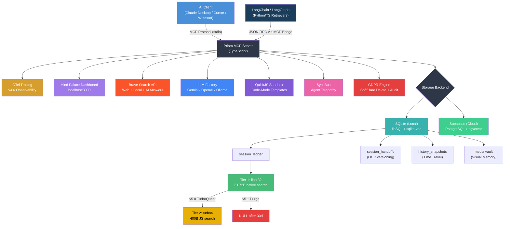

# Prism MCP — The Mind Palace for AI Agents 🧠

[](https://www.npmjs.com/package/prism-mcp-server)
[](https://registry.modelcontextprotocol.io)
[](https://glama.ai/mcp/servers/dcostenco/prism-mcp)
[](https://smithery.ai/server/prism-mcp-server)
[](LICENSE)
[](https://www.typescriptlang.org/)
[](https://nodejs.org/)

> **Your AI agent's memory that survives between sessions.** Prism MCP is a Model Context Protocol server that gives Claude Desktop, Cursor, Windsurf, and any MCP client **persistent memory**, **time travel**, **visual context**, **multi-agent sync**, **GDPR-compliant deletion**, **memory tracing**, **quantized vector compression**, and **LangChain integration** — all running locally with zero cloud dependencies.
>
> Built with **SQLite + F32_BLOB vector search**, **TurboQuant 10× embedding compression**, **optimistic concurrency control**, **MCP Prompts & Resources**, **auto-compaction**, **Gemini-powered Morning Briefings**, **MemoryTrace explainability**, and optional **Supabase cloud sync**.

## Table of Contents

- [What's New (v5.0.0)](#whats-new-in-v500--quantized-agentic-memory-)
- [What's New (v4.6.0)](#whats-new-in-v460--opentelemetry-observability-)
- [Multi-Instance Support](#multi-instance-support)
- [How Prism Compares](#how-prism-compares)
- [Quick Start](#quick-start-zero-config--local-mode)
- [Mind Palace Dashboard](#-the-mind-palace-dashboard)
- [Integration Examples](#integration-examples)
- [Claude Code Integration (Hooks)](#claude-code-integration-hooks)
- [Gemini / Antigravity Integration](#gemini--antigravity-integration)
- [Use Cases](#use-cases)
- [Architecture](#architecture) | [Full Architecture Guide](docs/ARCHITECTURE.md) | [Self-Improving Agent Guide](docs/self-improving-agent.md)
- [Tool Reference](#tool-reference)
- [Agent Hivemind — Role Usage](#agent-hivemind--role-usage)
- [LangChain / LangGraph Integration](#langchain--langgraph-integration)
- [Environment Variables](#environment-variables)
- [Boot Settings (Restart Required)](#-boot-settings-restart-required)
- [Progressive Context Loading](#progressive-context-loading)
- [Time Travel](#time-travel-version-history)
- [Agent Telepathy](#agent-telepathy-multi-client-sync)
- [Knowledge Accumulation](#knowledge-accumulation)
- [GDPR Compliance](#gdpr-compliance)
- [Observability & Tracing](#observability--tracing)
- [Supabase Setup](#supabase-setup-cloud-mode)
- [Project Structure](#project-structure)
- [Hybrid Search Pipeline](#hybrid-search-pipeline-brave--vertex-ai)
- [🚀 Roadmap](#-roadmap)

---

## What's New in v5.0.0 — Quantized Agentic Memory 🧬

> **🧬 10× embedding compression is here.** Powered by Google's TurboQuant (ICLR 2026), Prism now compresses 768-dim embeddings from **3,072 bytes → ~400 bytes** — enabling decades of session history on a standard laptop.
> [RFC-001: Quantized Agentic Memory](docs/rfcs/001-turboquant-integration.md) | [CHANGELOG](CHANGELOG.md)

### Performance Benchmarks

| Metric | Before v5.0 | After v5.0 |
|--------|------------|------------|
| **Storage per embedding** | 3,072 bytes (float32) | ~400 bytes (turbo4) |
| **Compression ratio** | 1:1 | **~7.7:1** (4-bit) / **~10.1:1** (3-bit) |
| **Similarity correlation** | Baseline | >0.85 (4-bit) |
| **Top-1 retrieval accuracy** | Baseline | >90% (N=100) |
| **Entries per GB** | ~330K | **~2.5M** |
| **Search without vector DB** | ❌ Empty | ✅ Tier-2 JS fallback |

### Three-Tier Memory Architecture

```
┌─────────────────────────────────────────────────────────────┐
│                    PRISM v5.0 MEMORY                       │
├─────────┬───────────────┬───────────────────────────────────┤
│  TIER   │ STORAGE       │ SEARCH METHOD                    │
├─────────┼───────────────┼───────────────────────────────────┤
│  Tier 0 │ FTS5 keywords │ Full-text search (knowledge_search) │
│  Tier 1 │ float32 3072B │ sqlite-vec cosine (native)       │
│  Tier 2 │ turbo4  400B  │ JS asymmetricCosineSimilarity    │
└─────────┴───────────────┴───────────────────────────────────┘

searchMemory() flow:
  → Tier 1 (sqlite-vec)  ── success → return results
                          ── fail    → Tier 2 (TurboQuant JS)
                                      ── success → return results
                                      ── fail    → return []
```

### Live Usage: How TurboQuant Works in Practice

**Every `session_save_ledger` call now generates both tiers automatically:**

```typescript
// What happens behind the scenes when you save a session:
await saveLedger({ project: "my-app", summary: "Built auth flow" });

// 1. Gemini generates float32 embedding (3,072 bytes)
// 2. TurboQuant compresses to turbo4 blob (~400 bytes)
// 3. Single atomic patchLedger writes BOTH to the database
//    → embedding: "[0.0234, -0.0156, ...]"   (float32)
//    → embedding_compressed: "base64..."       (turbo4)
//    → embedding_format: "turbo4"
//    → embedding_turbo_radius: 12.847

// Searching works seamlessly across both tiers:
await searchMemory({ query: "auth flow" });
// → Tier 1 tries native vector search
// → If unavailable, Tier 2 deserializes compressed blobs
//   and ranks using asymmetric cosine similarity in JS
```

**Backfill existing entries with one command:**
```
> Use tool: session_backfill_embeddings
> Now repairs AND compresses in a single atomic update
```

> **💡 Ollama TurboQuant Tip:** If using Ollama for self-hosted inference, set `OLLAMA_KV_CACHE_TYPE=turbo3` for 10× smaller KV caches during generation — the same algorithm powering Prism's memory compression.

---

<details>
<summary><strong>What's in v4.6.0 — OpenTelemetry Observability 🔭</strong></summary>

> **🔭 Full distributed tracing for every MCP tool call, LLM provider hop, and background AI worker.**
> Configure in the new **🔭 Observability** tab in Mind Palace — no code changes required.
> Activates a 4-tier span waterfall: `mcp.call_tool` → `worker.vlm_caption` → `llm.generate_image_description` / `llm.generate_embedding`.

</details>

<a name="whats-new-in-v451--gdpr-export-"></a>
<details>
<summary><strong>What's in v4.5.1 — GDPR Export & Test Hardening 🔒</strong></summary>

| Feature | Description |
|---|---|
| 📦 **`session_export_memory`** | Full ZIP export of project memory (JSON + Markdown). Satisfies GDPR Art. 20 Right to Portability. API keys redacted, embeddings stripped. |
| 🧪 **270 Tests** | Concurrent export safety, redaction edge cases, MCP contract validation under load. |

</details>

<a name="whats-new-in-v450--vlm-multimodal-memory-"></a>
<details>
<summary><strong>What's in v4.5.0 — VLM Multimodal Memory 👁️</strong></summary>

| Feature | Description |
|---|---|
| 👁️ **Visual Memory** | `session_save_image` → VLM auto-caption → ledger entry → vector embedding. Images become semantically searchable with zero schema changes. |
| 🛡️ **Provider Size Guards** | Anthropic 5MB hard cap, Gemini/OpenAI 20MB. Pre-flight check before API call. |

</details>

<a name="whats-new-in-v440--pluggable-llm-adapters-"></a>
<details>
<summary><strong>What's in v4.4.0 — Pluggable LLM Adapters (BYOM) 🔌</strong></summary>

| Feature | Description |
|---|---|
| 🔌 **BYOM** | OpenAI, Anthropic, Gemini, Ollama adapters. Text + embedding providers independently configurable. |
| 🛡️ **Air-Gapped** | Full local mode via `http://127.0.0.1:11434` — zero cloud API keys required. |

</details>

<a name="whats-new-in-v430--the-bridge-"></a>
<details>
<summary><strong>What's in v4.3.0 — The Bridge: Knowledge Sync Rules 🌉</strong></summary>

> **🧠 Active Behavioral Memory & IDE Sync**
> Prism doesn't just log what happened—it learns. When an agent is corrected, the memory gains "Importance". Once an insight graduates (Importance >= 7), Prism automatically syncs it to `.cursorrules` / `.clauderules` — permanent, zero-token IDE enforcement.

</details>


<a name="whats-new-in-v420--project-repo-registry-"></a>
<details>
<summary><strong>What's in v4.2.0 — Project Repo Registry 🗂️</strong></summary>

| Feature | Description |
|---|---|
| 🗂️ **Project Repo Paths** | Map each project to its repo directory in the dashboard. `session_save_ledger` validates `files_changed` paths and warns on mismatch — prevents cross-project contamination. |
| 🔄 **Universal Auto-Load** | Auto-load projects via dynamic tool descriptions — works across all MCP clients (Claude, Cursor, Gemini, Antigravity) without lifecycle hooks. Dashboard is the sole source of truth. |
| 🏠 **Dashboard-First Config** | Removed `PRISM_AUTOLOAD_PROJECTS` env var override. The Mind Palace dashboard is now the single source of truth for auto-load project configuration. |

</details>

<a name="whats-in-v410--auto-migration--multi-instance-"></a>
<details>
<summary><strong>What's in v4.1.0 — Auto-Migration & Multi-Instance 🔀</strong></summary>

| Feature | Description |
|---|---|
| 🔄 **Auto-Migrations (Supabase)** | Zero-config schema upgrades — pending DDL migrations run automatically on server startup via `prism_apply_ddl` RPC. |
| 🔀 **Multi-Instance Support** | `PRISM_INSTANCE` env var enables instance-aware PID locks — run multiple Prism servers side-by-side without conflicts. |
| 🛡️ **Server Lifecycle Management** | Singleton PID lock with graceful shutdown and stale PID recovery. |

</details>

<a name="whats-in-v400--behavioral-memory-"></a>
<details>
<summary><strong>What's in v4.0.0 — Behavioral Memory 🧠</strong></summary>

| Feature | Description |
|---|---|
| 🧠 **Behavioral Memory** | `session_save_experience` — log actions, outcomes, corrections with confidence scores. Auto-injects warnings into context so agents learn from mistakes. |
| 🎯 **Dynamic Roles** | Role auto-resolves from dashboard settings. Set once in Mind Palace, applies everywhere. |
| 📏 **Token Budget** | `max_tokens` on `session_load_context` — intelligently truncates to fit your budget. |
| 📉 **Importance Decay** | Stale corrections auto-fade over time to keep context fresh. |
| 🔧 **Claude Code Hooks** | Simplified SessionStart/Stop hooks that reliably trigger MCP tool calls. |

</details>

<a name="whats-in-v310--memory-lifecycle-"></a>
<details>
<summary><strong>What's in v3.1.0 — Memory Lifecycle 🔄</strong></summary>

| Feature | Description |
|---|---|
| 📊 **Memory Analytics** | Dashboard sparkline chart, session counts, rollup savings, context richness metrics. |
| ⏳ **Data Retention (TTL)** | Per-project TTL via `knowledge_set_retention` or dashboard. Auto-expires old entries every 12h. |
| 🗜️ **Auto-Compaction** | Background health check after saves — auto-compacts when brain is degraded. |
| 📦 **PKM Export** | Export project memory as ZIP of Markdown files for Obsidian/Logseq. |
| 🧪 **95 Tests** | Analytics, TTL, rollup, compaction, type guards, and export coverage. |

</details>

<details>
<summary><strong>What's in v3.0.1 — Agent Identity & Brain Clean-up 🧹</strong></summary>

| Feature | Description |
|---|---|
| 🧹 **Brain Health Clean-up** | One-click **Fix Issues** button — detects and cleans orphaned handoffs, missing embeddings, stale rollups. |
| 👤 **Agent Identity** | Set Default Role and Agent Name in dashboard — auto-applies as fallback in all tools. |
| 📜 **Role-Scoped Skills** | Per-role persistent rules documents, auto-injected at `session_load_context`. |
| 🔤 **Resource Formatting** | `memory://` resources render as formatted text instead of raw JSON. |

</details>

<a name="whats-in-v300--agent-hivemind-"></a>
<details>
<summary><strong>What's in v3.0.0 — Agent Hivemind 🐝</strong></summary>

| Feature | Description |
|---|---|
| 🐝 **Role-Scoped Memory** | Optional `role` param — each role gets isolated memory within a project. |
| 👥 **Agent Registry** | `agent_register`, `agent_heartbeat`, `agent_list_team` — multi-agent discovery. |
| 🎯 **Team Roster** | Auto-injected teammate awareness during context loading. |
| ⚙️ **Dashboard Settings** | Runtime toggles backed by persistent key-value store. |
| 📡 **Hivemind Radar** | Dashboard widget showing active agents, roles, and heartbeats. |
| 🔒 **Conditional Tools** | `PRISM_ENABLE_HIVEMIND` gates multi-agent tools. |
| ✅ **58 Tests** | Storage, tools, dashboard, concurrent writes, role isolation. |

</details>


<details>
<summary><strong>What's in v2.5.1 — Version Sync & Embedding Safety</strong></summary>

| Feature | Description |
|---|---|
| 🔄 **Dynamic Versioning** | Version derived from `package.json` — MCP handshake, dashboard, and npm stay in sync. |
| 🛡️ **Embedding Validation** | Validates 768-dimension vectors at runtime to catch model regressions. |

</details>

<details>
<summary><strong>What's in v2.5.0 — Enterprise Memory 🏗️</strong></summary>

| Feature | Description |
|---|---|
| 🔍 **Memory Tracing** | `MemoryTrace` with latency breakdown and scoring metadata for LangSmith. |
| 🛡️ **GDPR Deletion** | `session_forget_memory` with soft/hard delete and Article 17 justification. |
| 🔗 **LangChain Integration** | `PrismMemoryRetriever` / `PrismKnowledgeRetriever` BaseRetriever adapters. |
| 🧩 **LangGraph Agent** | 5-node research agent example with MCP bridge and hybrid search. |

</details>

<details>
<summary><strong>What's in v2.3.12 — Stability & Fixes</strong></summary>

| Feature | Description |
|---|---|
| 🪲 **Windows Black Screen Fix** | Fixed Python `subprocess.Popen` spawning visible Node.js terminal windows on Windows. |
| 📝 **Debug Logging** | Gated verbose startup logs behind `PRISM_DEBUG_LOGGING` for a cleaner default experience. |
| ⚡ **Excess Loading Fixes** | Performance improvements to resolve excess loading loops. |

</details>

<details>
<summary><strong>What's in v2.3.8 — LangGraph Research Agent</strong></summary>

| Feature | Description |
|---|---|
| 🤖 **LangGraph Agent** | 5-node research agent with autonomous looping, MCP integration, persistent memory. |
| 🧠 **Agentic Memory** | `save_session` node persists findings to ledger — agents don't just answer and forget. |
| 🔌 **MCP Client Bridge** | JSON-RPC 2.0 client wraps Prism tools as LangChain `StructuredTool` objects. |
| 🔧 **Storage Fix** | Resource/Prompt handlers route through `getStorage()` — eliminates EOF crashes. |
| 🛡️ **Error Boundaries** | Graceful error handling with proper MCP error responses. |

</details>

<details>
<summary><strong>What's in v2.2.0</strong></summary>

| Feature | Description |
|---|---|
| 🩺 **Brain Health Check** | `session_health_check` — like Unix `fsck` for your agent's memory. Detects missing embeddings, duplicate entries, orphaned handoffs, and stale rollups. Use `auto_fix: true` to repair automatically. |
| 📊 **Mind Palace Health** | Brain health indicator on the Mind Palace Dashboard — see your memory integrity at a glance. **🧹 Fix Issues** button auto-deletes orphaned handoffs in one click. |

</details>

<details>
<summary><strong>What's in v2.0 "Mind Palace"</strong></summary>

| Feature | Description |
|---|---|
| 🏠 **Local-First SQLite** | Run Prism entirely locally with zero cloud dependencies. Full vector search (libSQL F32_BLOB) and FTS5 included. |
| 🔮 **Mind Palace UI** | A beautiful glassmorphism dashboard at `localhost:3000` to inspect your agent's memory, visual vault, and Git drift. |
| 🕰️ **Time Travel** | `memory_history` and `memory_checkout` act like `git revert` for your agent's brain — full version history with OCC. |
| 🖼️ **Visual Memory** | Agents can save screenshots to a local media vault. Auto-capture mode snapshots your local dev server on every handoff save. |
| 📡 **Agent Telepathy** | Multi-client sync: if your agent in Cursor saves state, Claude Desktop gets a live notification instantly. |
| 🌅 **Morning Briefing** | Gemini auto-synthesizes a 3-bullet action plan if it's been >4 hours since your last session. |
| 📝 **Code Mode Templates** | 8 pre-built QuickJS extraction templates for GitHub, Jira, OpenAPI, Slack, CSV, and DOM parsing — zero reasoning tokens. |
| 🔍 **Reality Drift Detection** | Prism captures Git state on save and warns if files changed outside the agent's view. |

</details>

---

> 💡 **TL;DR:** Prism MCP gives your AI agent persistent memory using a local SQLite database. No cloud accounts, no API keys, and no Postgres/Qdrant containers required. Just `npx -y prism-mcp-server` and you're running.

## How Prism Compares

| Feature | **Prism MCP** | [MCP Memory](https://github.com/modelcontextprotocol/servers/tree/main/src/memory) | [Mem0](https://github.com/mem0ai/mem0) | [Mnemory](https://github.com/fpytloun/mnemory) | [Basic Memory](https://github.com/basicmachines-co/basic-memory) |
|---|---|---|---|---|---|
| **Pricing** | ✅ Free / MIT | ✅ Free / MIT | Freemium | ✅ Free / OSS | Freemium |
| **Storage** | SQLite + Supabase | JSON file | Postgres + Qdrant | Qdrant + S3 | Markdown files |
| **Zero Config** | ✅ npx one-liner | ✅ | ❌ Qdrant/Postgres | ✅ uvx | ✅ pip |
| **Behavioral Memory** | ✅ Importance tracking | ❌ | ❌ | ❌ | ❌ |
| **Dynamic Roles** | ✅ Dashboard auto-resolve | ❌ | ❌ | ❌ | ❌ |
| **Token Budget** | ✅ max_tokens param | ❌ | ❌ | ❌ | ❌ |
| **Importance Decay** | ✅ Auto-fade stale data | ❌ | ❌ | ❌ | ❌ |
| **Semantic Search** | ✅ Vectors + FTS5 | ❌ | ✅ pgvector | ✅ Qdrant | ❌ Text only |
| **Knowledge Graph** | ✅ Neural Graph | ✅ Entity model | ❌ | ✅ Graph | ✅ MD links |
| **Time Travel** | ✅ History + checkout | ❌ | ❌ | ❌ | ❌ |
| **Fact Merging** | ✅ Gemini async | ❌ | ✅ Built-in | ✅ Contradiction | ❌ |
| **Security Scan** | ✅ Injection detection | ❌ | ❌ | ✅ Anti-injection | ❌ |
| **Health Check** | ✅ fsck tool | ❌ | ❌ | ✅ 3-phase fsck | ❌ |
| **Visual Dashboard** | ✅ Mind Palace | ❌ | ✅ Cloud UI | ✅ Mgmt UI | ❌ |
| **Multi-Agent Sync** | ✅ Real-time | ❌ | ❌ | ❌ Per-user | ❌ |
| **Visual Memory** | ✅ Screenshot vault | ❌ | ❌ | ✅ Artifacts | ❌ |
| **Auto-Compaction** | ✅ Gemini rollups | ❌ | ❌ | ❌ | ❌ |
| **Morning Briefing** | ✅ Gemini synthesis | ❌ | ❌ | ❌ | ❌ |
| **OCC (Concurrency)** | ✅ Version-based | ❌ | ❌ | ❌ | ❌ |
| **GDPR Compliance** | ✅ Soft/hard delete + ZIP export | ❌ | ❌ | ❌ | ❌ |
| **Memory Tracing** | ✅ Latency breakdown | ❌ | ❌ | ❌ | ❌ |
| **OpenTelemetry** | ✅ OTLP spans (v4.6) | ❌ | ❌ | ❌ | ❌ |
| **VLM Image Captions** | ✅ Auto-caption vault (v4.5) | ❌ | ❌ | ❌ | ❌ |
| **Pluggable LLM Adapters** | ✅ OpenAI/Anthropic/Gemini/Ollama | ❌ | ✅ Multi-provider | ❌ | ❌ |
| **LangChain** | ✅ BaseRetriever | ❌ | ❌ | ❌ | ❌ |
| **Vector Compression** | ✅ TurboQuant 10× (v5.0) | ❌ | ❌ | ❌ | ❌ |
| **Three-Tier Search** | ✅ FTS + Vec + Quantized | ❌ | ❌ | ❌ | ❌ |
| **MCP Native** | ✅ stdio | ✅ stdio | ❌ Python SDK | ✅ HTTP + MCP | ✅ stdio |
| **Language** | TypeScript | TypeScript | Python | Python | Python |

> **When to choose Prism MCP:** You want MCP-native memory with zero infrastructure overhead, progressive context loading, and enterprise features (OCC, compaction, time travel, security scanning) that work directly in Claude Desktop — without running Qdrant, Postgres, or cloud services.

---

## Quick Start (Zero Config — Local Mode)

Get the MCP server running with Claude Desktop or Cursor in **under 60 seconds**. No API keys required for basic local memory!

### Option A: npx (Fastest)

Add this to your `claude_desktop_config.json` or `.cursor/mcp.json`:

```json
{
  "mcpServers": {
    "prism-mcp": {
      "command": "npx",
      "args": ["-y", "prism-mcp-server"]
    }
  }
}
```

That's it — **zero env vars needed** for local memory, Mind Palace dashboard, Time Travel, and Telepathy.

> **Optional API keys:** Add `BRAVE_API_KEY` for web search, `GOOGLE_API_KEY` for semantic search + Morning Briefings + paper analysis. See [Environment Variables](#environment-variables) for the full list.

### Option B: Cloud Sync Mode (Supabase)

To share memory across multiple machines or teams, switch to Supabase:

```json
{
  "mcpServers": {
    "prism-mcp": {
      "command": "npx",
      "args": ["-y", "prism-mcp-server"],
      "env": {
        "PRISM_STORAGE": "supabase",
        "SUPABASE_URL": "https://your-project.supabase.co",
        "SUPABASE_KEY": "your-supabase-anon-key"
      }
    }
  }
}
```

### Option C: Clone & Build (Full Control)

```bash
git clone https://github.com/dcostenco/prism-mcp.git
cd prism-mcp
npm install
npm run build
```

Then add to your MCP config:

```json
{
  "mcpServers": {
    "prism-mcp": {
      "command": "node",
      "args": ["/absolute/path/to/prism-mcp/dist/server.js"],
      "env": {
        "BRAVE_API_KEY": "your-brave-api-key",
        "GOOGLE_API_KEY": "your-google-gemini-key"
      }
    }
  }
}
```

**Restart your MCP client. That's it — all tools are now available.**

---

## 🔮 The Mind Palace Dashboard

Prism MCP spins up a lightweight, zero-dependency HTTP server alongside the MCP stdio process. No frameworks, no build step — just pure glassmorphism CSS served as a template literal.

Open **`http://localhost:3000`** in your browser to see exactly what your AI agent is thinking:


- **Current State & TODOs** — See the exact context injected into the LLM's prompt
- **Agent Identity Chip** — Header shows your active role + name (e.g. `🛠️ dev · Antigravity`); click to open Settings
- **Project Repo Paths** — Map each project to its repo directory for save validation
- **Brain Health 🩺** — Memory integrity status at a glance; **🧹 Fix Issues** button auto-cleans orphaned handoffs in one click
- **Git Drift Detection** — Alerts you if you've modified code outside the agent's view
- **Morning Briefing** — AI-synthesized action plan from your last sessions
- **Time Travel Timeline** — Browse historical handoff states and revert any version
- **Visual Memory Vault** — Browse UI screenshots and auto-captured HTML states
- **Session Ledger** — Full audit trail of every decision your agent has made
- **Neural Graph** — Force-directed visualization of project ↔ keyword associations
- **Hivemind Radar** — Real-time active agent roster with role, task, and heartbeat

The dashboard auto-discovers all your projects and updates in real time.

---

## Integration Examples

Copy-paste configs for popular MCP clients. All configs use the `npx` method.

<details>
<summary><strong>Claude Desktop</strong></summary>

Add to your `claude_desktop_config.json`:

```json
{
  "mcpServers": {
    "prism-mcp": {
      "command": "npx",
      "args": ["-y", "prism-mcp-server"],
      "env": {}
    }
  }
}
```

</details>

<details>
<summary><strong>Cursor</strong></summary>

Add to `.cursor/mcp.json` in your project root (or `~/.cursor/mcp.json` for global):

```json
{
  "mcpServers": {
    "prism-mcp": {
      "command": "npx",
      "args": ["-y", "prism-mcp-server"],
      "env": {}
    }
  }
}
```

</details>

<details>
<summary><strong>Windsurf</strong></summary>

Add to `~/.codeium/windsurf/mcp_config.json`:

```json
{
  "mcpServers": {
    "prism-mcp": {
      "command": "npx",
      "args": ["-y", "prism-mcp-server"],
      "env": {}
    }
  }
}
```

</details>

<details>
<summary><strong>VS Code + Continue / Cline</strong></summary>

Add to your Continue `config.json` or Cline MCP settings:

```json
{
  "mcpServers": {
    "prism-mcp": {
      "command": "npx",
      "args": ["-y", "prism-mcp-server"],
      "env": {
        "PRISM_STORAGE": "local",
        "BRAVE_API_KEY": "your-brave-api-key"
      }
    }
  }
}
```

</details>

---

## Claude Code Integration (Hooks)

Claude Code supports **lifecycle hooks** in `~/.claude/settings.json` that fire automatically at session start and end. Use these to auto-hydrate and persist Prism memory without manual prompting.

### SessionStart Hook

Automatically loads context when a new session begins:

```json
{
  "hooks": {
    "SessionStart": [
      {
        "matcher": "*",
        "hooks": [
          {
            "type": "command",
            "command": "python3 -c \"import json; print(json.dumps({'continue': True, 'suppressOutput': False, 'systemMessage': 'You MUST call mcp__prism-mcp__session_load_context twice before responding to the user: first with project=my-project level=standard, then with project=my-other-project level=standard. Do not skip this.'}))\"",
            "timeout": 10
          }
        ]
      }
    ]
  }
}
```

### Stop Hook

Automatically saves session memory when a session ends:

```json
{
  "hooks": {
    "Stop": [
      {
        "matcher": "*",
        "hooks": [
          {
            "type": "command",
            "command": "python3 -c \"import json; print(json.dumps({'continue': True, 'suppressOutput': False, 'systemMessage': 'MANDATORY END WORKFLOW: 1) Call mcp__prism-mcp__session_save_ledger with project and summary. 2) Call mcp__prism-mcp__session_save_handoff with expected_version set to the loaded version.'}))\"",
            "timeout": 10
          }
        ]
      }
    ]
  }
}
```

### How the Hooks Work

The hook `command` runs a Python one-liner that returns a JSON object to Claude Code:

| Field | Purpose |
|---|---|
| `continue: true` | Tell Claude Code to proceed (don't abort the session) |
| `suppressOutput: false` | Show the hook result to the agent |
| `systemMessage` | Instruction injected as a system message — the agent follows it |

The agent receives the `systemMessage` as an instruction and executes the tool calls. The server resolves the agent's **role** and **name** automatically from the dashboard — no need to specify them in the hook.

### Role Resolution — No Hardcoding Needed

Prism resolves the agent role dynamically using a priority chain:

```
explicit tool argument  →  dashboard setting  →  "global" (default)
```

1. **Explicit arg wins** — if `role` is passed in the tool call, it's used directly.
2. **Dashboard fallback** — if `role` is omitted, the server calls `getSetting("default_role")` and uses whatever role you configured in the **Mind Palace Dashboard ⚙️ Settings → Agent Identity**.
3. **Final default** — if no dashboard setting exists, falls back to `"global"`.

Change your role once in the dashboard, and it automatically applies to every session — CLI, extension, and all MCP clients.

### Verification

If hydration ran successfully, the agent's output will include:
- A `[👤 AGENT IDENTITY]` block showing your dashboard-configured role and name
- `PRISM_CONTEXT_LOADED` marker text

If the marker is missing, the hook did not fire or the MCP server is not connected.

---

## Gemini / Antigravity Integration

Gemini-based clients (like Antigravity) use `GEMINI.md` global rules or user rules for startup behavior. The server resolves the role from the dashboard automatically.

### Global Rules (`~/.gemini/GEMINI.md`)

```markdown
## Prism MCP Memory Auto-Load (CRITICAL)
At the start of every new session, call `mcp__prism-mcp__session_load_context`
for these projects:
- `my-project` (level=standard)
- `my-other-project` (level=standard)

After both succeed, print PRISM_CONTEXT_LOADED.
```

### User Rules (Antigravity Settings)

If your Gemini client supports user rules, add the same instructions there. The key points:

1. **Call `session_load_context` as a tool** — not `read_resource`. Only the tool returns the `[👤 AGENT IDENTITY]` block.
2. **Verify** — confirm the response includes `version` and `last_summary`.

### Session End

At the end of each session, save state:

```markdown
## Session End Protocol
1) Call `mcp__prism-mcp__session_save_ledger` with project and summary.
2) Call `mcp__prism-mcp__session_save_handoff` with expected_version from the loaded version.
```

---

## Use Cases

| Scenario | How Prism MCP Helps | Live Sample |
|----------|---------------------|-------------|
| **Long-running feature work** | Save session state at end of day, restore full context next morning — no re-explaining | `session_save_handoff(project, last_summary, open_todos)` |
| **Multi-agent collaboration** | Hivemind Telepathy lets multiple agents share real-time context across clients | `session_load_context(project, role="qa")` |
| **Consulting / multi-project** | Switch between client projects with progressive context loading | `session_load_context(project, level="quick")` |
| **Research & analysis** | Multi-engine search with 94% context reduction via sandboxed code transforms | `brave_web_search` + `code_mode_transform(template="api_endpoints")` |
| **Team onboarding** | New team member's agent loads full project history instantly | `session_load_context(project, level="deep")` |
| **Visual debugging** | Save UI screenshots to visual memory — searchable by description | `session_save_image(project, path, description)` → `session_view_image(id)` |
| **Offline / air-gapped** | Full SQLite local mode, Ollama LLM adapter — zero internet dependency | `PRISM_LLM_PROVIDER=ollama` in MCP config env |
| **Behavior enforcement** | Agent corrections auto-graduate into permanent `.cursorrules` | `session_save_experience(event_type="correction")` → `knowledge_sync_rules(project)` |
| **Infrastructure observability** | OTel spans to Jaeger/Grafana for every MCP tool call fanout | Enable in Dashboard → Settings → 🔭 Observability |
| **GDPR / audit export** | ZIP export of all memory as JSON + Markdown, sensitive fields redacted | `session_export_memory(project, format="zip")` |

---

## New in v4.6.0 — Feature Setup Guide

### 🔭 OpenTelemetry Distributed Tracing

**Why:** Every `session_save_ledger` call can silently fan out into a synchronous DB write, an async VLM caption, and a vector embedding backfill. Without tracing, these are invisible. OTel makes the full call tree visible in Jaeger, Grafana Tempo, or any OTLP-compatible collector.

**Setup:**
1. Open Mind Palace Dashboard → ⚙️ Settings → 🔭 Observability
2. Toggle **Enable OpenTelemetry** → set your OTLP endpoint (default: `http://localhost:4318`)
3. Restart the MCP server
4. Run Jaeger locally:
```bash
docker run -d --name jaeger \
  -p 16686:16686 -p 4318:4318 \
  jaegertracing/all-in-one:latest
```
5. Open http://localhost:16686 — select service `prism-mcp` to see span waterfalls.

**Span hierarchy:**
```
mcp.call_tool [session_save_ledger]
├── storage.write_ledger          ~2ms
├── llm.generate_embedding        ~180ms
└── worker.vlm_caption (async)    ~1.2s
```

> GDPR note: Span attributes contain only metadata — no prompt content, embeddings, or image data.

---

### 🖼️ VLM Multimodal Memory

**Why:** Agents lose visual context between sessions. UI screenshots, architecture diagrams, and bug states all become searchable memory.

**Setup:** Requires `ANTHROPIC_API_KEY` or `OPENAI_API_KEY` (vision-capable model).

**Usage:**
```
session_save_image(project="my-app", file_path="/path/to/screenshot.png", description="Login page broken layout after CSS refactor")
```
The image is auto-captioned by a VLM and stored in the media vault. Retrieve later:
```
session_view_image(project="my-app", image_id="8f2a1b3c")
```

---

## Architecture

> **📖 Deep dive**: [Full Architecture Guide](docs/ARCHITECTURE.md) — TurboQuant math, Three-Tier search, storage optimization flow
> **🤖 Tutorial**: [How to Build a Self-Improving Agent](docs/self-improving-agent.md) — corrections → behavioral memory → IDE rules



---

## Tool Reference

### Search & Analysis Tools

| Tool | Purpose |
|------|---------|
| `brave_web_search` | Real-time internet search |
| `brave_local_search` | Location-based POI discovery |
| `brave_web_search_code_mode` | JS extraction over web search results |
| `brave_local_search_code_mode` | JS extraction over local search results |
| `code_mode_transform` | Universal post-processing with **8 built-in templates** |
| `gemini_research_paper_analysis` | Academic paper analysis via Gemini |
| `brave_answers` | AI-grounded answers from Brave |

### Session Memory & Knowledge Tools

| Tool | Purpose |
|------|---------|
| `session_save_ledger` | Append immutable session log (summary, TODOs, decisions) |
| `session_save_handoff` | Upsert latest project state with OCC version tracking |
| `session_load_context` | Progressive context loading (quick / standard / deep) |
| `knowledge_search` | Semantic search across accumulated knowledge |
| `knowledge_forget` | Prune outdated or incorrect memories (4 modes + dry_run) |
| `session_search_memory` | Vector similarity search across all sessions |
| `session_compact_ledger` | Auto-compact old ledger entries via Gemini-powered summarization |

### v3.1 Lifecycle Tools

| Tool | Purpose |
|------|---------|
| `knowledge_set_retention` | Set a per-project TTL retention policy (0 = disabled, min 7 days). Immediately expires overdue entries. |

### v2.0 Advanced Memory Tools

| Tool | Purpose |
|------|---------|
| `memory_history` | Browse all historical versions of a project's handoff state |
| `memory_checkout` | Revert to any previous version (non-destructive, like `git revert`) |
| `session_save_image` | Save a screenshot/image to the visual memory vault |
| `session_view_image` | Retrieve and display a saved image from the vault |

### v2.2 Brain Health Tools

| Tool | Purpose | Key Args | Returns |
|------|---------|----------|---------|
| `session_health_check` | Scan brain for integrity issues (`fsck`) | `project`, `auto_fix` (boolean) | Health report & auto-repairs |

The **Mind Palace Dashboard** also shows a live **Brain Health 🩺** card for every project:

- **Status indicator** — `✅ Healthy` or `⚠️ Issues detected` with entry/handoff/rollup counts
- **🧹 Fix Issues button** — appears automatically when issues are detected; click to clean up orphaned handoffs and stale rollups in one click, no MCP tool call required
- **No issues found** — shown in green when memory integrity is confirmed

The tool and dashboard button both call the same repair logic — the dashboard button is simply a zero-friction shortcut for common maintenance.

### v2.5 Enterprise Memory Tools

| Tool | Purpose | Key Args | Returns |
|------|---------|----------|---------|
| `session_forget_memory` | GDPR-compliant deletion (soft/hard) | `memory_id`, `hard_delete`, `reason` | Deletion confirmation + audit |
| `session_search_memory` | Semantic search with `enable_trace` | `query`, `enable_trace` | Results + `MemoryTrace` in `content[1]` |
| `knowledge_search` | Knowledge search with `enable_trace` | `query`, `enable_trace` | Results + `MemoryTrace` in `content[1]` |

### v4.0 Behavioral Memory Tools

| Tool | Purpose | Key Args |
|------|---------|----------|
| `session_save_experience` | Record behavioral events with importance tracking | `project`, `event_type`, `context`, `action`, `outcome` |

**Dynamic Roles (v4.0):** `role` is now *optional* on all tools. Set your **Default Role** once in the dashboard (⚙️ Settings → Agent Identity) and it auto-applies everywhere — no need to pass it per call.

**Token Budget (v4.0):** Set a default in the dashboard (⚙️ Settings → Token Budget) or pass `max_tokens` per call to override:

```json
{ "name": "session_load_context", "arguments": {
    "project": "my-app", "level": "standard", "max_tokens": 2000
}}
```

> 💡 Set Token Budget to `0` in the dashboard for unlimited (default). Per-call `max_tokens` always takes priority.

**Recording experiences:**

```json
{ "name": "session_save_experience", "arguments": {
    "project": "my-app",
    "event_type": "correction",
    "context": "User asked to add a database migration",
    "action": "Ran ALTER TABLE directly in production",
    "outcome": "Data was corrupted",
    "correction": "Always create a migration file and test in staging first",
    "confidence_score": 95
}}
```

**Event types:** `correction` (user corrected the agent), `success` (task went well), `failure` (task failed), `learning` (new knowledge acquired).

**How behavioral memory works:**
1. Agent records experiences via `session_save_experience`
2. Prism assigns an **importance score** based on event type + confidence
3. Stale entries **auto-decay** in importance over time
4. On `session_load_context`, high-importance corrections auto-surface as `[⚠️ BEHAVIORAL WARNINGS]`
5. Agent sees warnings and avoids repeating past mistakes

### v4.3.0 Knowledge Sync Rules — "The Bridge"

Bridges **v4.0 Behavioral Memory** (graduated insights) with **v4.2.0 Project Registry** (repo paths) to physically write agent learnings into your project's IDE rules file.

| Feature | Without Sync Rules | With `knowledge_sync_rules` |
|---------|-------------------|----------------------------|
| **Insight Visibility** | Only in Prism context injection | Persisted as static IDE context (`.cursorrules` / `.clauderules`) |
| **Cross-Session** | Loaded per-session via tool call | Always-on — IDE reads rules file on every prompt |
| **Agent Learning Loop** | Behavioral warnings during context load | Rules enforced even without Prism connected |
| **Idempotency** | N/A | Sentinel markers ensure safe re-runs |
| **User Control** | View in dashboard | User-maintained rules preserved; only sentinel block updated |

**Syncing graduated insights:**

```json
{ "name": "knowledge_sync_rules", "arguments": {
    "project": "my-app",
    "target_file": ".cursorrules",
    "dry_run": true
}}
```

**How it works:**
1. Fetches graduated insights (`importance >= 7`) from the ledger
2. Formats them as markdown rules inside `<!-- PRISM:AUTO-RULES:START/END -->` sentinel markers
3. Idempotently writes them into the target file at the project's configured `repo_path`

| Tool | Purpose | Key Args |
|------|---------|----------|
| `knowledge_sync_rules` | Sync graduated insights to IDE rules file | `project`, `target_file`, `dry_run` |
| `knowledge_upvote` | Increase entry importance (+1) | `id` |
| `knowledge_downvote` | Decrease entry importance (-1) | `id` |

> 💡 **Prerequisite:** Set a `repo_path` for your project in the Mind Palace dashboard (⚙️ Settings → Project Repo Paths) before syncing.

### Code Mode Templates (v2.1)

Instead of writing custom JavaScript, pass a `template` name for instant extraction:

| Template | Source Data | What It Extracts |
|----------|-----------|-----------------|
| `github_issues` | GitHub REST API | `#number [state] title (@author) {labels}` |
| `github_prs` | GitHub REST API | `#number [state] title (base ← head)` |
| `jira_tickets` | Jira REST API | `[KEY] summary - Status - Priority - Assignee` |
| `dom_links` | Raw HTML | All `<a>` links as markdown |
| `dom_headings` | Raw HTML | H1-H6 hierarchy with indentation |
| `api_endpoints` | OpenAPI/Swagger JSON | `[METHOD] /path - summary` |
| `slack_messages` | Slack Web API | `[timestamp] @user: message` |
| `csv_summary` | CSV text | Column names, row count, sample rows |

**Tool Arguments:** `{ "data": "<raw JSON>", "template": "github_issues" }` — no custom code needed.

---

## Agent Hivemind — Role Usage

Role-scoped memory lets multiple agents work on the same project without stepping on each other's memory. Each role gets its own isolated memory lane. Defaults to `global` for full backward compatibility.

### Available Roles

| Role | Use for |
|------|---------|
| `dev` | Development agent |
| `qa` | Testing / QA agent |
| `pm` | Product management |
| `lead` | Tech lead / orchestrator |
| `security` | Security review |
| `ux` | Design / UX |
| `global` | Default — shared, no isolation |

Custom role strings are also supported (e.g. `"docs"`, `"ml"`).

### Using Roles with Memory Tools

Just add `"role"` to any of the core memory tools:

```json
// Save a ledger entry as the "dev" agent
{ "name": "session_save_ledger", "arguments": {
  "project": "my-app",
  "role": "dev",
  "conversation_id": "abc123",
  "summary": "Fixed the auth race condition"
}}

// Load context scoped to your role
// Also injects a Team Roster showing active teammates
{ "name": "session_load_context", "arguments": {
  "project": "my-app",
  "role": "dev",
  "level": "standard"
}}

// Save handoff as the "qa" agent
{ "name": "session_save_handoff", "arguments": {
  "project": "my-app",
  "role": "qa",
  "last_summary": "Ran regression suite — 2 failures in auth module"
}}
```

### Hivemind Coordination Tools

> **Requires:** `PRISM_ENABLE_HIVEMIND=true` (Boot Setting — restart required)

```json
// Announce yourself to the team at session start
{ "name": "agent_register", "arguments": {
  "project": "my-app",
  "role": "dev",
  "agent_name": "Dev Agent #1",
  "current_task": "Refactoring auth module"
}}

// Pulse every ~5 min to stay visible (agents pruned after 30 min)
{ "name": "agent_heartbeat", "arguments": {
  "project": "my-app",
  "role": "dev",
  "current_task": "Now writing tests"
}}

// See everyone on the team
{ "name": "agent_list_team", "arguments": {
  "project": "my-app"
}}
```

### How Role Isolation Works

- `session_load_context` with `role: "dev"` only sees entries saved with `role: "dev"`
- The `global` role is a shared pool — anything saved without a role goes here
- When loading *with* a role, Prism auto-injects a **Team Roster** block listing active teammates, roles, and tasks — no extra tool call needed
- The Hivemind Radar widget in the Mind Palace dashboard shows agent activity in real time

### Setting Your Agent Identity

The easiest way to configure your role and name is via the **Mind Palace Dashboard ⚙️ Settings → Agent Identity**:

- **Default Role** — dropdown to select `dev`, `qa`, `pm`, `lead`, `security`, `ux`, or `global`
- **Agent Name** — free text for your display name (e.g. `Dmitri`, `Dev Alex`, `QA Bot`)

Once set, **all memory and Hivemind tools automatically use these values** as fallbacks — no need to pass `role` or `agent_name` in every tool call.

> **Priority order:** explicit tool arg → dashboard setting → `"global"` (default)

**Alternative — hardcode in your startup rules** (if you prefer prompt-level config):

```markdown
## Prism MCP Memory Auto-Load (CRITICAL)
At the start of every new session, call session_load_context with:
- project: "my-app", role: "dev"
- project: "my-other-project", role: "dev"
```

> **Tip:** For true multi-agent setups, each AI instance has its own Mind Palace dashboard — set a different identity per agent there rather than managing it in prompts.

---

## LangChain / LangGraph Integration

Prism MCP includes first-class Python adapters for the LangChain ecosystem, located in `examples/langgraph-agent/`:

| Component | File | Purpose |
|-----------|------|---------|
| **MCP Bridge** | `mcp_client.py` | JSON-RPC 2.0 client with `call_tool()` and `call_tool_raw()` (preserves `MemoryTrace`) |
| **Semantic Retriever** | `prism_retriever.py` | `PrismMemoryRetriever(BaseRetriever)` — async-first vector search |
| **Keyword Retriever** | `prism_retriever.py` | `PrismKnowledgeRetriever(BaseRetriever)` — FTS5 keyword search |
| **Forget Tool** | `tools.py` | `forget_memory()` — GDPR deletion bridge |
| **Research Agent** | `agent.py` | 5-node LangGraph agent (plan→search→analyze→decide→answer→save) |

### Hybrid Search with EnsembleRetriever

Combine both retrievers for hybrid (semantic + keyword) search with a single line:

```python
from langchain.retrievers import EnsembleRetriever
from prism_retriever import PrismMemoryRetriever, PrismKnowledgeRetriever

retriever = EnsembleRetriever(
    retrievers=[PrismMemoryRetriever(...), PrismKnowledgeRetriever(...)],
    weights=[0.7, 0.3],  # 70% semantic, 30% keyword
)
```

### MemoryTrace in LangSmith

When `enable_trace=True`, each `Document.metadata["trace"]` contains:

```json
{
  "strategy": "vector_cosine_similarity",
  "latency": { "embedding_ms": 45, "storage_ms": 12, "total_ms": 57 },
  "result_count": 5,
  "threshold": 0.7
}
```

This metadata flows automatically into LangSmith traces for observability.

### Async Architecture

The retrievers use `_aget_relevant_documents` as the primary path with `asyncio.to_thread()` to wrap the synchronous MCP bridge. This prevents the `RuntimeError: This event loop is already running` crash that plagues most LangGraph deployments.

---

## Environment Variables

| Variable | Required | Description |
|----------|----------|-------------|
| `BRAVE_API_KEY` | No | Brave Search Pro API key (enables web/local search tools) |
| `PRISM_STORAGE` | No | `"local"` (default) or `"supabase"` — **requires restart** |
| `PRISM_ENABLE_HIVEMIND` | No | Set `"true"` to enable multi-agent Hivemind tools — **requires restart** |
| `PRISM_INSTANCE` | No | Instance name for PID lock isolation (e.g. `"athena"`, `"prism-dev"`). Enables [multi-instance support](#multi-instance-support). Default: `"default"` |
| `GOOGLE_API_KEY` | No | Google AI / Gemini — enables paper analysis, Morning Briefings, compaction |
| `BRAVE_ANSWERS_API_KEY` | No | Separate Brave Answers key for AI-grounded answers |
| `SUPABASE_URL` | If cloud mode | Supabase project URL |
| `SUPABASE_KEY` | If cloud mode | Supabase anon/service key |
| `PRISM_USER_ID` | No | Multi-tenant user isolation (default: `"default"`) |
| `PRISM_AUTO_CAPTURE` | No | Set `"true"` to auto-capture HTML snapshots of dev servers |
| `PRISM_CAPTURE_PORTS` | No | Comma-separated ports to scan (default: `3000,3001,5173,8080`) |
| `PRISM_DEBUG_LOGGING` | No | Set `"true"` to enable verbose debug logs (default: quiet) |

---

## ⚡ Boot Settings (Restart Required)

Some settings affect how Prism **initializes at startup** and cannot be changed at runtime. Prism stores these in a lightweight, dedicated SQLite database (`~/.prism-mcp/prism-config.db`) that is read **before** the main storage backend is selected — solving the chicken-and-egg problem of needing config before the config store is ready.

> **⚠️ You must restart the Prism MCP server after changing any Boot Setting.** The Mind Palace dashboard labels these with a **"Restart Required"** badge.

| Setting | Dashboard Control | Environment Override | Description |
|---------|------------------|---------------------|-------------|
| `PRISM_STORAGE` | ⚙️ Storage Backend dropdown | `PRISM_STORAGE=supabase` | Switch between `local` (SQLite) and `supabase` (cloud) |
| `PRISM_ENABLE_HIVEMIND` | ⚙️ Hivemind Mode toggle | `PRISM_ENABLE_HIVEMIND=true` | Enable/disable multi-agent coordination tools |

### How Boot Settings Work

1. **Dashboard saves the setting** → written to `~/.prism-mcp/prism-config.db` immediately
2. **You restart the MCP server** → server reads the config DB at startup, selects backend/features
3. **Environment variables always win** → if `PRISM_STORAGE` is set in your MCP config JSON, it overrides the dashboard value

```
Priority: env var in MCP config JSON  >  Dashboard (prism-config.db)  >  default (local)
```

### Runtime Settings (no restart needed)

These settings take effect immediately without a restart:

| Setting | Description |
|---------|-------------|
| Dashboard Theme | Visual theme for the Mind Palace (`dark`, `midnight`, `purple`) |
| Context Depth | Default level for `session_load_context` (`quick`, `standard`, `deep`) |
| Auto-Capture HTML | Snapshot local dev server HTML on every handoff save |

---

## Progressive Context Loading

Load only what you need — saves tokens and speeds up boot:

| Level | What You Get | Size | When to Use |
|-------|-------------|------|-------------|
| **quick** | Open TODOs + keywords | ~50 tokens | Fast check-in: "what was I working on?" |
| **standard** | Above + summary + recent decisions + knowledge cache + Git drift | ~200 tokens | **Recommended default** |
| **deep** | Above + full logs (last 5 sessions) + cross-project knowledge | ~1000+ tokens | After a long break or when you need complete history |

### Morning Briefing (Automatic)

If it's been more than 4 hours since your last session, Prism automatically:
1. Fetches the 10 most recent uncompacted ledger entries
2. Sends a notification: *"🌅 Brewing your Morning Briefing..."*
3. Uses Gemini to synthesize a 3-bullet action plan
4. Injects the briefing into the `session_load_context` response

The agent boots up knowing exactly what to do — zero prompting needed.

### Auto-Load on Session Start (Recommended)

For the best experience, ensure your agent boots with full project memory on every new session. There are three approaches — use whichever fits your workflow:

#### Option A: Dashboard Setting (Easiest)

Open the **Mind Palace Dashboard** (⚙️ Settings) and type your project names into the **Auto-Load Projects** field under Boot Settings:

```
prism-mcp, my-app
```

That's it. Restart your AI client and Prism auto-pushes context for each listed project on next boot.

#### Option B: Client-Side Hooks / Rules

For clients that support lifecycle hooks or startup rules, instruct the AI to **call `session_load_context` as a tool** at session start:

- **[Claude Code Integration (Hooks)](#claude-code-integration-hooks)** — `SessionStart` and `Stop` hook JSON samples for `~/.claude/settings.json`
- **[Gemini / Antigravity Integration](#gemini--antigravity-integration)** — global rules for `~/.gemini/GEMINI.md` or user rules

> **You can use both approaches together.** The dashboard auto-load (A) injects project names into the `session_load_context` tool description — works universally across all MCP clients. Client-side hooks (B) give the AI full structured access to the context response (including version numbers for OCC).

> **Key principle:** Never hardcode a `role` in your hooks or rules. Set your role once in the **Mind Palace Dashboard ⚙️ Settings → Agent Identity**, and Prism automatically resolves it for every tool call across all clients. See [Role Resolution](#role-resolution--no-hardcoding-needed).

> **Tip:** Replace `my-project` with your actual project identifiers. You can list as many projects as you need — each one gets its own independent memory timeline.

---

## Time Travel (Version History)

Every successful handoff save creates a snapshot. You can browse and revert any version:

```
v1 → v2 → v3 → v4 (current)
              ↑
        memory_checkout(v2) → creates v5 with v2's content
```

This is a **non-destructive revert** — like `git revert`, not `git reset`. No history is ever lost.

### Usage

```json
// Browse all versions
{ "name": "memory_history", "arguments": { "project": "my-app" } }

// Revert to version 2
{ "name": "memory_checkout", "arguments": { "project": "my-app", "version": 2 } }
```

---

## Agent Telepathy (Multi-Client Sync)

When Agent A (Cursor) saves a handoff, Agent B (Claude Desktop) gets notified instantly:

- **Local Mode:** File-based IPC via SQLite polling
- **Cloud Mode:** Supabase Realtime (Postgres CDC)

No configuration needed — it just works.

---

## Reality Drift Detection

Prism captures Git state (branch + commit SHA) on every handoff save. When the agent loads context, it compares the saved state against the current working directory:

```
⚠️ REALITY DRIFT DETECTED for "my-app":
  Branch changed: feature/auth → main
  Commit changed: abc1234 → def5678
  
  The codebase has been modified since your last session.
  Re-examine before making assumptions.
```

This prevents the agent from writing code based on stale context.

---

## Visual Memory & Auto-Capture

### Manual: Save Screenshots

```json
{ "name": "session_save_image", "arguments": {
  "project": "my-app",
  "image_path": "/path/to/screenshot.png",
  "description": "Login page after CSS fix"
}}
```

### Automatic: HTML Snapshots

Set `PRISM_AUTO_CAPTURE=true` and Prism silently captures your local dev server's HTML on every handoff save. Supported formats: PNG, JPG, WebP, GIF, SVG, HTML.

---

## Knowledge Accumulation

Every `session_save_ledger` and `session_save_handoff` automatically extracts keywords using lightweight, in-process NLP (~0.020ms/call). No LLM calls, no external dependencies.

**Example:** Saving *"Fixed Stripe webhook race condition using database-backed idempotency keys"* auto-extracts:
- **Keywords:** `stripe`, `webhook`, `race`, `condition`, `database`, `idempotency`
- **Categories:** `cat:debugging`, `cat:api-integration`

### Search Knowledge

```json
{ "name": "knowledge_search", "arguments": {
  "project": "ecommerce-api",
  "category": "debugging",
  "query": "Stripe webhook"
}}
```

### Forget Bad Memories

| Mode | Example | Effect |
|------|---------|--------|
| **By project** | `project: "old-app"` | Clear all knowledge |
| **By category** | `category: "debugging"` | Forget debugging entries only |
| **By age** | `older_than_days: 30` | Forget entries older than 30 days |
| **Dry run** | `dry_run: true` | Preview what would be deleted |

## GDPR Compliance

### GDPR-Compliant Deletion

Prism supports surgical, per-entry deletion for GDPR Article 17 compliance:

```json
// Soft delete (tombstone — reversible, keeps audit trail)
{ "name": "session_forget_memory", "arguments": {
  "memory_id": "abc123",
  "reason": "User requested data deletion"
}}

// Hard delete (permanent — irreversible)
{ "name": "session_forget_memory", "arguments": {
  "memory_id": "abc123",
  "hard_delete": true
}}
```

**How it works:**
- **Soft delete** sets `deleted_at = NOW()` + `deleted_reason`. The entry stays in the DB for audit but is excluded from ALL search results (vector, FTS5, and context loading).
- **Hard delete** physically removes the row. FTS5 triggers auto-clean the full-text index.
- **Top-K Hole Prevention**: `deleted_at IS NULL` filtering happens INSIDE the SQL query, BEFORE the `LIMIT` clause — so `LIMIT 5` always returns 5 live results, never fewer. *(A "Top-K Hole" occurs when deleted entries are filtered out after the vector search, causing fewer than K results to be returned. Prism avoids this by filtering inside SQL before the LIMIT.)*

### Article 17 — Right to Erasure ("Right to be Forgotten")

| Requirement | How Prism Satisfies It |
|-------------|----------------------|
| **Individual deletion** | `session_forget_memory` operates on a single `memory_id` — the data subject can request deletion of *specific* memories, not just bulk wipes. |
| **Soft delete (audit trail)** | `deleted_at` + `deleted_reason` columns prove *when* and *why* data was deleted — required for SOC2 audit logs. |
| **Hard delete (full erasure)** | `hard_delete: true` physically removes the row from the database. No tombstone, no trace. True erasure as required by Article 17(1). |
| **Justification logging** | The `reason` parameter captures the GDPR justification (e.g., `"User requested data deletion"`, `"Data retention policy expired"`). |

### Article 25 — Data Protection by Design and by Default

| Requirement | How Prism Satisfies It |
|-------------|----------------------|
| **Ownership guards** | `softDeleteLedger()` and `hardDeleteLedger()` verify `user_id` before executing. User A cannot delete User B's data. |
| **Database-level filtering** | `deleted_at IS NULL` is inside the SQL `WHERE` clause, *before* `LIMIT`. Soft-deleted data never leaks into search results — not even accidentally. |
| **Default = safe** | The system defaults to soft delete (reversible). Hard delete requires an explicit `hard_delete: true` flag — preventing accidental permanent data loss. |
| **Multi-tenant isolation** | `PRISM_USER_ID` environment variable ensures all operations are scoped to a single tenant. |

### Coverage Summary

| GDPR Right | Status | Implementation |
|-----------|--------|----------------|
| Right to Erasure (Art. 17) | ✅ Implemented | `session_forget_memory` (soft + hard delete) |
| Data Protection by Design (Art. 25) | ✅ Implemented | Ownership guards, DB-level filtering, safe defaults |
| Audit Trail | ✅ Implemented | `deleted_at` + `deleted_reason` columns |
| User Isolation | ✅ Implemented | `user_id` verification on all delete operations |
| Right to Portability (Art. 20) | ✅ Implemented | `session_export_memory` — ZIP export of JSON + Markdown, API keys redacted |
| Consent Management | ➖ Out of scope | Application-layer responsibility |

> **Note:** No software is "GDPR certified" on its own — GDPR is an organizational compliance framework. Prism provides the technical controls that a DPO (Data Protection Officer) needs to satisfy the data deletion and privacy-by-design requirements.

---

## Observability & Tracing

Prism MCP ships **two complementary tracing systems** serving different audiences:

| | MemoryTrace | OpenTelemetry (OTel) |
|---|---|---|
| **Question answered** | Why was this memory returned? | What was the end-to-end latency? |
| **Output** | `content[1]` in MCP response | OTLP → Jaeger / Tempo / Zipkin |
| **Trigger** | `enable_trace: true` parameter | Every tool call, automatically |
| **Audience** | LLM / LangSmith orchestration | Developers debugging infrastructure |

### MemoryTrace (Phase 1 — LLM Explainability)

A zero-dependency tracing system built for MCP. Returns per-query latency breakdowns and result scoring metadata as a second `content` block — keeping structured telemetry out of the LLM's context window.

```json
{ "trace": { "strategy": "semantic", "latency": { "embedding_ms": 45, "storage_ms": 12, "total_ms": 57 }, "result_count": 3 } }
```

### OpenTelemetry (Phase 2 — Infrastructure Observability)

Every MCP tool call emits a **4-tier span waterfall** to any OTLP-compatible collector:

```
mcp.call_tool  [e.g. session_save_image, ~50 ms]
  └─ worker.vlm_caption          [~2–5 s, outlives parent ✓]
       └─ llm.generate_image_description  [~1–4 s]
       └─ llm.generate_embedding          [~200 ms]
```

**Quick-start with Jaeger:**

```bash
docker run -d -p 4318:4318 -p 16686:16686 jaegertracing/all-in-one
```

Then open **Mind Palace Dashboard → ⚙️ Settings → 🔭 Observability**, toggle OTel on, and restart. Open [localhost:16686](http://localhost:16686) to see traces.

**GDPR-safe by design:** Span attributes capture only character counts and byte sizes — never prompt content, vector embeddings, or base64 image data.

| Setting | Default | Description |
|---------|---------|-------------|
| `otel_enabled` | `false` | Toggle OTel pipeline on/off (restart required) |
| `otel_endpoint` | `http://localhost:4318/v1/traces` | OTLP HTTP collector URL |
| `otel_service_name` | `prism-mcp-server` | Service label in trace UI |


---

## Supabase Setup (Cloud Mode)

<details>
<summary><strong>Step-by-step Supabase configuration</strong></summary>

### 1. Create a Supabase Project

1. Go to [supabase.com](https://supabase.com) and sign in (free tier works)
2. Click **New Project** → choose a name and password → select a region
3. Wait for provisioning (~30 seconds)

### 2. Apply Migrations

In the SQL Editor, run the **bootstrap migration** first:
1. [`supabase/migrations/015_session_memory.sql`](supabase/migrations/015_session_memory.sql)
2. [`supabase/migrations/016_knowledge_accumulation.sql`](supabase/migrations/016_knowledge_accumulation.sql)
3. [`supabase/migrations/027_auto_migration_infra.sql`](supabase/migrations/027_auto_migration_infra.sql) — **enables auto-migrations** (see below)

> **After applying migration 027**, all future schema changes are applied automatically on server startup — no manual SQL required.

### 3. Get Credentials

Go to **Settings → API** and copy:
- **Project URL** (e.g. `https://abcdefg.supabase.co`)
- **anon public** key (starts with `eyJ...`)

### 4. Configure

Add these to your MCP client's configuration file (e.g., `claude_desktop_config.json` under `"env"`), or export them if running the server manually:

```bash
export SUPABASE_URL="https://your-project.supabase.co"
export SUPABASE_KEY="eyJhbGciOiJIUzI1NiIsInR5cCI6IkpXVCJ9..."
export PRISM_STORAGE="supabase"
```

> **Note:** Claude Desktop, Cursor, and other MCP clients spawn isolated processes — terminal `export` commands won't be inherited. Always set env vars in the client's config JSON.

### Security

1. **Use the anon key** for MCP server config
2. **Enable RLS** on both tables
3. **Never commit** your `SUPABASE_KEY` to version control

</details>

### Auto-Migrations (Supabase Cloud)

Prism includes a zero-config auto-migration system for Supabase. Once the bootstrap migration (`027_auto_migration_infra.sql`) is applied, all future schema changes are applied automatically on server startup.

**How it works:**

1. On startup, the migration runner checks each entry in `MIGRATIONS[]` (defined in `supabaseMigrations.ts`)
2. For each migration, it calls `prism_apply_ddl(version, name, sql)` — a `SECURITY DEFINER` RPC function
3. The function checks `prism_schema_versions` — if the version is already recorded, it's silently skipped (idempotent)
4. If not applied, it executes the DDL and records the version number

**Graceful degradation:** If `prism_apply_ddl()` doesn't exist (you haven't applied migration 027 yet), the runner logs a warning and continues — the server still starts, but newer schema features may not be available.

**Adding new migrations** — just append to the `MIGRATIONS[]` array in `src/storage/supabaseMigrations.ts`:

```typescript
{
  version: 28,
  name: "my_new_feature",
  sql: `ALTER TABLE session_ledger ADD COLUMN IF NOT EXISTS my_col TEXT;`,
}
```

All SQL must be idempotent (`IF NOT EXISTS` / `IF EXISTS` guards).

---

## Multi-Instance Support

Run multiple Prism MCP servers side-by-side on the same machine without PID lock conflicts. This is useful when you have different MCP configurations (e.g., one for web search + memory, another for memory-only) running in different clients simultaneously.

### Configuration

Set `PRISM_INSTANCE` to a unique name per server instance:

```json
{
  "mcpServers": {
    "prism-search": {
      "command": "node",
      "args": ["/path/to/prism/dist/server.js"],
      "env": {
        "PRISM_INSTANCE": "prism-search",
        "BRAVE_API_KEY": "your-key"
      }
    },
    "prism-memory": {
      "command": "node",
      "args": ["/path/to/prism/dist/server.js"],
      "env": {
        "PRISM_INSTANCE": "prism-memory"
      }
    }
  }
}
```

### How it works

- Each instance gets its own PID file: `/tmp/prism-{PRISM_INSTANCE}.pid`
- Default instance name is `"default"` (backward compatible)
- Instances share the same SQLite database and Supabase backend — only the process lock is isolated
- Graceful shutdown cleans up the instance's PID file

---

## Hybrid Search Pipeline (Brave + Vertex AI)

<details>
<summary><strong>Enterprise search with Vertex AI Discovery Engine</strong></summary>

Prism can combine **real-time web search** (Brave) with **enterprise-curated search** (Vertex AI Discovery Engine) for a hybrid pipeline achieving **94% context reduction** and **~17K tokens saved per query**.

| Metric | Brave (Web) | Discovery Engine | Hybrid |
|--------|------------|-----------------|--------|
| Avg latency | 220ms | 1,193ms | ~1.4s |
| Raw payload | 42.4 KB | 28.9 KB | 71.3 KB |
| Reduced payload | 3.0 KB | 1.2 KB | **4.2 KB** (94% reduction) |
| Token savings | ~10,103 | ~7,097 | **~17,200 / query** |

See [`vertex-ai/`](vertex-ai/) for setup and benchmarks.

</details>

---

## Project Structure

```
├── src/
│   ├── server.ts                        # MCP server core + tool routing + lifecycle
│   ├── config.ts                        # Environment management
│   ├── storage/
│   │   ├── interface.ts                 # StorageBackend abstraction (+ GDPR delete methods)
│   │   ├── sqlite.ts                    # SQLite local storage (libSQL + F32_BLOB + deleted_at migration)
│   │   ├── supabase.ts                  # Supabase cloud storage (+ soft/hard delete)
│   │   ├── supabaseMigrations.ts        # Auto-migration runner for Supabase DDL
│   │   ├── configStorage.ts             # Boot config micro-DB (~/.prism-mcp/prism-config.db)
│   │   └── index.ts                     # Backend factory (auto-selects based on PRISM_STORAGE)
│   ├── sync/
│   │   ├── interface.ts                 # SyncBus abstraction (Telepathy)
│   │   ├── localSync.ts                 # File-based IPC for local mode
│   │   ├── supabaseSync.ts             # Supabase Realtime CDC for cloud mode
│   │   └── factory.ts                   # Auto-selects sync backend
│   ├── dashboard/
│   │   ├── server.ts                    # Dashboard HTTP server with port recovery
│   │   └── ui.ts                        # Mind Palace glassmorphism HTML template
│   ├── templates/
│   │   └── codeMode.ts                  # 8 pre-built QuickJS extraction templates
│   ├── tools/
│   │   ├── definitions.ts               # Search & analysis tool schemas
│   │   ├── handlers.ts                  # Search & analysis handlers
│   │   ├── sessionMemoryDefinitions.ts  # Memory tools + GDPR + tracing schemas
│   │   ├── sessionMemoryHandlers.ts     # Memory handlers (OCC, GDPR, Tracing, Time Travel)
│   │   ├── compactionHandler.ts         # Gemini-powered ledger compaction
│   │   └── index.ts                     # Tool registration & re-exports
│   └── utils/
│       ├── telemetry.ts                 # OTel singleton — NodeTracerProvider, BatchSpanProcessor, no-op mode
│       ├── tracing.ts                   # MemoryTrace types + factory (Phase 1 — LLM explainability)
│       ├── imageCaptioner.ts            # VLM auto-caption pipeline (v4.5) + worker.vlm_caption OTel span
│       ├── logger.ts                    # Debug logging (gated by PRISM_DEBUG_LOGGING)
│       ├── braveApi.ts                  # Brave Search REST client
│       ├── googleAi.ts                  # Gemini SDK wrapper
│       ├── executor.ts                  # QuickJS sandbox executor
│       ├── autoCapture.ts               # Dev server HTML snapshot utility
│       ├── healthCheck.ts               # Brain integrity engine + security scanner
│       ├── factMerger.ts                # Async LLM contradiction resolution
│       ├── git.ts                       # Git state capture + drift detection
│       ├── embeddingApi.ts              # Embedding generation
│       ├── keywordExtractor.ts          # Zero-dependency NLP keyword extraction
│       └── llm/
│           ├── provider.ts              # LLMProvider interface
│           ├── factory.ts               # Provider factory — composes + wraps in TracingLLMProvider
│           └── adapters/
│               ├── gemini.ts            # Google Gemini adapter
│               ├── openai.ts            # OpenAI adapter
│               ├── anthropic.ts         # Anthropic Claude adapter
│               ├── ollama.ts            # Ollama (local) adapter
│               └── traced.ts            # TracingLLMProvider decorator (v4.6 OTel)
├── examples/langgraph-agent/            # LangChain/LangGraph integration
│   ├── agent.py                         # 5-node LangGraph research agent
│   ├── mcp_client.py                    # MCP Bridge (call_tool + call_tool_raw)
│   ├── prism_retriever.py               # PrismMemoryRetriever + PrismKnowledgeRetriever
│   ├── tools.py                         # Agent tools + GDPR forget_memory
│   └── demo_retriever.py                # Standalone retriever demo
├── supabase/migrations/                 # Cloud mode SQL schemas + auto-migration bootstrap
│   └── 027_auto_migration_infra.sql     # prism_apply_ddl() RPC + schema version tracking
├── vertex-ai/                           # Vertex AI hybrid search pipeline
├── index.ts                             # Server entry point
└── package.json
```

---

## 🚀 Roadmap

> **[View the full project board →](https://github.com/users/dcostenco/projects/1/views/1)** | **[Full ROADMAP.md →](ROADMAP.md)**

### ✅ v5.0 — Quantized Agentic Memory (Shipped!)

| Feature | Description |
|---|---|
| 🧮 **TurboQuant Math Core** | Pure TypeScript port of Google's TurboQuant (ICLR 2026) — Lloyd-Max codebook, QR rotation, QJL error correction. Zero dependencies. [RFC-001](docs/rfcs/001-turboquant-integration.md) |
| 📦 **~7× Embedding Compression** | 768-dim embeddings shrink from 3,072 bytes to ~400 bytes (4-bit) via variable bit-packing. |
| 🔍 **Asymmetric Similarity** | Unbiased inner product estimator: query as float32 vs compressed blobs. No decompression needed. |
| 🗄️ **Two-Tier Search** | FTS5 candidate filter → JS-side asymmetric scoring. Bypasses sqlite-vec float32 limitation. |

### ✅ v5.1 — Deep Storage Mode (Shipped!)

| Feature | Description |
|---|---|
| 🧬 **Deep Storage Purge** | Automated `deep_storage_purge` tool NULLs out redundant float32 embeddings for entries with TurboQuant compressed blobs, reclaiming ~90% of vector storage. |
| 🛡️ **Safety Guards** | Minimum 7-day age threshold, dry-run preview mode, multi-tenant isolation, and compressed-blob-existence validation ensure zero data loss. |
| 🗃️ **Supabase RPC** | `prism_purge_embeddings` Postgres function (migration 030) provides full backend parity with SQLite. Auto-applied via the v4.1 migration runner. |
| 🧪 **303 Tests** | 8 new deep-storage test cases covering dry run, execute, safety guards, and idempotency — zero regressions across the full suite. |

### ✅ v4.6 — OpenTelemetry Observability (Shipped!)

| Feature | Description |
|---|---|
| 🔭 **OTel Root Span** | Every MCP tool call wrapped in `mcp.call_tool` span — propagated to all child async operations via AsyncLocalStorage. |
| 🎨 **TracingLLMProvider** | Decorator pattern wraps the composed LLM factory. Zero changes to vendor adapters. Instruments `generate_text`, `generate_embedding`, `generate_image_description`. |
| ⚙️ **Worker Spans** | `worker.vlm_caption` span in `imageCaptioner` correctly parents fire-and-forget async tasks to the root span. |
| 🔒 **Shutdown Flush** | `shutdownTelemetry()` wired as step-0 in `lifecycle.ts` — flushes `BatchSpanProcessor` before DB closes on SIGTERM. |
| 🖥️ **Dashboard UI** | New 🔭 Observability tab with enable toggle, OTLP endpoint, service name, inline Jaeger docker command, and ASCII waterfall diagram. |

### ✅ v4.5 — VLM Multimodal Memory & GDPR Export (Shipped!)

| Feature | Description |
|---|---|
| 👁️ **Auto-Captioning** | `session_save_image` → VLM → ledger entry → vector embedding. Images become semantically searchable with zero schema changes. |
| 📦 **GDPR Art. 20** | `session_export_memory` — full ZIP export (JSON + Markdown), API keys redacted, embeddings stripped. |
| 🧪 **270 tests** | Full regression coverage including concurrent safety, redaction edge cases, and MCP contract validation. |

### ✅ v4.4 — Pluggable LLM Adapters (Shipped!)

| Feature | Description |
|---|---|
| 🔌 **BYOM** | OpenAI, Anthropic, Gemini, Ollama adapters. Text + embedding providers independently configurable. |
| 🛡️ **Air-Gapped** | Full local mode via Ollama — zero cloud API keys required. |

### ✅ v4.3 — The Bridge: Knowledge Sync Rules (Shipped!)

See [What's in v4.3.0](#whats-new-in-v430--the-bridge-) above — syncing dynamic behavioral insights to static IDE rules files.

### ✅ v4.2 — Project Repo Registry (Shipped!)

| Feature | Description |
|---|---|
| 🗂️ **Project Repo Paths** | Dashboard UI to map projects to repo directories + `session_save_ledger` path validation. |
| 🔄 **Universal Auto-Load** | Dynamic tool descriptions replace env var — dashboard is sole source of truth. |

### ✅ v4.1 — Auto-Migration & Multi-Instance (Shipped!)

See [What's in v4.1.0](#whats-in-v410--auto-migration--multi-instance-) above.

### ✅ v4.0 — Behavioral Memory (Shipped!)

See [What's in v4.0.0](#whats-in-v400--behavioral-memory-) above.

### ✅ v3.x — Memory Lifecycle & Agent Hivemind (Shipped!)

See [v3.1.0](#whats-in-v310--memory-lifecycle-) and [v3.0.0](#whats-in-v300--agent-hivemind-) above.

---

### 🗺️ Next on the Horizon

| Priority | Feature | Description |
|----------|---------|-------------|
| ✅ | **Documentation & Architecture Guide** | [Architecture Guide](docs/ARCHITECTURE.md), [Self-Improving Agent Guide](docs/self-improving-agent.md), updated README diagram with v5.x vector tiers. |
| ✅ | **Knowledge Graph Editor** | Interactive vis.js graph with click-to-filter, node stats, project/keyword/category visualization. |
| 🥉 | **Autonomous Web Scholar** | Agent-driven learning pipeline using Brave Search + VLM to autonomously build project context while the developer sleeps. |
| ✅ | **Dashboard Auth** | HTTP Basic Auth with session cookies, timing-safe comparison, styled login page. Set `PRISM_DASHBOARD_USER`/`PRISM_DASHBOARD_PASS`. |
| ✅ | **TypeScript LangGraph Examples** | [Reference agent](examples/langgraph-ts/) with MCP client, memory retriever nodes, and session persistence. |
| — | **CRDT Conflict Resolution** | Conflict-free types for concurrent multi-agent edits on the same handoff. |

---

## License

MIT

---

<sub>**Keywords:** MCP server, Model Context Protocol, Claude Desktop memory, persistent session memory, AI agent memory, local-first, SQLite MCP, Mind Palace, time travel, visual memory, VLM image captioning, OpenTelemetry OTel tracing, Jaeger distributed traces, GDPR export portability, agent telepathy, multi-agent sync, behavioral memory, IDE rules sync, cursorrules, pluggable LLM, Ollama MCP, Anthropic Claude MCP, OpenAI MCP, reality drift detection, morning briefing, code mode templates, cursor MCP server, windsurf MCP server, cline MCP server, pgvector semantic search, progressive context loading, MCP Prompts, MCP Resources, knowledge management AI, Brave Search MCP, Gemini analysis, optimistic concurrency control, zero config, memory tracing, LangChain retriever, LangGraph agent, soft delete, memory lineage, explainability, enterprise AI memory</sub>
