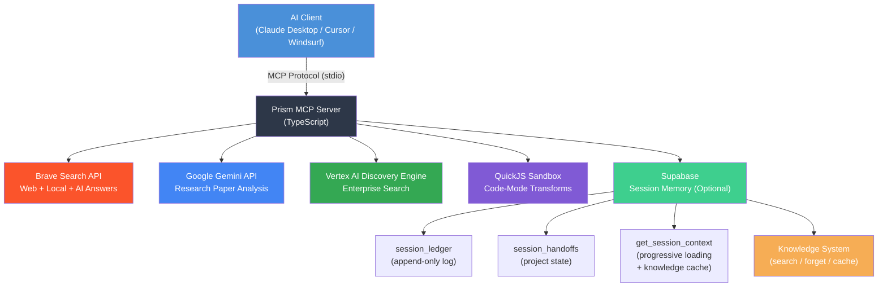

# Prism MCP — Enterprise-Grade AI Agent Memory & Multi-Engine Search

[](https://www.npmjs.com/package/prism-mcp-server)
[](https://registry.modelcontextprotocol.io)
[](https://glama.ai/mcp/servers/@dcostenco/prism-mcp)
[](LICENSE)
[](https://www.typescriptlang.org/)
[](https://nodejs.org/)

> Production-grade **Model Context Protocol (MCP)** server with **persistent session memory**, **multi-tenant RLS**, **semantic search (pgvector)**, **optimistic concurrency control**, **MCP Prompts & Resources**, **brain-inspired knowledge accumulation**, and **multi-engine search** (Brave + Vertex AI) with sandboxed code transforms and Gemini-powered analysis.

---

## What's New in v1.5.0

| Feature | Description |
|---|---|
| 🧠 **MCP Prompts** | `/resume_session` slash command — inject context before the LLM thinks. Zero tool calls. |
| 📎 **MCP Resources** | Attach `memory://project/handoff` via paperclip — auto-refresh on state changes. |
| 🔒 **Optimistic Concurrency** | Version-tracked handoffs prevent multi-client data loss. |
| 🧹 **Ledger Compaction** | Gemini-powered rollup of old entries — keeps ledger lean with soft-delete archiving. |
| 🔍 **Semantic Search** | pgvector embeddings — find sessions by meaning, not just keywords. |
| ♻️ **Resource Subscriptions** | Attached memory auto-refreshes when handoff state changes mid-conversation. |
| 🛡️ **Multi-Tenant RLS** | `PRISM_USER_ID` env var — Row Level Security isolates data per user on shared Supabase. |

---

## How Prism MCP Compares

| Capability | **Prism MCP** | **Mem0** | **Zep** | **Basic Memory** |
|---|---|---|---|---|
| **Architecture** | MCP-native (single npm package) | Standalone service + MCP adapter | Standalone service + API | MCP-native (local files) |
| **Storage** | Supabase (PostgreSQL) | Hybrid (vector + graph DBs) | PostgreSQL + Neo4j | Local markdown files |
| **Cold Start Fix** | ✅ MCP Prompts + Resources inject context before LLM thinks | ❌ Requires tool call | ❌ Requires tool call | ❌ Requires tool call |
| **Progressive Loading** | ✅ quick / standard / deep levels | ❌ All-or-nothing | ❌ Fixed context window | ❌ All-or-nothing |
| **Semantic Search** | ✅ pgvector + HNSW | ✅ Qdrant/Chroma | ✅ Built-in embeddings | ❌ No embeddings |
| **Concurrency Control** | ✅ OCC with version tracking | ❌ Last write wins | ❌ Last write wins | ❌ Single user only |
| **Auto-Compaction** | ✅ Gemini-powered rollup | ❌ Manual management | ✅ Auto-summarization | ❌ No compaction |
| **Resource Subscriptions** | ✅ Live refresh on state change | ❌ Not MCP-native | ❌ Not MCP-native | ❌ Not supported |
| **Knowledge Accumulation** | ✅ Auto-extracted keywords + categories | ✅ User/agent memories | ✅ Fact extraction | ❌ Manual tagging |
| **Infrastructure Cost** | Free tier (Supabase + Gemini) | Free tier available, paid for scale | Self-hosted or cloud ($$$) | Free (local only) |
| **Setup Complexity** | 2 env vars (Supabase URL + Key) | Docker + API keys + vector DB | Docker + PostgreSQL + Neo4j | No setup needed |
| **Multi-Project** | ✅ Built-in project isolation | ✅ User-scoped memories | ✅ Session-scoped | ❌ Single knowledge base |
| **Multi-Tenant RLS** | ✅ user_id + RLS policies | ❌ Not built-in | ❌ Not built-in | ❌ Single user only |

> **When to choose Prism MCP**: You want MCP-native memory with zero infrastructure overhead, progressive context loading, and enterprise features (OCC, compaction, semantic search) that work directly in Claude Desktop — without running separate services.

---

## Overview

Prism MCP is a unified AI agent platform with two core pillars:

1. **Session Memory & Knowledge System** — Persistent session memory with progressive context loading, MCP Prompts for cold-start fix, MCP Resources for zero-tool-call context, semantic search via pgvector embeddings, optimistic concurrency control, auto-compaction, cross-project knowledge transfer, and selective memory pruning
2. **Multi-Engine Search & Analysis** — Brave Search + Vertex AI Discovery Engine hybrid pipeline with 94% context reduction, Gemini research analysis, and sandboxed code transforms

| Capability | Implementation |
|---|---|
| **Session Memory & Knowledge** | Progressive context loading (quick / standard / deep), MCP Prompts (/resume_session), MCP Resources (memory://), OCC (version tracking), ledger compaction, semantic search (pgvector), knowledge accumulation, and memory pruning via Supabase |
| **Multi-Engine Search** | Brave Search (real-time web) + Vertex AI Discovery Engine (curated enterprise index) with hybrid merge/dedup pipeline |
| **MCP Server Architecture** | Multi-tool server with `@modelcontextprotocol/sdk`, structured request handling, MCP Prompts, Resources with subscriptions, and extensible tool registration |
| **LLM Integration** | Claude Desktop, Google Gemini, and Claude-on-Vertex AI with secure prompt patterns |
| **API Orchestration** | Brave Search, Gemini, Gmail, Chrome DevTools Protocol, GCP Discovery Engine, and Supabase REST APIs |
| **Code-Mode Transforms** | Sandboxed JavaScript extraction over raw JSON/CSV payloads — 85-95% token reduction |
| **Security & IP Protection** | GCP Application Default Credentials, OAuth 2.0, encrypted credential management, env-based secrets |
| **Testing & Validation** | Cross-MCP integration tests, Vertex AI verification scripts, schema validation, and benchmarks |

## Quick Start

Get the MCP server running with Claude Desktop in under 2 minutes:

### 1. Clone & Build

```bash
git clone https://github.com/dcostenco/prism-mcp.git
cd prism-mcp
npm install
npm run build
```

### 2. Add to Claude Desktop

Copy this into your `claude_desktop_config.json` (replace the paths and API keys):

```json
{
  "mcpServers": {
    "prism-mcp": {
      "command": "node",
      "args": ["/absolute/path/to/BCBA/build/server.js"],
      "env": {
        "BRAVE_API_KEY": "your-brave-api-key",
        "GOOGLE_API_KEY": "your-google-gemini-key",
        "SUPABASE_URL": "https://your-project.supabase.co",
        "SUPABASE_KEY": "your-supabase-anon-key",
        "PRISM_USER_ID": "your-unique-user-id"
      }
    }
  }
}
```

> **Note:** Only `BRAVE_API_KEY` is required. All other keys are optional and enable additional tools (Gemini analysis, session memory, etc.)

### 3. Restart Claude Desktop

That's it — all tools are now available in Claude.

### Alternative: Local PostgreSQL (Docker)

If you prefer local PostgreSQL instead of Cloud Supabase:

```bash
docker compose up -d          # Start PostgreSQL + PostgREST
# Run all migrations:
cat supabase/migrations/*.sql | docker compose exec -T db psql -U prism -d prism_mcp
```

Then set `SUPABASE_URL=http://localhost:3000` in your MCP config.

---

## Architecture



### ASCII Architecture (for terminals)

```
┌────────────────────┐        MCP Protocol (stdio)        ┌──────────────────────────┐
│   AI Client        │ ◄───────────────────────────────── │    MCP Server            │
│   (Claude Desktop) │                                    │    (TypeScript + Python)  │
└────────────────────┘                                    └────────────┬─────────────┘
                                                                      │
                    ┌──────────────────┬──────────────────┼──────────────────┬────────────────────┐
                    │                  │                  │                  │                    │
           ┌───────▼────────┐ ┌───────▼───────┐ ┌───────▼────────┐ ┌──────▼──────────┐ ┌───────▼──────────────┐
           │  Brave Search  │ │  Gemini API   │ │  Gmail OAuth   │ │ Chrome DevTools │ │  Vertex AI Search    │
           │  (Web + Local) │ │  (Analysis)   │ │  (Data Pipe)   │ │ (MCP Introspect)│ │  (Discovery Engine)  │
           └────────────────┘ └───────────────┘ └────────────────┘ └─────────────────┘ └──────────────────────┘

                    ┌──────────────────────────────────────────────────────┐
                    │              Google Cloud (Vertex AI)               │
                    │                                                      │
                    │  ┌──────────────┐  ┌─────────────┐  ┌────────────┐  │
                    │  │ Discovery    │  │ Gemini SDK  │  │ Claude on  │  │
                    │  │ Engine /     │  │ (Vertex AI) │  │ Vertex AI  │  │
                    │  │ AI Search    │  │             │  │ (Anthropic)│  │
                    │  └──────────────┘  └─────────────┘  └────────────┘  │
                    └──────────────────────────────────────────────────────┘

                    ┌──────────────────────────────────────────────────────┐
                    │              Supabase (Optional)                    │
                    │                                                      │
                    │  ┌──────────────┐  ┌─────────────┐  ┌────────────┐  │
                    │  │ session_     │  │ session_    │  │ get_session│  │
                    │  │ ledger       │  │ handoffs    │  │ _context() │  │
                    │  │ (append-only)│  │ (upsert)    │  │ (RPC)      │  │
                    │  └──────────────┘  └─────────────┘  └────────────┘  │
                    └──────────────────────────────────────────────────────┘
```

## Core Components

### 1. MCP Server (`src/`, `index.ts`)

The backbone of the platform — a TypeScript MCP server that registers and exposes multiple tools via the Model Context Protocol standard.

- **Server entry point** with stdio transport binding
- **Modular tool definitions** with JSON Schema parameter validation
- **Request handlers** with structured error handling and response formatting
- **Config management** with environment-variable-driven API key injection

### 2. Vertex AI Applications (`vertex-ai/`)

Integration layer connecting Google Cloud's Vertex AI services with the MCP search pipeline, enabling hybrid retrieval and multi-model analysis:

| Component | Description | GCP Service |
|-----------|-------------|-------------|
| `verify_discovery_engine.ts` | Queries and validates a Discovery Engine search index with structured result parsing | Vertex AI Search / Discovery Engine |
| `test_gemini_vertex.py` | Gemini model invocation via the Vertex AI Python SDK with ADC authentication | Vertex AI Generative Models |
| `test_claude_vertex.py` | Claude model deployment via Anthropic's Vertex AI integration with multi-region failover | Claude on Vertex AI (Model Garden) |

**Key capabilities:**
- **Discovery Engine Search** — Document ingestion, index building, and structured query execution via `@google-cloud/discoveryengine` SDK
- **Multi-model orchestration** — Seamless switching between Gemini and Claude models through the same GCP project
- **Application Default Credentials (ADC)** — Secure, keyless authentication using `gcloud auth application-default login`
- **Multi-region failover** — Automatic region rotation for Claude on Vertex AI (`us-east5`, `us-central1`, `europe-west1`)

### Hybrid Search Pipeline: MCP + Vertex AI Discovery Engine

The platform's core architectural advantage is combining **real-time web search** (via MCP/Brave) with **enterprise-curated search** (via Vertex AI Discovery Engine) in a unified pipeline:

```
Query ──► MCP Server
           ├── brave_web_search ──────────► Real-time web results
           ├── Discovery Engine ──────────► Curated enterprise index
           └── code_mode_transform ───────► Merged, deduplicated, normalized output
                                                   │
                                           gemini_research_paper_analysis
                                                   │
                                           Structured analysis (LLM)
```

**Why a hybrid pipeline?** Each source has distinct strengths — the enhancement comes from combining them, not replacing one with the other:

| Dimension | 🌐 Brave Search (MCP) | 🔍 Discovery Engine (Vertex AI) | 🔀 Hybrid (Combined) |
|-----------|----------------------|----------------------------------|----------------------|
| **Coverage** | Public web — broad, real-time | Curated document index — deep, domain-specific | **Both:** breadth + depth |
| **Result quality** | Keyword-ranked web pages | ML-ranked with semantic understanding | **Deduplicated, best-of-both** |
| **Speed** | **~200ms** (live search) | ~900ms (pre-indexed retrieval) | ~2.4s sequential (both stages) |
| **Context efficiency** | 93% reduction via `code_mode_transform` | 95% reduction (pre-structured data) | 94% overall (71 KB → 4.1 KB) |
| **Token savings** | **~10,074 / query** | **~7,087 / query** | Combined: **~17K tokens saved** |
| **Freshness** | Real-time (seconds old) | Managed re-crawl schedules | Real-time + deep archive |
| **Model routing** | Single Gemini API key | Multi-model (Gemini + Claude) via GCP | Full model flexibility |

The `code_mode_transform` tool is the key performance enabler — it runs sandboxed JavaScript over raw API payloads to extract only the relevant fields before passing data to the LLM, reducing context window usage by **85-95%** (measured via the built-in `benchmark.ts` suite). When combined with Discovery Engine's pre-structured results, the total pipeline achieves significantly lower token consumption compared to raw web scraping approaches.

### Verified Test Results

Benchmark data from [`test_pipeline_benchmark.ts`](vertex-ai/test_pipeline_benchmark.ts) (5 queries × 3 iterations each):

| Metric | 🌐 Brave (MCP) | 🔍 Discovery Engine | Hybrid Total |
|--------|----------------|---------------------|--------------|
| **Avg latency** | 220ms | 1,193ms | ~1.4s (sequential) |
| **Avg raw payload** | 42.4 KB | 28.9 KB | 71.3 KB total input |
| **Avg reduced payload** | 3.0 KB | 1.2 KB | **4.2 KB total** (94% reduction) |
| **Token savings** | ~10,103 | ~7,097 | **~17,200 tokens saved / query** |

End-to-end pipeline results from [`test_hybrid_search_pipeline.ts`](vertex-ai/test_hybrid_search_pipeline.ts):

| Pipeline Stage | Results | Latency | Payload |
|----------------|---------|---------|--------|
| Stage 1: Brave Web Search | 5 results | 520ms | 24.1 KB raw |
| Stage 2: Discovery Engine | 5 results | 1,895ms | 23.1 KB raw |
| Stage 3: Merge & Dedup | **9 unique** (1 duplicate removed) | <1ms | 2.6 KB → 1.4 KB |
| Stage 4: Gemini Analysis | Structured summary | 4,919ms | — |
| **Total Pipeline** | **9 merged results** | **7.3s end-to-end** | **~17K tokens saved** |

> *"The web search results provide practical understanding... the Discovery Engine results delve into specialized and cutting-edge topics from arXiv... Together, the sources provide a holistic perspective, bridging established techniques with advanced research."*
> — Gemini 2.5 Flash analysis output

### Real-World Comparison: Why the Hybrid Pipeline Matters

Results from [`test_realworld_comparison.ts`](vertex-ai/test_realworld_comparison.ts) — 3 real AI/ML queries comparing Brave-only vs Hybrid:

| Real-World Query | Brave Only | Hybrid | DE Added |
|-----------------|------------|--------|----------|
| *RLHF implementation* (AI engineer) | 10 results (2 academic) | 20 results (12 academic) | **+10 unique papers** |
| *INT8 quantization* (ML deployment) | 10 results (4 academic) | 20 results (14 academic) | **+10 unique papers** |
| *RAG architecture* (enterprise dev) | 10 results (0 academic) | 20 results (10 academic) | **+10 unique papers** |

**Key finding:** For the RAG query, Brave returned **zero academic sources** — only vendor docs (AWS, NVIDIA, IBM, Google Cloud). Discovery Engine filled this gap entirely with 10 peer-reviewed papers including the foundational RAG paper by Lewis et al.

| Aggregate Metric | Brave Only | Hybrid | Improvement |
|-----------------|------------|--------|-------------|
| **Avg results / query** | 10 | 20 | **+100%** |
| **Avg academic sources** | 2.0 | 12.0 | **+10 per query** |
| **Source overlap** | — | 0% | Fully complementary |
| **Unique DE contributions** | — | 30 total | 10 per query |

<details>
<summary><strong>Sample output: RAG Architecture query — Brave-only vs Hybrid</strong></summary>

**Brave Search returned** (0 academic sources):
```
[1] 🌐 Retrieval-augmented generation - Wikipedia (en.wikipedia.org)
[2] 🌐 Retrieval-Augmented Generation (RAG) | Pinecone (pinecone.io)
[3] 🌐 Introduction to RAG and Vector Databases (medium.com)
[4] 🌐 What is RAG? - AWS (aws.amazon.com)
[5] 🌐 RAG and vector databases - GitHub (github.com)
[6] 🌐 What is RAG? | Databricks (databricks.com)
[7] 🌐 What is RAG? | NVIDIA (nvidia.com)
[8] 🌐 What is RAG? | IBM (ibm.com)
[9] 🌐 What is RAG? | Confluent (confluent.io)
[10] 🌐 What is RAG? | Google Cloud (cloud.google.com)
```

**Discovery Engine added** (10 academic sources, 0 overlap):
```
[+1] 📚 Retrieval-Augmented Generation for Knowledge-Intensive NLP Tasks (arxiv.org)
[+2] 📚 Benchmarking Vector, Graph and Hybrid RAG (arxiv.org)
[+3] 📚 HybridRAG: Integrating Knowledge Graphs and Vector Retrieval (arxiv.org)
[+4] 📚 Adversarial Threat Vectors and Risk Mitigation for RAG (arxiv.org)
[+5] 📚 RAGdb: A Zero-Dependency, Embeddable Architecture (arxiv.org)
[+6] 📚 Building Scalable AI-Powered Applications with Cloud Databases (arxiv.org)
[+7] 📚 Federated Retrieval-Augmented Generation (FRAG) (arxiv.org)
[+8] 📚 A Systematic Review of Key RAG Components (arxiv.org)
[+9] 📚 From Traditional RAG to Agentic and Graph RAG (arxiv.org)
[+10] 📚 Accelerating Retrieval-Augmented Generation (arxiv.org)
```

</details>

### 3. Search & Data Extraction Tools

Seven search/analysis tools plus five session memory & knowledge tools (12 total):

| Tool | Purpose | Input | Output |
|------|---------|-------|--------|
| `brave_web_search` | Real-time internet search | Query string | Structured search results |
| `brave_local_search` | Location-based POI discovery | Query + location | Business/POI data |
| `brave_web_search_code_mode` | JS extraction over web results | Query + JS transform | Filtered fields |
| `brave_local_search_code_mode` | JS extraction over local results | Query + JS transform | Filtered fields |
| `code_mode_transform` | Universal post-processing | Raw data + JS transform | Normalized output |
| `gemini_research_paper_analysis` | Academic paper analysis | Paper text + analysis type | Structured analysis |
| `brave_answers` | AI-grounded answers | Question | Concise answer |

**Optional: Session Memory & Knowledge Tools** *(enabled when Supabase is configured)*

| Tool | Purpose | Input | Output |
|------|---------|-------|--------|
| `session_save_ledger` | Append immutable session log | Project + summary + TODOs | Confirmation |
| `session_save_handoff` | Upsert latest project state | Project + context | Confirmation |
| `session_load_context` | Progressive context loading + knowledge cache | Project + level | Session context + hot keywords |
| `knowledge_search` | Search accumulated knowledge | Keywords, category, or free text | Ranked results |
| `knowledge_forget` | Prune bad/old session memories | Project + filters + dry_run | Deletion report |

### 4. Data Pipeline Integrations (Python)

Python-based automation for API consumption and data manipulation:

- **Gmail API** — OAuth 2.0 authenticated email data retrieval and parsing
- **Chrome DevTools Protocol** — Programmatic MCP tool introspection and browser automation
- **Cross-MCP Testing** — Integration test suite validating tool interoperability across MCP servers

### 5. Universal Code Mode Transform

A powerful **post-processing layer** designed to normalize and extract specific fields from large MCP outputs. Supports ready-to-use templates for:

- GitHub Issues / Pull Requests → compact summaries
- Firecrawl scrape results → title + URL extraction
- Chrome DevTools network logs → method + URL + status
- Video transcripts → keyword-filtered timestamp extraction

## Technical Stack

| Layer | Technologies |
|-------|-------------|
| **Runtime** | Node.js 18+, TypeScript, `@modelcontextprotocol/sdk` |
| **Cloud AI** | Google Cloud Vertex AI, Discovery Engine, Gemini SDK, Anthropic Vertex SDK |
| **Data Processing** | Python 3.10+, JSON/CSV parsing, JavaScript extraction |
| **APIs** | Brave Search (Pro + Answers), Google Gemini, Gmail, Chrome DevTools, GCP Discovery Engine |
| **Auth & Security** | GCP ADC, OAuth 2.0, AES-encrypted credentials, env-based secrets injection |
| **Testing** | MCP schema validation, cross-server integration tests, Vertex AI verification, hybrid pipeline benchmarks |
| **Tooling** | Git, npm, gcloud CLI, Linux/macOS |

## Project Structure

```
├── src/
│   ├── server.ts                        # MCP server core (conditional tool registration)
│   ├── config.ts                        # Configuration & environment management
│   ├── tools/
│   │   ├── definitions.ts               # Search & analysis tool schemas
│   │   ├── handlers.ts                  # Search & analysis handlers
│   │   ├── sessionMemoryDefinitions.ts  # Session memory + knowledge tool schemas
│   │   ├── sessionMemoryHandlers.ts     # Session memory + knowledge handlers
│   │   └── index.ts                     # Tool registration & re-exports
│   └── utils/
│       ├── braveApi.ts                  # Brave Search REST client
│       ├── googleAi.ts                  # Google Gemini SDK wrapper
│       ├── executor.ts                  # QuickJS sandbox executor
│       ├── supabaseApi.ts               # Supabase REST client (optional)
│       └── keywordExtractor.ts          # Zero-dependency keyword extraction
├── supabase/
│   └── migrations/
│       ├── 015_session_memory.sql       # Session memory schema (tables + RPC)
│       └── 016_knowledge_accumulation.sql # Knowledge indexes, search RPC, cache preload
├── vertex-ai/
│   ├── verify_discovery_engine.ts       # Vertex AI Search index verification
│   ├── test_hybrid_search_pipeline.ts   # End-to-end hybrid pipeline test
│   ├── test_pipeline_benchmark.ts       # Performance benchmark: Brave vs DE
│   ├── test_realworld_comparison.ts     # Real-world side-by-side comparison
│   ├── test_gemini_vertex.py            # Gemini model via Vertex AI SDK
│   └── test_claude_vertex.py            # Claude model via Vertex AI
├── index.ts                     # Server entry point
├── benchmark.ts                 # Performance benchmarking suite
├── test_mcp_schema.js           # MCP schema validation tests
├── test_cross_mcp.js            # Cross-MCP integration test suite
├── package.json                 # Dependencies & build config
└── tsconfig.json                # TypeScript configuration
```

## Getting Started

### Prerequisites
- Node.js 18+
- Python 3.10+
- npm
- Google Cloud SDK (`gcloud`) with Vertex AI enabled

### Installation
```bash
git clone https://github.com/dcostenco/prism-mcp.git
cd prism-mcp
npm install
npm run build
```

### GCP / Vertex AI Setup
```bash
# Authenticate for Vertex AI (no API keys needed — uses ADC)
gcloud auth application-default login

# Optional: set Discovery Engine env vars for hybrid search
export DISCOVERY_ENGINE_PROJECT_ID=<your-gcp-project>
export DISCOVERY_ENGINE_ENGINE_ID=<your-engine-id>
export DISCOVERY_ENGINE_LOCATION=global
export DISCOVERY_ENGINE_COLLECTION=default_collection
export DISCOVERY_ENGINE_SERVING_CONFIG=default_serving_config
```

### Configuration

All credentials are injected via environment variables or GCP Application Default Credentials — **no API keys are stored in this repository**.

Required environment variables (set via your shell profile or a `.env` file, which is `.gitignore`’d):

- `BRAVE_API_KEY` — Brave Search Pro subscription
- `GEMINI_API_KEY` — Google AI Studio API key
- `DISCOVERY_ENGINE_PROJECT_ID` — GCP project with Discovery Engine enabled
- `DISCOVERY_ENGINE_ENGINE_ID` — Your Discovery Engine app/engine ID

### Running
```bash
# MCP Server
npm start

# Vertex AI Discovery Engine verification
npx ts-node vertex-ai/verify_discovery_engine.ts

# Vertex AI model tests
python3 vertex-ai/test_gemini_vertex.py
python3 vertex-ai/test_claude_vertex.py

# Hybrid pipeline test (MCP + Discovery Engine end-to-end)
npx ts-node vertex-ai/test_hybrid_search_pipeline.ts

# Performance benchmark (Brave Search vs Discovery Engine)
npx ts-node vertex-ai/test_pipeline_benchmark.ts
```

### Claude Desktop Integration

Add the server to your Claude Desktop MCP config (credentials are passed via environment variables):

```json
{
  "mcpServers": {
    "prism-mcp": {
      "command": "node",
      "args": ["<path>/build/index.js"],
      "env": {
        "BRAVE_API_KEY": "${BRAVE_API_KEY}",
        "GEMINI_API_KEY": "${GEMINI_API_KEY}",
        "DISCOVERY_ENGINE_PROJECT_ID": "${DISCOVERY_ENGINE_PROJECT_ID}",
        "DISCOVERY_ENGINE_ENGINE_ID": "${DISCOVERY_ENGINE_ENGINE_ID}",
        "SUPABASE_URL": "${SUPABASE_URL}",
        "SUPABASE_KEY": "${SUPABASE_KEY}"
      }
    }
  }
}
```

> **Note:** All 12 tools are available when both Brave and Supabase keys are configured. `SUPABASE_URL` and `SUPABASE_KEY` enable the 5 session memory + knowledge tools. Without them, the server runs with 7 search & analysis tools.

## Key Design Decisions

- **Protocol-first architecture** — All tools are exposed through the standardized MCP interface, ensuring compatibility with any MCP-compliant AI client
- **Cloud-native AI** — Vertex AI integration provides enterprise-grade model access with GCP's security, quota management, and multi-region support
- **Multi-model strategy** — Supports Gemini and Claude through the same GCP infrastructure, enabling model selection based on task requirements
- **Separation of concerns** — Tool definitions, handlers, and configuration are cleanly separated for maintainability
- **Security by design** — No hardcoded credentials; all secrets flow through environment variables, ADC, or encrypted stores
- **Extensibility** — New tools can be registered by adding a definition + handler without modifying the server core
- **Optional modules** — Session memory tools only register when Supabase is configured — zero impact on users who don't need them
- **Cross-system interoperability** — Universal transform layer enables output normalization across heterogeneous MCP servers

---

## Session Memory & Knowledge System

Prism's core differentiator: persistent session memory and brain-inspired knowledge accumulation for AI agents — save work logs, hand off state between sessions, progressively load context on boot, search accumulated knowledge, and prune bad memories. This is what makes Prism more than just another search server.

### Knowledge Accumulation System *(v0.3.0)*

The brain-inspired knowledge layer that turns session data into searchable, manageable institutional memory.

```
Session saves → Keywords auto-extracted → GIN-indexed → Searchable at boot
                                                           │
                                            ┌──────────────┤
                                            ▼              ▼
                                    knowledge_search    knowledge_cache
                                    (on-demand)         (auto at boot)
```

#### How Knowledge Accumulates (Zero Effort)

Every `session_save_ledger` and `session_save_handoff` call automatically extracts keywords from the text using lightweight, in-process NLP (~0.020ms/call). No LLM calls, no external dependencies.

**Example:** Saving a ledger entry with summary *"Fixed Stripe webhook race condition using database-backed idempotency keys"* automatically extracts:
- **Keywords:** `stripe`, `webhook`, `race`, `condition`, `database`, `idempotency`, `keys`
- **Categories:** `cat:debugging`, `cat:api-integration`

#### `knowledge_search` — Query Accumulated Knowledge

Search across all sessions by keyword, category, or free text:

```json
{
  "name": "knowledge_search",
  "arguments": {
    "project": "ecommerce-api",
    "category": "debugging",
    "query": "Stripe webhook"
  }
}
```

**Available categories:** `debugging`, `architecture`, `deployment`, `testing`, `configuration`, `api-integration`, `data-migration`, `security`, `performance`, `documentation`, `ai-ml`, `ui-frontend`, `resume`

#### `knowledge_forget` — Prune Bad Memories

Selectively delete outdated or incorrect knowledge, like a brain pruning bad connections:

| Mode | Example | Effect |
|------|---------|--------|
| **By project** | `project: "old-app"` | Clear all knowledge for that project |
| **By category** | `project: "my-app", category: "debugging"` | Only forget debugging entries |
| **By age** | `project: "my-app", older_than_days: 30` | Forget entries older than 30 days |
| **Full reset** | `project: "my-app", confirm_all: true, clear_handoff: true` | Wipe everything + handoff state |
| **Dry run** | `dry_run: true` | Preview what would be deleted |

```json
{
  "name": "knowledge_forget",
  "arguments": {
    "project": "my-app",
    "older_than_days": 30,
    "dry_run": true
  }
}
```
**Response:** `🔍 12 ledger entries would be forgotten for project "my-app" older than 30 days. This was a dry run.`

#### Knowledge Cache Preload (Automatic at Boot)

When `session_load_context` runs at `standard` or `deep` level, it now automatically includes a `knowledge_cache` section with the brain's hottest pathways — no separate search call needed:

```json
{
  "level": "standard",
  "project": "ecommerce-api",
  "knowledge_cache": {
    "hot_keywords": ["stripe", "webhook", "idempotency", "subscription", "api"],
    "top_categories": ["api-integration", "debugging"],
    "total_sessions": 14
  }
}
```

At `deep` level, you also get **cross-project knowledge** — related sessions from OTHER projects that share keywords with the current one, enabling knowledge transfer across codebases.

#### Why Prism's Approach Is Different

Most MCP memory servers require **embedding models**, **graph databases**, or **LLM calls at save time**. Prism takes a fundamentally different approach:

> **🧠 Zero-cost intelligence.** Knowledge accumulates automatically from data you're already saving — no new infrastructure, no extra API calls, no perceptible latency.

**5 key benefits no other MCP memory server offers:**

| # | Benefit | Details |
|---|---|---|
| ⚡ | **40,000× faster writes** | 0.005ms per save vs. 200–500ms for graph/embedding servers. Your agent never waits. |
| 🏗️ | **Zero new infrastructure** | No Neo4j, no FalkorDB, no pgvector, no embedding API. Uses existing Supabase `TEXT[]` columns + PostgreSQL GIN indexes. |
| 🧹 | **Built-in memory pruning** | The only MCP memory with a first-class `knowledge_forget` tool — 4 delete modes + dry_run safety. Others require manual DB operations. |
| 🔥 | **Knowledge cache at boot** | `session_load_context` auto-includes hot keywords and top categories. No separate search call. No other server preloads knowledge. |
| 🔗 | **Cross-project knowledge transfer** | At `deep` level, surfaces relevant sessions from *other* projects via keyword overlap. Graph servers enforce strict isolation — Prism treats cross-pollination as a feature. |

**Comparison with leading alternatives:**

```
                    Prism       Knowledge Graph    Graphiti/FalkorDB    Hindsight
Write overhead      0.005ms     ~200ms             ~500ms+              ~300ms
External deps       None        Neo4j/JSON         FalkorDB (Docker)    pgvector + embeddings
LLM at save time    No          No                 Yes                  Yes
Auto-categorize     13 cats     Schema-dependent   Schema-dependent     Via LLM
Forget/prune tool   ✅ 4 modes  ❌ Manual           ⚠️ TTL only          ❌ None
Cache preload       ✅          ❌                  ❌                   ❌
Cross-project       ✅          ❌                  ❌ Isolated           ❌
```

> **Philosophy:** Make the simplest thing that actually works, then make it invisible.

### Why Session Memory?

AI agents forget everything between sessions. Session memory solves this:

```
Session 1: Agent works on feature → saves ledger + handoff
                                          │
Session 2: Agent boots → loads context ← ─┘ → continues seamlessly
```

### How It Works

Three complementary tools:

| Tool | When to Use | What It Does |
|------|-------------|---------------|
| `session_save_ledger` | End of every session | Appends an **immutable** log entry (summary, TODOs, files changed, decisions) |
| `session_save_handoff` | End of every session | **Upserts** the latest project state for next session boot |
| `session_load_context` | Start of every session | **Loads** context at the requested depth level |

### Progressive Context Loading

Load only what you need — saves tokens and speeds up boot:

| Level | What You Get | Approximate Size | When to Use |
|-------|-------------|-------------------|-------------|
| **quick** | Open TODOs and keywords from the last session | ~50 tokens (very small) | Fast check-ins — "what was I working on?" |
| **standard** | Everything in *quick*, plus a summary of recent work and key decisions | ~200 tokens (small) | **Recommended for most sessions** — gives the agent enough context to continue working |
| **deep** | Everything in *standard*, plus full logs from the last 5 sessions including all files changed | ~1000+ tokens (larger) | After a long break or when you need the complete history |

### Real-Life Usage Examples

#### Example 1: Saving a Session (End of Work)

After completing a feature implementation session, the agent saves both a ledger entry and a handoff:

**Save Ledger** — permanent record of what happened:
```json
{
  "name": "session_save_ledger",
  "arguments": {
    "project": "ecommerce-api",
    "conversation_id": "conv-2026-03-18-a1b2c3",
    "summary": "Implemented Stripe webhook handler for subscription lifecycle events. Added idempotency keys to prevent duplicate processing. Fixed race condition in concurrent webhook delivery.",
    "todos": [
      "Add retry logic for failed Stripe API calls (currently fails silently)",
      "Write integration tests for subscription upgrade/downgrade flows",
      "Update API docs with new webhook endpoint schema"
    ],
    "files_changed": [
      "src/webhooks/stripe.ts",
      "src/services/subscription.ts",
      "src/middleware/idempotency.ts",
      "tests/webhooks/stripe.test.ts"
    ],
    "decisions": [
      "Used database-backed idempotency keys instead of Redis (simpler ops, acceptable latency for webhook volume)",
      "Chose to process webhooks synchronously rather than queue — volume is under 100/min",
      "Deferred retry logic to next session — needs design review for exponential backoff strategy"
    ]
  }
}
```

**Save Handoff** — live state for next session:
```json
{
  "name": "session_save_handoff",
  "arguments": {
    "project": "ecommerce-api",
    "open_todos": [
      "Add retry logic for failed Stripe API calls",
      "Write integration tests for subscription flows",
      "Update API docs with webhook endpoint schema"
    ],
    "active_branch": "feature/stripe-webhooks",
    "last_summary": "Stripe webhook handler implemented with idempotency. Race condition fixed. Tests passing. Retry logic deferred.",
    "key_context": "Webhook endpoint is POST /api/webhooks/stripe. Using stripe.webhooks.constructEvent() for signature verification. Idempotency table is 'webhook_events' with unique constraint on stripe_event_id."
  }
}
```

#### Example 2: Booting a New Session (Start of Work)

The next session (possibly hours or days later) loads context to resume:

**Load Context (L2 — recommended default):**
```json
{
  "name": "session_load_context",
  "arguments": {
    "project": "ecommerce-api",
    "level": "standard"
  }
}
```

**What the agent gets back:**
```json
{
  "handoff": {
    "project": "ecommerce-api",
    "open_todos": [
      "Add retry logic for failed Stripe API calls",
      "Write integration tests for subscription flows",
      "Update API docs with webhook endpoint schema"
    ],
    "active_branch": "feature/stripe-webhooks",
    "last_summary": "Stripe webhook handler implemented with idempotency. Race condition fixed. Tests passing. Retry logic deferred.",
    "key_context": "Webhook endpoint is POST /api/webhooks/stripe. Using stripe.webhooks.constructEvent() for signature verification. Idempotency table is 'webhook_events' with unique constraint on stripe_event_id."
  },
  "recent_sessions": [
    {
      "summary": "Stripe webhook handler implemented with idempotency. Race condition fixed.",
      "created_at": "2026-03-18T16:30:00Z"
    },
    {
      "summary": "Set up Stripe SDK integration and customer portal. Created subscription model.",
      "created_at": "2026-03-17T14:00:00Z"
    },
    {
      "summary": "Designed payment architecture. Chose Stripe over Paddle for webhook flexibility.",
      "created_at": "2026-03-16T10:00:00Z"
    }
  ]
}
```

The agent now knows exactly where to pick up — it can immediately start on the retry logic without asking the user to re-explain the project.

#### Example 3: Multi-Day Workflow (Full Lifecycle)

A realistic multi-day development workflow showing how session memory accumulates:

```
Day 1 (Monday) — Architecture & Setup
├── Agent designs auth system architecture
├── session_save_ledger: "Designed JWT auth with refresh tokens. Chose bcrypt over argon2."
└── session_save_handoff: branch=feature/auth, todos=["implement signup endpoint"]

Day 2 (Tuesday) — Implementation
├── session_load_context("standard"): Gets Day 1 handoff + summary
├── Agent implements signup/login endpoints
├── session_save_ledger: "Built signup + login. Added rate limiting. 12 tests passing."
└── session_save_handoff: branch=feature/auth, todos=["add password reset flow"]

Day 3 (Wednesday) — Bug Fix (Different Agent Session)
├── session_load_context("standard"): Gets Day 2 handoff + Day 1-2 summaries
├── Agent fixes token refresh race condition
├── session_save_ledger: "Fixed refresh token rotation bug (was invalidating too early)."
└── session_save_handoff: todos=["add password reset", "deploy to staging"]

Day 5 (Friday) — Deep Recovery After Break
├── session_load_context("deep"): Gets FULL history — all summaries, all TODOs, all decisions
├── Agent sees complete project context despite 2-day gap
└── Continues with password reset implementation
```

**A "deep" recovery response** includes aggregated data across all sessions:
```json
{
  "handoff": { "...": "latest state" },
  "recent_sessions": [ "...3 most recent..." ],
  "all_todos_aggregated": [
    "add password reset flow",
    "deploy to staging",
    "add password complexity validation"
  ],
  "all_decisions": [
    "JWT auth with refresh tokens (Day 1)",
    "bcrypt over argon2 for password hashing (Day 1)",
    "Rate limiting: 5 attempts per 15 min window (Day 2)",
    "Refresh token rotation: invalidate after use, not on issue (Day 3)"
  ],
  "session_count": 4,
  "first_session": "2026-03-16T10:00:00Z",
  "last_session": "2026-03-19T09:00:00Z"
}
```

### Supabase Setup (Step-by-Step)

#### 1. Create a Supabase Project

1. Go to [supabase.com](https://supabase.com) and sign in (free tier works)
2. Click **New Project** → choose a name and password → select a region close to you
3. Wait for the project to be provisioned (~30 seconds)

#### 2. Apply the Migration

1. In your Supabase dashboard, go to **SQL Editor** (left sidebar)
2. Click **New query**
3. Copy the contents of [`supabase/migrations/015_session_memory.sql`](supabase/migrations/015_session_memory.sql) and paste into the editor
4. Click **Run** (or press `Cmd+Enter`)
5. You should see: `Success. No rows returned`

This creates:
- `session_ledger` table — append-only session logs
- `session_handoffs` table — latest project state (one per project)
- `get_session_context()` RPC function — progressive context loading

#### 3. Get Your Credentials

1. Go to **Settings → API** in your Supabase dashboard
2. Copy the **Project URL** (e.g. `https://abcdefg.supabase.co`)
3. Copy the **anon public** key (starts with `eyJ...`)

#### 4. Set Environment Variables

```bash
# Add to your shell profile (.zshrc, .bashrc) or .env file
export SUPABASE_URL="https://your-project.supabase.co"
export SUPABASE_KEY="eyJhbGciOiJIUzI1NiIsInR5cCI6IkpXVCJ9..."
```

#### 5. Rebuild and Restart

```bash
npm run build
# Restart your MCP client (Claude Desktop, etc.)
```

On startup you'll see:
```
Session memory enabled (Supabase configured)
Registering 12 tools (7 base + 5 session memory & knowledge)
```

#### 6. Apply Knowledge Accumulation Migration

1. In your Supabase dashboard, go to **SQL Editor**
2. Click **New query**
3. Copy the contents of [`supabase/migrations/016_knowledge_accumulation.sql`](supabase/migrations/016_knowledge_accumulation.sql)
4. Click **Run**
5. You should see: `Success. No rows returned`

This adds:
- GIN indexes on keywords columns for fast search
- `search_knowledge()` RPC for querying accumulated knowledge
- Enhanced `get_session_context()` with knowledge cache preload

### Verifying the Setup

After configuring, verify the tables exist by running this in the Supabase SQL Editor:

```sql
-- Should return 3 rows: session_ledger, session_handoffs, get_session_context
SELECT
  CASE
    WHEN routine_type IS NOT NULL THEN 'function'
    ELSE 'table'
  END AS type,
  COALESCE(table_name, routine_name) AS name
FROM information_schema.tables
WHERE table_schema = 'public'
  AND table_name IN ('session_ledger', 'session_handoffs')
UNION ALL
SELECT 'function', routine_name
FROM information_schema.routines
WHERE routine_schema = 'public'
  AND routine_name = 'get_session_context';
```

### Maintenance Guide

#### Cleaning Up Old Ledger Entries

The ledger grows over time. To prune entries older than 30 days:

```sql
DELETE FROM session_ledger
WHERE created_at < NOW() - INTERVAL '30 days';
```

#### Backing Up Session Data

```sql
-- Export all session data as JSON
SELECT json_agg(t) FROM (
  SELECT * FROM session_ledger ORDER BY created_at
) t;

SELECT json_agg(t) FROM (
  SELECT * FROM session_handoffs ORDER BY updated_at
) t;
```

#### Restoring from Backup

Paste the JSON arrays into INSERT statements:

```sql
INSERT INTO session_ledger (project, conversation_id, summary, todos, files_changed, decisions)
SELECT project, conversation_id, summary, todos, files_changed, decisions
FROM json_populate_recordset(NULL::session_ledger, '<paste JSON array>');
```

#### Monitoring Table Size

```sql
SELECT
  relname AS table_name,
  pg_size_pretty(pg_total_relation_size(relid)) AS total_size,
  n_live_tup AS row_count
FROM pg_stat_user_tables
WHERE schemaname = 'public'
  AND relname IN ('session_ledger', 'session_handoffs')
ORDER BY pg_total_relation_size(relid) DESC;
```

### Troubleshooting

| Symptom | Cause | Fix |
|---------|-------|-----|
| `Session memory disabled` on startup | `SUPABASE_URL` or `SUPABASE_KEY` not set | Set both env vars and restart |
| `Supabase POST failed: 404` | Migration not applied | Run `015_session_memory.sql` in SQL Editor |
| `Supabase POST failed: 401` | Wrong API key | Use the **anon public** key from Settings → API |
| `Supabase POST failed: 42501` | RLS blocking inserts | Ensure RLS policies allow inserts (see Security below) |
| `No session context found` | No prior sessions saved | Expected for new projects — save a ledger entry first |
| `session_save_handoff` returns empty | First-time upsert | Normal — the handoff is created, subsequent loads will work |

### Security Recommendations

1. **Use the anon key** for MCP server config — it's safe for client-side use
2. **Enable Row Level Security (RLS)** on both tables:

```sql
-- Enable RLS
ALTER TABLE session_ledger ENABLE ROW LEVEL SECURITY;
ALTER TABLE session_handoffs ENABLE ROW LEVEL SECURITY;

-- Allow inserts and reads for authenticated and anon users
CREATE POLICY "Allow all for session_ledger" ON session_ledger
  FOR ALL USING (true) WITH CHECK (true);

CREATE POLICY "Allow all for session_handoffs" ON session_handoffs
  FOR ALL USING (true) WITH CHECK (true);
```

3. **For multi-user setups**, restrict policies to specific projects:

```sql
-- Example: only allow access to your own projects
CREATE POLICY "User-scoped access" ON session_ledger
  FOR ALL USING (project = current_setting('request.jwt.claims')::json->>'project')
  WITH CHECK (project = current_setting('request.jwt.claims')::json->>'project');
```

4. **Never commit** your `SUPABASE_KEY` to version control — use environment variables

---

## License

MIT
