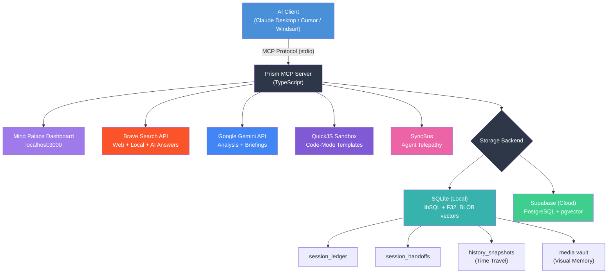

# Prism MCP — The Mind Palace for AI Agents 🧠

[](https://www.npmjs.com/package/prism-mcp-server)
[](https://registry.modelcontextprotocol.io)
[](https://glama.ai/mcp/servers/dcostenco/BCBA)
[](https://smithery.ai/server/prism-mcp-server)
[](LICENSE)
[](https://www.typescriptlang.org/)
[](https://nodejs.org/)

> **Your AI agent's memory that survives between sessions.** Prism MCP is a Model Context Protocol server that gives Claude Desktop, Cursor, Windsurf, and any MCP client **persistent memory**, **time travel**, **visual context**, **multi-agent sync**, and **multi-engine search** — all running locally with zero cloud dependencies.
>
> Built with **SQLite + F32_BLOB vector search**, **optimistic concurrency control**, **MCP Prompts & Resources**, **auto-compaction**, **Gemini-powered Morning Briefings**, and optional **Supabase cloud sync**.

---

## What's New in v2.3.8 — LangGraph Research Agent 🔬

| Feature | Description |
|---|---|
| 🤖 **LangGraph Research Agent** | New `examples/langgraph-agent/` — a 5-node agentic research agent (plan→search→analyze→decide→answer→save) with autonomous looping, MCP integration, and persistent memory. |
| 🧠 **Agentic Memory** | `save_session` node persists research findings to a ledger — the agent doesn't just answer and forget. Routes to Prism's `session_save_ledger` in MCP-connected mode. |
| 🔌 **MCP Client Bridge** | Raw JSON-RPC 2.0 client (`mcp_client.py`) for Python 3.9+ — dynamically discovers and wraps Prism MCP tools as LangChain `StructuredTool` objects. |
| 🔧 **Storage Abstraction Fix** | Resource/Prompt handlers now route through `getStorage()` instead of calling Supabase directly — eliminates EOF crashes when reading `memory://` resources. |
| 🛡️ **Error Boundaries** | Resource handlers catch errors gracefully and return proper MCP error responses (`isError: true`) instead of crashing the server process. |

<details>
<summary><strong>What's in v2.2.0</strong></summary>

| Feature | Description |
|---|---|
| 🩺 **Brain Health Check** | `session_health_check` — like Unix `fsck` for your agent's memory. Detects missing embeddings, duplicate entries, orphaned handoffs, and stale rollups. Use `auto_fix: true` to repair automatically. |
| 📊 **Mind Palace Health** | Brain health indicator on the Mind Palace Dashboard — see your memory integrity at a glance. |

</details>

<details>
<summary><strong>What's in v2.0 "Mind Palace"</strong></summary>

| Feature | Description |
|---|---|
| 🏠 **Local-First SQLite** | Run Prism entirely locally with zero cloud dependencies. Full vector search (libSQL F32_BLOB) and FTS5 included. |
| 🔮 **Mind Palace UI** | A beautiful glassmorphism dashboard at `localhost:3000` to inspect your agent's memory, visual vault, and Git drift. |
| 🕰️ **Time Travel** | `memory_history` and `memory_checkout` act like `git revert` for your agent's brain — full version history with OCC. |
| 🖼️ **Visual Memory** | Agents can save screenshots to a local media vault. Auto-capture mode snapshots your local dev server on every handoff save. |
| 📡 **Agent Telepathy** | Multi-client sync: if your agent in Cursor saves state, Claude Desktop gets a live notification instantly. |
| 🌅 **Morning Briefing** | Gemini auto-synthesizes a 3-bullet action plan if it's been >4 hours since your last session. |
| 📝 **Code Mode Templates** | 8 pre-built QuickJS extraction templates for GitHub, Jira, OpenAPI, Slack, CSV, and DOM parsing — zero reasoning tokens. |
| 🔍 **Reality Drift Detection** | Prism captures Git state on save and warns if files changed outside the agent's view. |

</details>

---

## How Prism Compares

| Feature | **Prism MCP** | [MCP Memory](https://github.com/modelcontextprotocol/servers/tree/main/src/memory) | [Mem0](https://github.com/mem0ai/mem0) | [Mnemory](https://github.com/fpytloun/mnemory) | [Basic Memory](https://github.com/basicmachines-co/basic-memory) |
|---|---|---|---|---|---|
| **Pricing** | ✅ Free & open source (MIT) | ✅ Free & open source (MIT) | Freemium (free 10K memories; paid Pro) | ✅ Free & open source | Freemium (OSS core free; paid Pro) |
| **Storage** | SQLite (local) + Supabase (cloud) | JSON file | Postgres + Qdrant (hosted or self-hosted) | Qdrant + S3/MinIO | Markdown files |
| **Zero Config** | ✅ `npx -y prism-mcp-server` | ✅ | ❌ Requires Qdrant/Postgres | ✅ `uvx mnemory` | ✅ `pip install basic-memory` |
| **Semantic Search** | ✅ F32_BLOB vectors + FTS5 | ❌ | ✅ pgvector | ✅ Qdrant vectors | ❌ Text search only |
| **Knowledge Graph** | ✅ Neural Graph (Vis.js dashboard) | ✅ Entity/Relation model | ❌ | ✅ Relationship graph | ✅ Markdown links |
| **Time Travel** | ✅ `memory_history` / `memory_checkout` | ❌ | ❌ | ❌ | ❌ |
| **Fact Merging** | ✅ Async Gemini (fire-and-forget) | ❌ | ✅ Built-in | ✅ Contradiction resolution | ❌ |
| **Security Scan** | ✅ Prompt injection detection | ❌ | ❌ | ✅ Anti-injection in fsck | ❌ |
| **Health Check** | ✅ `session_health_check` (fsck) | ❌ | ❌ | ✅ 3-phase fsck | ❌ |
| **Visual Dashboard** | ✅ Mind Palace (localhost:3000) | ❌ | ✅ Cloud dashboard | ✅ Management UI | ❌ |
| **Multi-Agent Sync** | ✅ Real-time cross-client | ❌ | ❌ | ❌ Per-user isolation | ❌ |
| **Visual Memory** | ✅ Screenshot vault + auto-capture | ❌ | ❌ | ✅ Artifact store | ❌ |
| **Auto-Compaction** | ✅ Gemini rollups | ❌ | ❌ | ❌ | ❌ |
| **Morning Briefing** | ✅ Gemini synthesis | ❌ | ❌ | ❌ | ❌ |
| **OCC (Concurrency)** | ✅ Version-based | ❌ | ❌ | ❌ | ❌ |
| **MCP Native** | ✅ stdio (Claude Desktop, Cursor) | ✅ stdio | ❌ Python SDK / REST | ✅ HTTP + MCP | ✅ stdio |
| **Language** | TypeScript | TypeScript | Python | Python | Python |

> **When to choose Prism MCP:** You want MCP-native memory with zero infrastructure overhead, progressive context loading, and enterprise features (OCC, compaction, time travel, security scanning) that work directly in Claude Desktop — without running Qdrant, Postgres, or cloud services.

---

## Quick Start (Zero Config — Local Mode)

Get the MCP server running with Claude Desktop or Cursor in **under 60 seconds**. No API keys required for basic local memory!

### Option A: npx (Fastest)

Add this to your `claude_desktop_config.json` or `.cursor/mcp.json`:

```json
{
  "mcpServers": {
    "prism-mcp": {
      "command": "npx",
      "args": ["-y", "prism-mcp-server"]
    }
  }
}
```

That's it — **zero env vars needed** for local memory, Mind Palace dashboard, Time Travel, and Telepathy.

> **Optional API keys:** Add `BRAVE_API_KEY` for web search, `GOOGLE_API_KEY` for semantic search + Morning Briefings + paper analysis. See [Environment Variables](#environment-variables) for the full list.

### Option B: Cloud Sync Mode (Supabase)

To share memory across multiple machines or teams, switch to Supabase:

```json
{
  "mcpServers": {
    "prism-mcp": {
      "command": "npx",
      "args": ["-y", "prism-mcp-server"],
      "env": {
        "PRISM_STORAGE": "supabase",
        "SUPABASE_URL": "https://your-project.supabase.co",
        "SUPABASE_KEY": "your-supabase-anon-key"
      }
    }
  }
}
```

### Option C: Clone & Build (Full Control)

```bash
git clone https://github.com/dcostenco/prism-mcp.git
cd prism-mcp
npm install
npm run build
```

Then add to your MCP config:

```json
{
  "mcpServers": {
    "prism-mcp": {
      "command": "node",
      "args": ["/absolute/path/to/prism-mcp/dist/server.js"],
      "env": {
        "BRAVE_API_KEY": "your-brave-api-key",
        "GOOGLE_API_KEY": "your-google-gemini-key"
      }
    }
  }
}
```

### Restart your MCP client. That's it — all tools are now available.

---

## 🔮 The Mind Palace Dashboard

Prism MCP spins up a lightweight, zero-dependency HTTP server alongside the MCP stdio process. No frameworks, no build step — just pure glassmorphism CSS served as a template literal.

Open **`http://localhost:3000`** in your browser to see exactly what your AI agent is thinking:

- **Current State & TODOs** — See the exact context injected into the LLM's prompt
- **Git Drift Detection** — Alerts you if you've modified code outside the agent's view
- **Morning Briefing** — AI-synthesized action plan from your last sessions
- **Time Travel Timeline** — Browse historical handoff states and revert any version
- **Visual Memory Vault** — Browse UI screenshots and auto-captured HTML states
- **Session Ledger** — Full audit trail of every decision your agent has made

The dashboard auto-discovers all your projects and updates in real time.

---

## Integration Examples

Copy-paste configs for popular MCP clients. All configs use the `npx` method.

<details>
<summary><strong>Claude Desktop</strong></summary>

Add to your `claude_desktop_config.json`:

```json
{
  "mcpServers": {
    "prism-mcp": {
      "command": "npx",
      "args": ["-y", "prism-mcp-server"],
      "env": {}
    }
  }
}
```

</details>

<details>
<summary><strong>Cursor</strong></summary>

Add to `.cursor/mcp.json` in your project root (or `~/.cursor/mcp.json` for global):

```json
{
  "mcpServers": {
    "prism-mcp": {
      "command": "npx",
      "args": ["-y", "prism-mcp-server"],
      "env": {}
    }
  }
}
```

</details>

<details>
<summary><strong>Windsurf</strong></summary>

Add to `~/.codeium/windsurf/mcp_config.json`:

```json
{
  "mcpServers": {
    "prism-mcp": {
      "command": "npx",
      "args": ["-y", "prism-mcp-server"],
      "env": {}
    }
  }
}
```

</details>

<details>
<summary><strong>VS Code + Continue / Cline</strong></summary>

Add to your Continue `config.json` or Cline MCP settings:

```json
{
  "mcpServers": {
    "prism-mcp": {
      "command": "npx",
      "args": ["-y", "prism-mcp-server"],
      "env": {
        "PRISM_STORAGE": "local",
        "BRAVE_API_KEY": "your-brave-api-key"
      }
    }
  }
}
```

</details>

---

## Claude Code + Gemini Startup Compatibility

If you want consistent behavior across clients, treat startup in two phases:

1. **Server availability**: ensure `prism-mcp` is enabled in MCP config so tools are available.
2. **Context hydration**: explicitly call `session_load_context` at session start.

Recommended startup call:

```json
{
  "projectName": "<your-project>",
  "level": "standard"
}
```

Important distinction:

- Auto-loading `prism-mcp` makes the server available.
- It does **not** guarantee memory context is auto-hydrated unless your client runtime/hook invokes `session_load_context`.

Client notes:

- **Gemini runtimes** may support native startup execution depending on configuration.
- **Claude Code** should use a local `SessionStart` hook in `~/.claude/settings.json` for deterministic startup context loading.

Verification pattern (same for both clients):

- Print a startup marker after successful `session_load_context` (for example, `PRISM_CONTEXT_LOADED`).
- If the marker is missing, startup hydration did not run.

---

## Use Cases

| Scenario | How Prism MCP Helps |
|----------|-------------------|
| **Long-running feature work** | Save session state at end of day, restore full context the next morning — no re-explaining |
| **Multi-agent collaboration** | Telepathy sync lets multiple agents share context in real time |
| **Consulting / multi-project** | Switch between client projects with progressive context loading |
| **Research & analysis** | Multi-engine search with 94% context reduction via sandboxed code transforms |
| **Team onboarding** | New team member's agent loads full project history via `session_load_context("deep")` |
| **Visual debugging** | Save screenshots of broken UI to visual memory — the agent remembers what it looked like |
| **Offline / air-gapped** | Full SQLite local mode with no internet dependency for memory features |

---

## Architecture



---

## Tool Reference

### Search & Analysis Tools

| Tool | Purpose |
|------|---------|
| `brave_web_search` | Real-time internet search |
| `brave_local_search` | Location-based POI discovery |
| `brave_web_search_code_mode` | JS extraction over web search results |
| `brave_local_search_code_mode` | JS extraction over local search results |
| `code_mode_transform` | Universal post-processing with **8 built-in templates** |
| `gemini_research_paper_analysis` | Academic paper analysis via Gemini |
| `brave_answers` | AI-grounded answers from Brave |

### Session Memory & Knowledge Tools

| Tool | Purpose |
|------|---------|
| `session_save_ledger` | Append immutable session log (summary, TODOs, decisions) |
| `session_save_handoff` | Upsert latest project state with OCC version tracking |
| `session_load_context` | Progressive context loading (quick / standard / deep) |
| `knowledge_search` | Semantic search across accumulated knowledge |
| `knowledge_forget` | Prune outdated or incorrect memories (4 modes + dry_run) |
| `session_search_memory` | Vector similarity search across all sessions |
| `session_compact_ledger` | Auto-compact old ledger entries via Gemini-powered summarization |

### v2.0 Advanced Memory Tools

| Tool | Purpose |
|------|---------|
| `memory_history` | Browse all historical versions of a project's handoff state |
| `memory_checkout` | Revert to any previous version (non-destructive, like `git revert`) |
| `session_save_image` | Save a screenshot/image to the visual memory vault |
| `session_view_image` | Retrieve and display a saved image from the vault |

### v2.2 Brain Health Tools

| Tool | Purpose | Key Args | Returns |
|------|---------|----------|---------|
| `session_health_check` | Scan brain for integrity issues (`fsck`) | `auto_fix` (boolean) | Health report & auto-repairs |

### Code Mode Templates (v2.1)

Instead of writing custom JavaScript, pass a `template` name for instant extraction:

| Template | Source Data | What It Extracts |
|----------|-----------|-----------------|
| `github_issues` | GitHub REST API | `#number [state] title (@author) {labels}` |
| `github_prs` | GitHub REST API | `#number [state] title (base ← head)` |
| `jira_tickets` | Jira REST API | `[KEY] summary - Status - Priority - Assignee` |
| `dom_links` | Raw HTML | All `<a>` links as markdown |
| `dom_headings` | Raw HTML | H1-H6 hierarchy with indentation |
| `api_endpoints` | OpenAPI/Swagger JSON | `[METHOD] /path - summary` |
| `slack_messages` | Slack Web API | `[timestamp] @user: message` |
| `csv_summary` | CSV text | Column names, row count, sample rows |

**Usage:** `{ "data": "<raw JSON>", "template": "github_issues" }` — no custom code needed.

---

## Environment Variables

| Variable | Required | Description |
|----------|----------|-------------|
| `BRAVE_API_KEY` | No | Brave Search Pro API key (enables web/local search tools) |
| `PRISM_STORAGE` | No | `"local"` (default) or `"supabase"` |
| `GOOGLE_API_KEY` | No | Google AI / Gemini — enables paper analysis, Morning Briefings, compaction |
| `BRAVE_ANSWERS_API_KEY` | No | Separate Brave Answers key for AI-grounded answers |
| `SUPABASE_URL` | If cloud mode | Supabase project URL |
| `SUPABASE_KEY` | If cloud mode | Supabase anon/service key |
| `PRISM_USER_ID` | No | Multi-tenant user isolation (default: `"default"`) |
| `PRISM_AUTO_CAPTURE` | No | Set `"true"` to auto-capture HTML snapshots of dev servers |
| `PRISM_CAPTURE_PORTS` | No | Comma-separated ports to scan (default: `3000,3001,5173,8080`) |

---

## Progressive Context Loading

Load only what you need — saves tokens and speeds up boot:

| Level | What You Get | Size | When to Use |
|-------|-------------|------|-------------|
| **quick** | Open TODOs + keywords | ~50 tokens | Fast check-in: "what was I working on?" |
| **standard** | Above + summary + recent decisions + knowledge cache + Git drift | ~200 tokens | **Recommended default** |
| **deep** | Above + full logs (last 5 sessions) + cross-project knowledge | ~1000+ tokens | After a long break or when you need complete history |

### Morning Briefing (Automatic)

If it's been more than 4 hours since your last session, Prism automatically:
1. Fetches the 10 most recent uncompacted ledger entries
2. Sends a notification: *"🌅 Brewing your Morning Briefing..."*
3. Uses Gemini to synthesize a 3-bullet action plan
4. Injects the briefing into the `session_load_context` response

The agent boots up knowing exactly what to do — zero prompting needed.

### Auto-Load on Session Start (Recommended)

For the best experience, configure your AI coding assistant to **automatically call `session_load_context`** at the start of every new session. This ensures your agent always boots with full project memory — no manual prompting needed.

<details>
<summary><strong>Claude Code (.clauderules / CLAUDE.md)</strong></summary>

Add this rule to your project's `.clauderules` or `CLAUDE.md`:

```markdown
## Prism MCP Memory Auto-Load (CRITICAL)
At the start of every new session, you MUST call `session_load_context`
at the `standard` level for these projects:
- `my-project`
- `my-other-project`

Do NOT skip this step.
```

</details>

<details>
<summary><strong>Gemini / Antigravity (GEMINI.md)</strong></summary>

Add this rule to your `~/.gemini/GEMINI.md` global rules file:

```markdown
## Prism MCP Memory Auto-Load (CRITICAL)
**At the start of every new session**, immediately after displaying
the startup block, you MUST call `session_load_context` (via the
`athena-public` MCP server) at the `standard` level for these projects:
- `my-project`
- `my-other-project`

This ensures accumulated project memory, pending TODOs, and key context
from previous sessions are always available. Do NOT skip this step.

**IMPORTANT:** The `athena-public` MCP server is always available.
Do NOT display any warnings or notes about MCP server availability
— just call the tools directly. Never claim the server is unavailable.
```

</details>

> **Tip:** Replace `my-project` with your actual project identifiers. You can list as many projects as you need — each one gets its own independent memory timeline.

---

## Time Travel (Version History)

Every successful handoff save creates a snapshot. You can browse and revert any version:

```
v1 → v2 → v3 → v4 (current)
              ↑
        memory_checkout(v2) → creates v5 with v2's content
```

This is a **non-destructive revert** — like `git revert`, not `git reset`. No history is ever lost.

### Usage

```json
// Browse all versions
{ "name": "memory_history", "arguments": { "project": "my-app" } }

// Revert to version 2
{ "name": "memory_checkout", "arguments": { "project": "my-app", "version": 2 } }
```

---

## Agent Telepathy (Multi-Client Sync)

When Agent A (Cursor) saves a handoff, Agent B (Claude Desktop) gets notified instantly:

- **Local Mode:** File-based IPC via SQLite polling
- **Cloud Mode:** Supabase Realtime (Postgres CDC)

No configuration needed — it just works.

---

## Reality Drift Detection

Prism captures Git state (branch + commit SHA) on every handoff save. When the agent loads context, it compares the saved state against the current working directory:

```
⚠️ REALITY DRIFT DETECTED for "my-app":
  Branch changed: feature/auth → main
  Commit changed: abc1234 → def5678
  
  The codebase has been modified since your last session.
  Re-examine before making assumptions.
```

This prevents the agent from writing code based on stale context.

---

## Visual Memory & Auto-Capture

### Manual: Save Screenshots

```json
{ "name": "session_save_image", "arguments": {
  "project": "my-app",
  "image_path": "/path/to/screenshot.png",
  "description": "Login page after CSS fix"
}}
```

### Automatic: HTML Snapshots

Set `PRISM_AUTO_CAPTURE=true` and Prism silently captures your local dev server's HTML on every handoff save. Supported formats: PNG, JPG, WebP, GIF, SVG, HTML.

---

## Knowledge Accumulation

Every `session_save_ledger` and `session_save_handoff` automatically extracts keywords using lightweight, in-process NLP (~0.020ms/call). No LLM calls, no external dependencies.

**Example:** Saving *"Fixed Stripe webhook race condition using database-backed idempotency keys"* auto-extracts:
- **Keywords:** `stripe`, `webhook`, `race`, `condition`, `database`, `idempotency`
- **Categories:** `cat:debugging`, `cat:api-integration`

### Search Knowledge

```json
{ "name": "knowledge_search", "arguments": {
  "project": "ecommerce-api",
  "category": "debugging",
  "query": "Stripe webhook"
}}
```

### Forget Bad Memories

| Mode | Example | Effect |
|------|---------|--------|
| **By project** | `project: "old-app"` | Clear all knowledge |
| **By category** | `category: "debugging"` | Forget debugging entries only |
| **By age** | `older_than_days: 30` | Forget entries older than 30 days |
| **Dry run** | `dry_run: true` | Preview what would be deleted |

---

## Supabase Setup (Cloud Mode)

<details>
<summary><strong>Step-by-step Supabase configuration</strong></summary>

### 1. Create a Supabase Project

1. Go to [supabase.com](https://supabase.com) and sign in (free tier works)
2. Click **New Project** → choose a name and password → select a region
3. Wait for provisioning (~30 seconds)

### 2. Apply Migrations

In the SQL Editor, run:
1. [`supabase/migrations/015_session_memory.sql`](supabase/migrations/015_session_memory.sql)
2. [`supabase/migrations/016_knowledge_accumulation.sql`](supabase/migrations/016_knowledge_accumulation.sql)

### 3. Get Credentials

Go to **Settings → API** and copy:
- **Project URL** (e.g. `https://abcdefg.supabase.co`)
- **anon public** key (starts with `eyJ...`)

### 4. Configure

```bash
export SUPABASE_URL="https://your-project.supabase.co"
export SUPABASE_KEY="eyJhbGciOiJIUzI1NiIsInR5cCI6IkpXVCJ9..."
export PRISM_STORAGE="supabase"
```

### Security

1. **Use the anon key** for MCP server config
2. **Enable RLS** on both tables
3. **Never commit** your `SUPABASE_KEY` to version control

</details>

---

## Hybrid Search Pipeline (Brave + Vertex AI)

<details>
<summary><strong>Enterprise search with Vertex AI Discovery Engine</strong></summary>

Prism can combine **real-time web search** (Brave) with **enterprise-curated search** (Vertex AI Discovery Engine) for a hybrid pipeline achieving **94% context reduction** and **~17K tokens saved per query**.

| Metric | Brave (Web) | Discovery Engine | Hybrid |
|--------|------------|-----------------|--------|
| Avg latency | 220ms | 1,193ms | ~1.4s |
| Raw payload | 42.4 KB | 28.9 KB | 71.3 KB |
| Reduced payload | 3.0 KB | 1.2 KB | **4.2 KB** (94% reduction) |
| Token savings | ~10,103 | ~7,097 | **~17,200 / query** |

See [`vertex-ai/`](vertex-ai/) for setup and benchmarks.

</details>

---

## Project Structure

```
├── src/
│   ├── server.ts                        # MCP server core + Mind Palace HTTP server
│   ├── config.ts                        # Environment management
│   ├── storage/
│   │   ├── interface.ts                 # StorageBackend abstraction
│   │   ├── sqlite.ts                    # SQLite local storage (libSQL + F32_BLOB)
│   │   ├── supabase.ts                  # Supabase cloud storage
│   │   └── index.ts                     # Backend factory (auto-selects based on PRISM_STORAGE)
│   ├── sync/
│   │   ├── interface.ts                 # SyncBus abstraction (Telepathy)
│   │   ├── localSync.ts                 # File-based IPC for local mode
│   │   ├── supabaseSync.ts             # Supabase Realtime CDC for cloud mode
│   │   └── factory.ts                   # Auto-selects sync backend
│   ├── dashboard/
│   │   ├── server.ts                    # Dashboard HTTP server with port recovery
│   │   └── ui.ts                        # Mind Palace glassmorphism HTML template
│   ├── templates/
│   │   └── codeMode.ts                  # 8 pre-built QuickJS extraction templates
│   ├── tools/
│   │   ├── definitions.ts               # All tool schemas (JSON Schema + type guards)
│   │   ├── handlers.ts                  # Search & analysis handlers
│   │   ├── sessionMemoryDefinitions.ts  # Memory + knowledge tool schemas
│   │   ├── sessionMemoryHandlers.ts     # Memory handlers (OCC, Time Travel, Drift, Briefing)
│   │   └── index.ts                     # Tool registration & re-exports
│   └── utils/
│       ├── braveApi.ts                  # Brave Search REST client
│       ├── googleAi.ts                  # Gemini SDK wrapper
│       ├── executor.ts                  # QuickJS sandbox executor
│       ├── autoCapture.ts               # Dev server HTML snapshot utility
│       ├── healthCheck.ts               # Brain integrity engine (v2.2.0) + security scanner (v2.3.0)
│       ├── factMerger.ts                # Async LLM contradiction resolution (v2.3.0)
│       ├── git.ts                       # Git state capture + drift detection
│       ├── embeddingApi.ts              # Embedding generation (Gemini)
│       └── keywordExtractor.ts          # Zero-dependency NLP keyword extraction
├── supabase/migrations/                 # Cloud mode SQL schemas
├── vertex-ai/                           # Vertex AI hybrid search pipeline
├── index.ts                             # Server entry point
└── package.json
```

---

## License

MIT

---

<sub>**Keywords:** MCP server, Model Context Protocol, Claude Desktop memory, persistent session memory, AI agent memory, local-first, SQLite MCP, Mind Palace, time travel, visual memory, agent telepathy, multi-agent sync, reality drift detection, morning briefing, code mode templates, cursor MCP server, windsurf MCP server, cline MCP server, pgvector semantic search, progressive context loading, MCP Prompts, MCP Resources, knowledge management AI, Brave Search MCP, Gemini analysis, optimistic concurrency control, zero config</sub>
