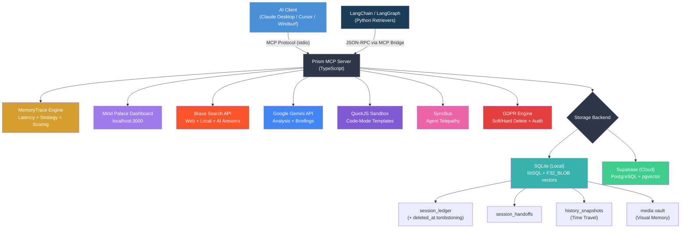

# Prism MCP — The Mind Palace for AI Agents 🧠

[](https://www.npmjs.com/package/prism-mcp-server)
[](https://registry.modelcontextprotocol.io)
[](https://glama.ai/mcp/servers/dcostenco/prism-mcp)
[](https://smithery.ai/server/prism-mcp-server)
[](LICENSE)
[](https://www.typescriptlang.org/)
[](https://nodejs.org/)

> **Your AI agent's memory that survives between sessions.** Prism MCP is a Model Context Protocol server that gives Claude Desktop, Cursor, Windsurf, and any MCP client **persistent memory**, **time travel**, **visual context**, **multi-agent sync**, **GDPR-compliant deletion**, **memory tracing**, and **LangChain integration** — all running locally with zero cloud dependencies.
>
> Built with **SQLite + F32_BLOB vector search**, **optimistic concurrency control**, **MCP Prompts & Resources**, **auto-compaction**, **Gemini-powered Morning Briefings**, **MemoryTrace explainability**, and optional **Supabase cloud sync**.

## Table of Contents

- [What's New (v4.0.0)](#whats-new-in-v400--behavioral-memory-)
- [How Prism Compares](#how-prism-compares)
- [Quick Start](#quick-start-zero-config--local-mode)
- [Mind Palace Dashboard](#-the-mind-palace-dashboard)
- [Integration Examples](#integration-examples)
- [Claude Code Integration (Hooks)](#claude-code-integration-hooks)
- [Gemini / Antigravity Integration](#gemini--antigravity-integration)
- [Use Cases](#use-cases)
- [Architecture](#architecture)
- [Tool Reference](#tool-reference)
- [Agent Hivemind — Role Usage](#agent-hivemind--role-usage)
- [LangChain / LangGraph Integration](#langchain--langgraph-integration)
- [Environment Variables](#environment-variables)
- [Boot Settings (Restart Required)](#-boot-settings-restart-required)
- [Progressive Context Loading](#progressive-context-loading)
- [Time Travel](#time-travel-version-history)
- [Agent Telepathy](#agent-telepathy-multi-client-sync)
- [Knowledge Accumulation](#knowledge-accumulation)
- [GDPR Compliance](#gdpr-compliance)
- [Observability & Tracing](#observability--tracing)
- [Supabase Setup](#supabase-setup-cloud-mode)
- [Project Structure](#project-structure)
- [Hybrid Search Pipeline](#hybrid-search-pipeline-brave--vertex-ai)
- [🚀 Roadmap](#-roadmap)

---

## What's New in v4.0.0 — Behavioral Memory 🧠

| Feature | Description |
|---|---|
| 🧠 **Active Behavioral Memory** | New `session_save_experience` tool — agents log actions, outcomes, corrections, and confidence scores. Prism tracks importance, applies decay over time, and injects behavioral warnings into context loading so agents learn from past mistakes. |
| 🎯 **Dynamic Role Resolution** | Role parameter is now fully optional across all tools. The server auto-resolves from dashboard settings via `getSetting("default_role")` — set your role once in the Mind Palace Dashboard, and it applies everywhere. No more hardcoding `role: "global"`. |
| 📏 **Token Budget** | New `max_tokens` parameter on `session_load_context` — set a token budget and the response is intelligently truncated to fit. Uses a 1 token ≈ 4 chars heuristic. |
| 📉 **Importance Decay** | Stale behavioral experiences automatically decay over time — older corrections fade in importance to keep context fresh and relevant. |
| 🔧 **Claude Code Hooks** | Refined SessionStart/Stop hook samples that reliably trigger MCP tool calls. Simplified from multi-step workflows to single imperative instructions. |

<details>
<summary><strong>What's in v3.1.0 — Memory Lifecycle 🔄</strong></summary>

| Feature | Description |
|---|---|
| 📊 **Memory Analytics** | New **Memory Analytics** card in the dashboard — 14-day sparkline chart, active sessions count, rollup savings, and average context richness. Powered by `getAnalytics()` on both SQLite and Supabase backends. |
| ⏳ **Automated Data Retention (TTL)** | Set a per-project data retention policy via `knowledge_set_retention` MCP tool or the dashboard **Lifecycle Controls** card. Entries older than the TTL are soft-deleted (GDPR-compliant `archived_at` tombstone) every 12 hours automatically. Rollups are never expired. Minimum 7 days to prevent accidental mass-delete. |
| 🗜️ **Smart Auto-Compaction** | After every `session_save_ledger`, Prism runs a background health check and triggers compaction automatically if the brain is degraded or unhealthy — gated by `compaction_auto` setting and debounced per-project to prevent concurrent Gemini calls. **Compact Now** button also available in the dashboard. |
| 📦 **PKM Export (Obsidian / Logseq)** | Export any project's full memory as a ZIP archive of Markdown files — one file per session with YAML-like frontmatter, TODOs, decisions, files-changed, and `#hashtag` keywords. Includes an `_index.md` with `[[wikilink]]` references. Click **Export ZIP** in the dashboard Lifecycle Controls card. |
| 🧪 **Expanded Test Suite** | 37 new Vitest tests (95 total) — covers analytics queries, TTL soft-delete idempotency, rollup preservation, `activeCompactions` Set memory-leak prevention, type guards, export Markdown structure, and TTL sweep scheduler contracts. |

</details>

<details>
<summary><strong>What's in v3.0.1 — Agent Identity & Brain Clean-up 🧹</strong></summary>

| Feature | Description |
|---|---|
| 🧹 **Brain Health Clean-up** | New **Fix Issues** button in the Mind Palace Dashboard's Brain Health card — detects orphaned handoffs, missing embeddings, and stale rollups, then cleans them up in one click without needing the MCP tool. |
| 👤 **Agent Identity Settings** | Dashboard Settings → Agent Identity panel lets you set a **Default Role** (`dev`, `qa`, `pm`…) and **Agent Name** (e.g. `Dmitri`). Both values auto-apply as fallbacks in all memory and Hivemind tools — no need to pass them per call. |
| 📜 **Role-Scoped Skills** | Each agent role can have its own persistent skill/rules document stored in the dashboard (⚙️ Settings → Skills). It is automatically injected into every `session_load_context` response so the agent boots with its rules pre-loaded. |
| 🔤 **Resource Formatting Fix** | `memory://{project}/handoff` resources now render as formatted plain text (Last Summary, TODOs, Keywords) instead of a raw JSON blob — readable in Claude Desktop's paperclip attach panel. |

</details>

<details>
<summary><strong>What's in v3.0.0 — Agent Hivemind 🐝</strong></summary>

| Feature | Description |
|---|---|
| 🐝 **Role-Scoped Memory** | Optional `role` parameter on ledger, handoff, and context loading — each agent role (dev, qa, pm, lead, security, ux) gets its own isolated memory lane within a project. Defaults to `'global'` for full backward compatibility. |
| 👥 **Agent Registry** | New `agent_register`, `agent_heartbeat`, `agent_list_team` tools — agents announce their presence, pulse their status, and discover who else is working on the team. Stale agents are auto-pruned after 30 minutes. |
| 🎯 **Team Roster Injection** | When loading context with a role, Prism automatically injects a "Team Roster" showing active teammates, their roles, current tasks, and last heartbeat — true multi-agent awareness without extra tool calls. |
| ⚙️ **Dashboard Settings** | New Settings modal with runtime toggles (auto-capture, theme, context depth) backed by a persistent `system_settings` key-value store. Environment variables override DB settings for safety. |
| 📡 **Hivemind Radar** | New dashboard widget showing active agents, their roles (with icons), current tasks, and heartbeat timestamps — a real-time team coordination dashboard. |
| 🔒 **Conditional Tool Registration** | `PRISM_ENABLE_HIVEMIND` env var gates Hivemind tools — users who don't need multi-agent features keep the same lean tool count as v2.x. |
| ✅ **Test Suite** | 58 tests across 4 suites (storage, tools, dashboard, load) with Vitest — includes concurrent write stress tests, role isolation verification, and 0.2ms/write performance benchmarks. |

</details>


<details>
<summary><strong>What's in v2.5.0 — Enterprise Memory 🏗️</strong></summary>

| Feature | Description |
|---|---|
| 🔍 **Memory Tracing (Phase 1)** | Every search now returns a structured `MemoryTrace` with latency breakdown (`embedding_ms`, `storage_ms`, `total_ms`), search strategy, and scoring metadata — surfaced as a separate `content[1]` block for LangSmith integration. |
| 🛡️ **GDPR Memory Deletion (Phase 2)** | New `session_forget_memory` tool with soft-delete (tombstoning via `deleted_at`) and hard-delete. Ownership guards prevent cross-user deletion. `deleted_reason` column captures GDPR Article 17 justification. Top-K Hole solved by filtering inside SQL, not post-query (ensures we always return exactly K results, rather than returning fewer because deleted items were filtered out after the vector search). |
| 🔗 **LangChain Integration (Phase 3)** | `PrismMemoryRetriever` and `PrismKnowledgeRetriever` — async-first `BaseRetriever` subclasses that wrap Prism MCP's traced search endpoints. Trace metadata flows automatically into `Document.metadata["trace"]` for LangSmith visibility. |
| 🧩 **LangGraph Research Agent** | Full example in `examples/langgraph-agent/` — a 5-node agentic research loop with MCP bridge, persistent memory, and `EnsembleRetriever` hybrid search. |

</details>

<details>
<summary><strong>What's in v2.5.1 — Version Sync & Embedding Safety</strong></summary>

| Feature | Description |
|---|---|
| 🔄 **Dynamic Versioning** | Server version is now derived from `package.json` at startup — MCP handshake, dashboard badge, and npm metadata always stay in sync. Falls back to `0.0.0` if unreadable. |
| 🛡️ **Embedding Dimension Validation** | `generateEmbedding()` now validates the returned vector is exactly 768 dimensions at runtime, catching model regressions before storing bad vectors. Removed `as any` cast in favor of proper `EmbedContentRequest` typing. |

</details>

<details>
<summary><strong>What's in v2.3.12 — Stability & Fixes</strong></summary>

| Feature | Description |
|---|---|
| 🪲 **Windows Black Screen Fix** | Fixed Python `subprocess.Popen` spawning visible Node.js terminal windows on Windows. |
| 📝 **Debug Logging** | Gated verbose startup logs behind `PRISM_DEBUG_LOGGING` for a cleaner default experience. |
| ⚡ **Excess Loading Fixes** | Performance improvements to resolve excess loading loops. |

</details>

<details>
<summary><strong>What's in v2.3.8 — LangGraph Research Agent</strong></summary>

| Feature | Description |
|---|---|
| 🤖 **LangGraph Research Agent** | New `examples/langgraph-agent/` — a 5-node agentic research agent (plan→search→analyze→decide→answer→save) with autonomous looping, MCP integration, and persistent memory. |
| 🧠 **Agentic Memory** | `save_session` node persists research findings to a ledger — the agent doesn't just answer and forget. Routes to Prism's `session_save_ledger` in MCP-connected mode. |
| 🔌 **MCP Client Bridge** | Raw JSON-RPC 2.0 client (`mcp_client.py`) for Python 3.9+ — dynamically discovers and wraps Prism MCP tools as LangChain `StructuredTool` objects. |
| 🔧 **Storage Abstraction Fix** | Resource/Prompt handlers now route through `getStorage()` instead of calling Supabase directly — eliminates EOF crashes when reading `memory://` resources. |
| 🛡️ **Error Boundaries** | Resource handlers catch errors gracefully and return proper MCP error responses (`isError: true`) instead of crashing the server process. |

</details>

<details>
<summary><strong>What's in v2.2.0</strong></summary>

| Feature | Description |
|---|---|
| 🩺 **Brain Health Check** | `session_health_check` — like Unix `fsck` for your agent's memory. Detects missing embeddings, duplicate entries, orphaned handoffs, and stale rollups. Use `auto_fix: true` to repair automatically. |
| 📊 **Mind Palace Health** | Brain health indicator on the Mind Palace Dashboard — see your memory integrity at a glance. **🧹 Fix Issues** button auto-deletes orphaned handoffs in one click. |

</details>

<details>
<summary><strong>What's in v2.0 "Mind Palace"</strong></summary>

| Feature | Description |
|---|---|
| 🏠 **Local-First SQLite** | Run Prism entirely locally with zero cloud dependencies. Full vector search (libSQL F32_BLOB) and FTS5 included. |
| 🔮 **Mind Palace UI** | A beautiful glassmorphism dashboard at `localhost:3000` to inspect your agent's memory, visual vault, and Git drift. |
| 🕰️ **Time Travel** | `memory_history` and `memory_checkout` act like `git revert` for your agent's brain — full version history with OCC. |
| 🖼️ **Visual Memory** | Agents can save screenshots to a local media vault. Auto-capture mode snapshots your local dev server on every handoff save. |
| 📡 **Agent Telepathy** | Multi-client sync: if your agent in Cursor saves state, Claude Desktop gets a live notification instantly. |
| 🌅 **Morning Briefing** | Gemini auto-synthesizes a 3-bullet action plan if it's been >4 hours since your last session. |
| 📝 **Code Mode Templates** | 8 pre-built QuickJS extraction templates for GitHub, Jira, OpenAPI, Slack, CSV, and DOM parsing — zero reasoning tokens. |
| 🔍 **Reality Drift Detection** | Prism captures Git state on save and warns if files changed outside the agent's view. |

</details>

---

> 💡 **TL;DR:** Prism MCP gives your AI agent persistent memory using a local SQLite database. No cloud accounts, no API keys, and no Postgres/Qdrant containers required. Just `npx -y prism-mcp-server` and you're running.

## How Prism Compares

| Feature | **Prism MCP** | [MCP Memory](https://github.com/modelcontextprotocol/servers/tree/main/src/memory) | [Mem0](https://github.com/mem0ai/mem0) | [Mnemory](https://github.com/fpytloun/mnemory) | [Basic Memory](https://github.com/basicmachines-co/basic-memory) |
|---|---|---|---|---|---|
| **Pricing** | ✅ Free / MIT | ✅ Free / MIT | Freemium | ✅ Free / OSS | Freemium |
| **Storage** | SQLite + Supabase | JSON file | Postgres + Qdrant | Qdrant + S3 | Markdown files |
| **Zero Config** | ✅ npx one-liner | ✅ | ❌ Qdrant/Postgres | ✅ uvx | ✅ pip |
| **Behavioral Memory** | ✅ Importance tracking | ❌ | ❌ | ❌ | ❌ |
| **Dynamic Roles** | ✅ Dashboard auto-resolve | ❌ | ❌ | ❌ | ❌ |
| **Token Budget** | ✅ max_tokens param | ❌ | ❌ | ❌ | ❌ |
| **Importance Decay** | ✅ Auto-fade stale data | ❌ | ❌ | ❌ | ❌ |
| **Semantic Search** | ✅ Vectors + FTS5 | ❌ | ✅ pgvector | ✅ Qdrant | ❌ Text only |
| **Knowledge Graph** | ✅ Neural Graph | ✅ Entity model | ❌ | ✅ Graph | ✅ MD links |
| **Time Travel** | ✅ History + checkout | ❌ | ❌ | ❌ | ❌ |
| **Fact Merging** | ✅ Gemini async | ❌ | ✅ Built-in | ✅ Contradiction | ❌ |
| **Security Scan** | ✅ Injection detection | ❌ | ❌ | ✅ Anti-injection | ❌ |
| **Health Check** | ✅ fsck tool | ❌ | ❌ | ✅ 3-phase fsck | ❌ |
| **Visual Dashboard** | ✅ Mind Palace | ❌ | ✅ Cloud UI | ✅ Mgmt UI | ❌ |
| **Multi-Agent Sync** | ✅ Real-time | ❌ | ❌ | ❌ Per-user | ❌ |
| **Visual Memory** | ✅ Screenshot vault | ❌ | ❌ | ✅ Artifacts | ❌ |
| **Auto-Compaction** | ✅ Gemini rollups | ❌ | ❌ | ❌ | ❌ |
| **Morning Briefing** | ✅ Gemini synthesis | ❌ | ❌ | ❌ | ❌ |
| **OCC (Concurrency)** | ✅ Version-based | ❌ | ❌ | ❌ | ❌ |
| **GDPR Compliance** | ✅ Soft/hard delete | ❌ | ❌ | ❌ | ❌ |
| **Memory Tracing** | ✅ Latency breakdown | ❌ | ❌ | ❌ | ❌ |
| **LangChain** | ✅ BaseRetriever | ❌ | ❌ | ❌ | ❌ |
| **MCP Native** | ✅ stdio | ✅ stdio | ❌ Python SDK | ✅ HTTP + MCP | ✅ stdio |
| **Language** | TypeScript | TypeScript | Python | Python | Python |

> **When to choose Prism MCP:** You want MCP-native memory with zero infrastructure overhead, progressive context loading, and enterprise features (OCC, compaction, time travel, security scanning) that work directly in Claude Desktop — without running Qdrant, Postgres, or cloud services.

---

## Quick Start (Zero Config — Local Mode)

Get the MCP server running with Claude Desktop or Cursor in **under 60 seconds**. No API keys required for basic local memory!

### Option A: npx (Fastest)

Add this to your `claude_desktop_config.json` or `.cursor/mcp.json`:

```json
{
  "mcpServers": {
    "prism-mcp": {
      "command": "npx",
      "args": ["-y", "prism-mcp-server"]
    }
  }
}
```

That's it — **zero env vars needed** for local memory, Mind Palace dashboard, Time Travel, and Telepathy.

> **Optional API keys:** Add `BRAVE_API_KEY` for web search, `GOOGLE_API_KEY` for semantic search + Morning Briefings + paper analysis. See [Environment Variables](#environment-variables) for the full list.

### Option B: Cloud Sync Mode (Supabase)

To share memory across multiple machines or teams, switch to Supabase:

```json
{
  "mcpServers": {
    "prism-mcp": {
      "command": "npx",
      "args": ["-y", "prism-mcp-server"],
      "env": {
        "PRISM_STORAGE": "supabase",
        "SUPABASE_URL": "https://your-project.supabase.co",
        "SUPABASE_KEY": "your-supabase-anon-key"
      }
    }
  }
}
```

### Option C: Clone & Build (Full Control)

```bash
git clone https://github.com/dcostenco/prism-mcp.git
cd prism-mcp
npm install
npm run build
```

Then add to your MCP config:

```json
{
  "mcpServers": {
    "prism-mcp": {
      "command": "node",
      "args": ["/absolute/path/to/prism-mcp/dist/server.js"],
      "env": {
        "BRAVE_API_KEY": "your-brave-api-key",
        "GOOGLE_API_KEY": "your-google-gemini-key"
      }
    }
  }
}
```

**Restart your MCP client. That's it — all tools are now available.**

---

## 🔮 The Mind Palace Dashboard

Prism MCP spins up a lightweight, zero-dependency HTTP server alongside the MCP stdio process. No frameworks, no build step — just pure glassmorphism CSS served as a template literal.

Open **`http://localhost:3000`** in your browser to see exactly what your AI agent is thinking:


- **Current State & TODOs** — See the exact context injected into the LLM's prompt
- **Agent Identity Chip** — Header shows your active role + name (e.g. `🛠️ dev · Antigravity`); click to open Settings
- **Brain Health 🩺** — Memory integrity status at a glance; **🧹 Fix Issues** button auto-cleans orphaned handoffs in one click
- **Git Drift Detection** — Alerts you if you've modified code outside the agent's view
- **Morning Briefing** — AI-synthesized action plan from your last sessions
- **Time Travel Timeline** — Browse historical handoff states and revert any version
- **Visual Memory Vault** — Browse UI screenshots and auto-captured HTML states
- **Session Ledger** — Full audit trail of every decision your agent has made
- **Neural Graph** — Force-directed visualization of project ↔ keyword associations
- **Hivemind Radar** — Real-time active agent roster with role, task, and heartbeat

The dashboard auto-discovers all your projects and updates in real time.

---

## Integration Examples

Copy-paste configs for popular MCP clients. All configs use the `npx` method.

<details>
<summary><strong>Claude Desktop</strong></summary>

Add to your `claude_desktop_config.json`:

```json
{
  "mcpServers": {
    "prism-mcp": {
      "command": "npx",
      "args": ["-y", "prism-mcp-server"],
      "env": {}
    }
  }
}
```

</details>

<details>
<summary><strong>Cursor</strong></summary>

Add to `.cursor/mcp.json` in your project root (or `~/.cursor/mcp.json` for global):

```json
{
  "mcpServers": {
    "prism-mcp": {
      "command": "npx",
      "args": ["-y", "prism-mcp-server"],
      "env": {}
    }
  }
}
```

</details>

<details>
<summary><strong>Windsurf</strong></summary>

Add to `~/.codeium/windsurf/mcp_config.json`:

```json
{
  "mcpServers": {
    "prism-mcp": {
      "command": "npx",
      "args": ["-y", "prism-mcp-server"],
      "env": {}
    }
  }
}
```

</details>

<details>
<summary><strong>VS Code + Continue / Cline</strong></summary>

Add to your Continue `config.json` or Cline MCP settings:

```json
{
  "mcpServers": {
    "prism-mcp": {
      "command": "npx",
      "args": ["-y", "prism-mcp-server"],
      "env": {
        "PRISM_STORAGE": "local",
        "BRAVE_API_KEY": "your-brave-api-key"
      }
    }
  }
}
```

</details>

---

## Claude Code Integration (Hooks)

Claude Code supports **lifecycle hooks** in `~/.claude/settings.json` that fire automatically at session start and end. Use these to auto-hydrate and persist Prism memory without manual prompting.

### SessionStart Hook

Automatically loads context when a new session begins:

```json
{
  "hooks": {
    "SessionStart": [
      {
        "matcher": "*",
        "hooks": [
          {
            "type": "command",
            "command": "python3 -c \"import json; print(json.dumps({'continue': True, 'suppressOutput': False, 'systemMessage': 'You MUST call mcp__prism-mcp__session_load_context twice before responding to the user: first with project=my-project level=standard, then with project=my-other-project level=standard. Do not skip this.'}))\"",
            "timeout": 10
          }
        ]
      }
    ]
  }
}
```

### Stop Hook

Automatically saves session memory when a session ends:

```json
{
  "hooks": {
    "Stop": [
      {
        "matcher": "*",
        "hooks": [
          {
            "type": "command",
            "command": "python3 -c \"import json; print(json.dumps({'continue': True, 'suppressOutput': False, 'systemMessage': 'MANDATORY END WORKFLOW: 1) Call mcp__prism-mcp__session_save_ledger with project and summary. 2) Call mcp__prism-mcp__session_save_handoff with expected_version set to the loaded version.'}))\"",
            "timeout": 10
          }
        ]
      }
    ]
  }
}
```

### How the Hooks Work

The hook `command` runs a Python one-liner that returns a JSON object to Claude Code:

| Field | Purpose |
|---|---|
| `continue: true` | Tell Claude Code to proceed (don't abort the session) |
| `suppressOutput: false` | Show the hook result to the agent |
| `systemMessage` | Instruction injected as a system message — the agent follows it |

The agent receives the `systemMessage` as an instruction and executes the tool calls. The server resolves the agent's **role** and **name** automatically from the dashboard — no need to specify them in the hook.

### Role Resolution — No Hardcoding Needed

Prism resolves the agent role dynamically using a priority chain:

```
explicit tool argument  →  dashboard setting  →  "global" (default)
```

1. **Explicit arg wins** — if `role` is passed in the tool call, it's used directly.
2. **Dashboard fallback** — if `role` is omitted, the server calls `getSetting("default_role")` and uses whatever role you configured in the **Mind Palace Dashboard ⚙️ Settings → Agent Identity**.
3. **Final default** — if no dashboard setting exists, falls back to `"global"`.

Change your role once in the dashboard, and it automatically applies to every session — CLI, extension, and all MCP clients.

### Verification

If hydration ran successfully, the agent's output will include:
- A `[👤 AGENT IDENTITY]` block showing your dashboard-configured role and name
- `PRISM_CONTEXT_LOADED` marker text

If the marker is missing, the hook did not fire or the MCP server is not connected.

---

## Gemini / Antigravity Integration

Gemini-based clients (like Antigravity) use `GEMINI.md` global rules or user rules for startup behavior. The server resolves the role from the dashboard automatically.

### Global Rules (`~/.gemini/GEMINI.md`)

```markdown
## Prism MCP Memory Auto-Load (CRITICAL)
At the start of every new session, call `mcp__prism-mcp__session_load_context`
for these projects:
- `my-project` (level=standard)
- `my-other-project` (level=standard)

After both succeed, print PRISM_CONTEXT_LOADED.
```

### User Rules (Antigravity Settings)

If your Gemini client supports user rules, add the same instructions there. The key points:

1. **Call `session_load_context` as a tool** — not `read_resource`. Only the tool returns the `[👤 AGENT IDENTITY]` block.
2. **Verify** — confirm the response includes `version` and `last_summary`.

### Session End

At the end of each session, save state:

```markdown
## Session End Protocol
1) Call `mcp__prism-mcp__session_save_ledger` with project and summary.
2) Call `mcp__prism-mcp__session_save_handoff` with expected_version from the loaded version.
```

---

## Use Cases

| Scenario | How Prism MCP Helps |
|----------|-------------------|
| **Long-running feature work** | Save session state at end of day, restore full context the next morning — no re-explaining |
| **Multi-agent collaboration** | Telepathy sync lets multiple agents share context in real time |
| **Consulting / multi-project** | Switch between client projects with progressive context loading |
| **Research & analysis** | Multi-engine search with 94% context reduction via sandboxed code transforms |
| **Team onboarding** | New team member's agent loads full project history via `session_load_context("deep")` |
| **Visual debugging** | Save screenshots of broken UI to visual memory — the agent remembers what it looked like |
| **Offline / air-gapped** | Full SQLite local mode with no internet dependency for memory features |

---

## Architecture



---

## Tool Reference

### Search & Analysis Tools

| Tool | Purpose |
|------|---------|
| `brave_web_search` | Real-time internet search |
| `brave_local_search` | Location-based POI discovery |
| `brave_web_search_code_mode` | JS extraction over web search results |
| `brave_local_search_code_mode` | JS extraction over local search results |
| `code_mode_transform` | Universal post-processing with **8 built-in templates** |
| `gemini_research_paper_analysis` | Academic paper analysis via Gemini |
| `brave_answers` | AI-grounded answers from Brave |

### Session Memory & Knowledge Tools

| Tool | Purpose |
|------|---------|
| `session_save_ledger` | Append immutable session log (summary, TODOs, decisions) |
| `session_save_handoff` | Upsert latest project state with OCC version tracking |
| `session_load_context` | Progressive context loading (quick / standard / deep) |
| `knowledge_search` | Semantic search across accumulated knowledge |
| `knowledge_forget` | Prune outdated or incorrect memories (4 modes + dry_run) |
| `session_search_memory` | Vector similarity search across all sessions |
| `session_compact_ledger` | Auto-compact old ledger entries via Gemini-powered summarization |

### v3.1 Lifecycle Tools

| Tool | Purpose |
|------|---------|
| `knowledge_set_retention` | Set a per-project TTL retention policy (0 = disabled, min 7 days). Immediately expires overdue entries. |

### v2.0 Advanced Memory Tools

| Tool | Purpose |
|------|---------|
| `memory_history` | Browse all historical versions of a project's handoff state |
| `memory_checkout` | Revert to any previous version (non-destructive, like `git revert`) |
| `session_save_image` | Save a screenshot/image to the visual memory vault |
| `session_view_image` | Retrieve and display a saved image from the vault |

### v2.2 Brain Health Tools

| Tool | Purpose | Key Args | Returns |
|------|---------|----------|---------|
| `session_health_check` | Scan brain for integrity issues (`fsck`) | `project`, `auto_fix` (boolean) | Health report & auto-repairs |

The **Mind Palace Dashboard** also shows a live **Brain Health 🩺** card for every project:

- **Status indicator** — `✅ Healthy` or `⚠️ Issues detected` with entry/handoff/rollup counts
- **🧹 Fix Issues button** — appears automatically when issues are detected; click to clean up orphaned handoffs and stale rollups in one click, no MCP tool call required
- **No issues found** — shown in green when memory integrity is confirmed

The tool and dashboard button both call the same repair logic — the dashboard button is simply a zero-friction shortcut for common maintenance.

### v2.5 Enterprise Memory Tools

| Tool | Purpose | Key Args | Returns |
|------|---------|----------|---------|
| `session_forget_memory` | GDPR-compliant deletion (soft/hard) | `memory_id`, `hard_delete`, `reason` | Deletion confirmation + audit |
| `session_search_memory` | Semantic search with `enable_trace` | `query`, `enable_trace` | Results + `MemoryTrace` in `content[1]` |
| `knowledge_search` | Knowledge search with `enable_trace` | `query`, `enable_trace` | Results + `MemoryTrace` in `content[1]` |

### Code Mode Templates (v2.1)

Instead of writing custom JavaScript, pass a `template` name for instant extraction:

| Template | Source Data | What It Extracts |
|----------|-----------|-----------------|
| `github_issues` | GitHub REST API | `#number [state] title (@author) {labels}` |
| `github_prs` | GitHub REST API | `#number [state] title (base ← head)` |
| `jira_tickets` | Jira REST API | `[KEY] summary - Status - Priority - Assignee` |
| `dom_links` | Raw HTML | All `<a>` links as markdown |
| `dom_headings` | Raw HTML | H1-H6 hierarchy with indentation |
| `api_endpoints` | OpenAPI/Swagger JSON | `[METHOD] /path - summary` |
| `slack_messages` | Slack Web API | `[timestamp] @user: message` |
| `csv_summary` | CSV text | Column names, row count, sample rows |

**Tool Arguments:** `{ "data": "<raw JSON>", "template": "github_issues" }` — no custom code needed.

---

## Agent Hivemind — Role Usage

Role-scoped memory lets multiple agents work on the same project without stepping on each other's memory. Each role gets its own isolated memory lane. Defaults to `global` for full backward compatibility.

### Available Roles

| Role | Use for |
|------|---------|
| `dev` | Development agent |
| `qa` | Testing / QA agent |
| `pm` | Product management |
| `lead` | Tech lead / orchestrator |
| `security` | Security review |
| `ux` | Design / UX |
| `global` | Default — shared, no isolation |

Custom role strings are also supported (e.g. `"docs"`, `"ml"`).

### Using Roles with Memory Tools

Just add `"role"` to any of the core memory tools:

```json
// Save a ledger entry as the "dev" agent
{ "name": "session_save_ledger", "arguments": {
  "project": "my-app",
  "role": "dev",
  "conversation_id": "abc123",
  "summary": "Fixed the auth race condition"
}}

// Load context scoped to your role
// Also injects a Team Roster showing active teammates
{ "name": "session_load_context", "arguments": {
  "project": "my-app",
  "role": "dev",
  "level": "standard"
}}

// Save handoff as the "qa" agent
{ "name": "session_save_handoff", "arguments": {
  "project": "my-app",
  "role": "qa",
  "last_summary": "Ran regression suite — 2 failures in auth module"
}}
```

### Hivemind Coordination Tools

> **Requires:** `PRISM_ENABLE_HIVEMIND=true` (Boot Setting — restart required)

```json
// Announce yourself to the team at session start
{ "name": "agent_register", "arguments": {
  "project": "my-app",
  "role": "dev",
  "agent_name": "Dev Agent #1",
  "current_task": "Refactoring auth module"
}}

// Pulse every ~5 min to stay visible (agents pruned after 30 min)
{ "name": "agent_heartbeat", "arguments": {
  "project": "my-app",
  "role": "dev",
  "current_task": "Now writing tests"
}}

// See everyone on the team
{ "name": "agent_list_team", "arguments": {
  "project": "my-app"
}}
```

### How Role Isolation Works

- `session_load_context` with `role: "dev"` only sees entries saved with `role: "dev"`
- The `global` role is a shared pool — anything saved without a role goes here
- When loading *with* a role, Prism auto-injects a **Team Roster** block listing active teammates, roles, and tasks — no extra tool call needed
- The Hivemind Radar widget in the Mind Palace dashboard shows agent activity in real time

### Setting Your Agent Identity

The easiest way to configure your role and name is via the **Mind Palace Dashboard ⚙️ Settings → Agent Identity**:

- **Default Role** — dropdown to select `dev`, `qa`, `pm`, `lead`, `security`, `ux`, or `global`
- **Agent Name** — free text for your display name (e.g. `Dmitri`, `Dev Alex`, `QA Bot`)

Once set, **all memory and Hivemind tools automatically use these values** as fallbacks — no need to pass `role` or `agent_name` in every tool call.

> **Priority order:** explicit tool arg → dashboard setting → `"global"` (default)

**Alternative — hardcode in your startup rules** (if you prefer prompt-level config):

```markdown
## Prism MCP Memory Auto-Load (CRITICAL)
At the start of every new session, call session_load_context with:
- project: "my-app", role: "dev"
- project: "my-other-project", role: "dev"
```

> **Tip:** For true multi-agent setups, each AI instance has its own Mind Palace dashboard — set a different identity per agent there rather than managing it in prompts.

---

## LangChain / LangGraph Integration

Prism MCP includes first-class Python adapters for the LangChain ecosystem, located in `examples/langgraph-agent/`:

| Component | File | Purpose |
|-----------|------|---------|
| **MCP Bridge** | `mcp_client.py` | JSON-RPC 2.0 client with `call_tool()` and `call_tool_raw()` (preserves `MemoryTrace`) |
| **Semantic Retriever** | `prism_retriever.py` | `PrismMemoryRetriever(BaseRetriever)` — async-first vector search |
| **Keyword Retriever** | `prism_retriever.py` | `PrismKnowledgeRetriever(BaseRetriever)` — FTS5 keyword search |
| **Forget Tool** | `tools.py` | `forget_memory()` — GDPR deletion bridge |
| **Research Agent** | `agent.py` | 5-node LangGraph agent (plan→search→analyze→decide→answer→save) |

### Hybrid Search with EnsembleRetriever

Combine both retrievers for hybrid (semantic + keyword) search with a single line:

```python
from langchain.retrievers import EnsembleRetriever
from prism_retriever import PrismMemoryRetriever, PrismKnowledgeRetriever

retriever = EnsembleRetriever(
    retrievers=[PrismMemoryRetriever(...), PrismKnowledgeRetriever(...)],
    weights=[0.7, 0.3],  # 70% semantic, 30% keyword
)
```

### MemoryTrace in LangSmith

When `enable_trace=True`, each `Document.metadata["trace"]` contains:

```json
{
  "strategy": "vector_cosine_similarity",
  "latency": { "embedding_ms": 45, "storage_ms": 12, "total_ms": 57 },
  "result_count": 5,
  "threshold": 0.7
}
```

This metadata flows automatically into LangSmith traces for observability.

### Async Architecture

The retrievers use `_aget_relevant_documents` as the primary path with `asyncio.to_thread()` to wrap the synchronous MCP bridge. This prevents the `RuntimeError: This event loop is already running` crash that plagues most LangGraph deployments.

---

## Environment Variables

| Variable | Required | Description |
|----------|----------|-------------|
| `BRAVE_API_KEY` | No | Brave Search Pro API key (enables web/local search tools) |
| `PRISM_STORAGE` | No | `"local"` (default) or `"supabase"` — **requires restart** |
| `PRISM_ENABLE_HIVEMIND` | No | Set `"true"` to enable multi-agent Hivemind tools — **requires restart** |
| `GOOGLE_API_KEY` | No | Google AI / Gemini — enables paper analysis, Morning Briefings, compaction |
| `BRAVE_ANSWERS_API_KEY` | No | Separate Brave Answers key for AI-grounded answers |
| `SUPABASE_URL` | If cloud mode | Supabase project URL |
| `SUPABASE_KEY` | If cloud mode | Supabase anon/service key |
| `PRISM_USER_ID` | No | Multi-tenant user isolation (default: `"default"`) |
| `PRISM_AUTO_CAPTURE` | No | Set `"true"` to auto-capture HTML snapshots of dev servers |
| `PRISM_CAPTURE_PORTS` | No | Comma-separated ports to scan (default: `3000,3001,5173,8080`) |
| `PRISM_DEBUG_LOGGING` | No | Set `"true"` to enable verbose debug logs (default: quiet) |

---

## ⚡ Boot Settings (Restart Required)

Some settings affect how Prism **initializes at startup** and cannot be changed at runtime. Prism stores these in a lightweight, dedicated SQLite database (`~/.prism-mcp/prism-config.db`) that is read **before** the main storage backend is selected — solving the chicken-and-egg problem of needing config before the config store is ready.

> **⚠️ You must restart the Prism MCP server after changing any Boot Setting.** The Mind Palace dashboard labels these with a **"Restart Required"** badge.

| Setting | Dashboard Control | Environment Override | Description |
|---------|------------------|---------------------|-------------|
| `PRISM_STORAGE` | ⚙️ Storage Backend dropdown | `PRISM_STORAGE=supabase` | Switch between `local` (SQLite) and `supabase` (cloud) |
| `PRISM_ENABLE_HIVEMIND` | ⚙️ Hivemind Mode toggle | `PRISM_ENABLE_HIVEMIND=true` | Enable/disable multi-agent coordination tools |

### How Boot Settings Work

1. **Dashboard saves the setting** → written to `~/.prism-mcp/prism-config.db` immediately
2. **You restart the MCP server** → server reads the config DB at startup, selects backend/features
3. **Environment variables always win** → if `PRISM_STORAGE` is set in your MCP config JSON, it overrides the dashboard value

```
Priority: env var in MCP config JSON  >  Dashboard (prism-config.db)  >  default (local)
```

### Runtime Settings (no restart needed)

These settings take effect immediately without a restart:

| Setting | Description |
|---------|-------------|
| Dashboard Theme | Visual theme for the Mind Palace (`dark`, `midnight`, `purple`) |
| Context Depth | Default level for `session_load_context` (`quick`, `standard`, `deep`) |
| Auto-Capture HTML | Snapshot local dev server HTML on every handoff save |

---

## Progressive Context Loading

Load only what you need — saves tokens and speeds up boot:

| Level | What You Get | Size | When to Use |
|-------|-------------|------|-------------|
| **quick** | Open TODOs + keywords | ~50 tokens | Fast check-in: "what was I working on?" |
| **standard** | Above + summary + recent decisions + knowledge cache + Git drift | ~200 tokens | **Recommended default** |
| **deep** | Above + full logs (last 5 sessions) + cross-project knowledge | ~1000+ tokens | After a long break or when you need complete history |

### Morning Briefing (Automatic)

If it's been more than 4 hours since your last session, Prism automatically:
1. Fetches the 10 most recent uncompacted ledger entries
2. Sends a notification: *"🌅 Brewing your Morning Briefing..."*
3. Uses Gemini to synthesize a 3-bullet action plan
4. Injects the briefing into the `session_load_context` response

The agent boots up knowing exactly what to do — zero prompting needed.

### Auto-Load on Session Start (Recommended)

For the best experience, configure your AI coding assistant to **automatically call `session_load_context`** at the start of every new session. This ensures your agent always boots with full project memory — no manual prompting needed.

See the full setup guides for each client:
- **[Claude Code Integration (Hooks)](#claude-code-integration-hooks)** — `SessionStart` and `Stop` hook JSON samples for `~/.claude/settings.json`
- **[Gemini / Antigravity Integration](#gemini--antigravity-integration)** — global rules for `~/.gemini/GEMINI.md` or user rules

> **Key principle:** Never hardcode a `role` in your hooks or rules. Set your role once in the **Mind Palace Dashboard ⚙️ Settings → Agent Identity**, and Prism automatically resolves it for every tool call across all clients. See [Role Resolution](#role-resolution--no-hardcoding-needed).

> **Tip:** Replace `my-project` with your actual project identifiers. You can list as many projects as you need — each one gets its own independent memory timeline.

---

## Time Travel (Version History)

Every successful handoff save creates a snapshot. You can browse and revert any version:

```
v1 → v2 → v3 → v4 (current)
              ↑
        memory_checkout(v2) → creates v5 with v2's content
```

This is a **non-destructive revert** — like `git revert`, not `git reset`. No history is ever lost.

### Usage

```json
// Browse all versions
{ "name": "memory_history", "arguments": { "project": "my-app" } }

// Revert to version 2
{ "name": "memory_checkout", "arguments": { "project": "my-app", "version": 2 } }
```

---

## Agent Telepathy (Multi-Client Sync)

When Agent A (Cursor) saves a handoff, Agent B (Claude Desktop) gets notified instantly:

- **Local Mode:** File-based IPC via SQLite polling
- **Cloud Mode:** Supabase Realtime (Postgres CDC)

No configuration needed — it just works.

---

## Reality Drift Detection

Prism captures Git state (branch + commit SHA) on every handoff save. When the agent loads context, it compares the saved state against the current working directory:

```
⚠️ REALITY DRIFT DETECTED for "my-app":
  Branch changed: feature/auth → main
  Commit changed: abc1234 → def5678
  
  The codebase has been modified since your last session.
  Re-examine before making assumptions.
```

This prevents the agent from writing code based on stale context.

---

## Visual Memory & Auto-Capture

### Manual: Save Screenshots

```json
{ "name": "session_save_image", "arguments": {
  "project": "my-app",
  "image_path": "/path/to/screenshot.png",
  "description": "Login page after CSS fix"
}}
```

### Automatic: HTML Snapshots

Set `PRISM_AUTO_CAPTURE=true` and Prism silently captures your local dev server's HTML on every handoff save. Supported formats: PNG, JPG, WebP, GIF, SVG, HTML.

---

## Knowledge Accumulation

Every `session_save_ledger` and `session_save_handoff` automatically extracts keywords using lightweight, in-process NLP (~0.020ms/call). No LLM calls, no external dependencies.

**Example:** Saving *"Fixed Stripe webhook race condition using database-backed idempotency keys"* auto-extracts:
- **Keywords:** `stripe`, `webhook`, `race`, `condition`, `database`, `idempotency`
- **Categories:** `cat:debugging`, `cat:api-integration`

### Search Knowledge

```json
{ "name": "knowledge_search", "arguments": {
  "project": "ecommerce-api",
  "category": "debugging",
  "query": "Stripe webhook"
}}
```

### Forget Bad Memories

| Mode | Example | Effect |
|------|---------|--------|
| **By project** | `project: "old-app"` | Clear all knowledge |
| **By category** | `category: "debugging"` | Forget debugging entries only |
| **By age** | `older_than_days: 30` | Forget entries older than 30 days |
| **Dry run** | `dry_run: true` | Preview what would be deleted |

## GDPR Compliance

### GDPR-Compliant Deletion

Prism supports surgical, per-entry deletion for GDPR Article 17 compliance:

```json
// Soft delete (tombstone — reversible, keeps audit trail)
{ "name": "session_forget_memory", "arguments": {
  "memory_id": "abc123",
  "reason": "User requested data deletion"
}}

// Hard delete (permanent — irreversible)
{ "name": "session_forget_memory", "arguments": {
  "memory_id": "abc123",
  "hard_delete": true
}}
```

**How it works:**
- **Soft delete** sets `deleted_at = NOW()` + `deleted_reason`. The entry stays in the DB for audit but is excluded from ALL search results (vector, FTS5, and context loading).
- **Hard delete** physically removes the row. FTS5 triggers auto-clean the full-text index.
- **Top-K Hole Prevention**: `deleted_at IS NULL` filtering happens INSIDE the SQL query, BEFORE the `LIMIT` clause — so `LIMIT 5` always returns 5 live results, never fewer. *(A "Top-K Hole" occurs when deleted entries are filtered out after the vector search, causing fewer than K results to be returned. Prism avoids this by filtering inside SQL before the LIMIT.)*

### Article 17 — Right to Erasure ("Right to be Forgotten")

| Requirement | How Prism Satisfies It |
|-------------|----------------------|
| **Individual deletion** | `session_forget_memory` operates on a single `memory_id` — the data subject can request deletion of *specific* memories, not just bulk wipes. |
| **Soft delete (audit trail)** | `deleted_at` + `deleted_reason` columns prove *when* and *why* data was deleted — required for SOC2 audit logs. |
| **Hard delete (full erasure)** | `hard_delete: true` physically removes the row from the database. No tombstone, no trace. True erasure as required by Article 17(1). |
| **Justification logging** | The `reason` parameter captures the GDPR justification (e.g., `"User requested data deletion"`, `"Data retention policy expired"`). |

### Article 25 — Data Protection by Design and by Default

| Requirement | How Prism Satisfies It |
|-------------|----------------------|
| **Ownership guards** | `softDeleteLedger()` and `hardDeleteLedger()` verify `user_id` before executing. User A cannot delete User B's data. |
| **Database-level filtering** | `deleted_at IS NULL` is inside the SQL `WHERE` clause, *before* `LIMIT`. Soft-deleted data never leaks into search results — not even accidentally. |
| **Default = safe** | The system defaults to soft delete (reversible). Hard delete requires an explicit `hard_delete: true` flag — preventing accidental permanent data loss. |
| **Multi-tenant isolation** | `PRISM_USER_ID` environment variable ensures all operations are scoped to a single tenant. |

### Coverage Summary

| GDPR Right | Status | Implementation |
|-----------|--------|----------------|
| Right to Erasure (Art. 17) | ✅ Implemented | `session_forget_memory` (soft + hard delete) |
| Data Protection by Design (Art. 25) | ✅ Implemented | Ownership guards, DB-level filtering, safe defaults |
| Audit Trail | ✅ Implemented | `deleted_at` + `deleted_reason` columns |
| User Isolation | ✅ Implemented | `user_id` verification on all delete operations |
| Right to Portability (Art. 20) | ⬜ Roadmap | `session_export_memory` (planned) |
| Consent Management | ➖ Out of scope | Application-layer responsibility |

> **Note:** No software is "GDPR certified" on its own — GDPR is an organizational compliance framework. Prism provides the technical controls that a DPO (Data Protection Officer) needs to satisfy the data deletion and privacy-by-design requirements.

---

## Observability & Tracing

Prism MCP includes a custom **MemoryTrace** engine that provides per-query observability for every memory operation. This is not the OpenTelemetry SDK — it's a lightweight, zero-dependency tracing system purpose-built for MCP.

### What MemoryTrace Provides

| Capability | MemoryTrace | Full OpenTelemetry SDK |
|------------|:-----------:|:----------------------:|
| Per-query latency breakdown (`embedding_ms`, `storage_ms`, `total_ms`) | ✅ | ✅ |
| Search strategy attribution (`semantic`, `keyword`, `hybrid`) | ✅ | ❌ (custom) |
| Result scoring metadata | ✅ | ❌ (custom) |
| LangSmith integration (via retriever metadata) | ✅ | ✅ |
| W3C `traceparent` / distributed trace context | ❌ | ✅ |
| Export to Jaeger / Zipkin / Datadog | ❌ | ✅ |
| Auto-instrumentation of HTTP / DB calls | ❌ | ✅ |
| External SDK dependency | **None** | `@opentelemetry/sdk-*` |

### Example MemoryTrace Output

```json
{
  "type": "text",
  "text": "{\"trace\":{\"strategy\":\"semantic\",\"latency\":{\"embedding_ms\":45,\"storage_ms\":12,\"total_ms\":57},\"result_count\":3,\"threshold\":0.7}}"
}
```

Traces are returned as `content[1]` in MCP responses — a separate content block that keeps structured telemetry out of the LLM's context window while making it available to orchestration layers like LangSmith.

### Roadmap

| Feature | Status |
|---------|--------|
| MemoryTrace (current) | ✅ Shipped |
| OpenTelemetry SDK integration | ⬜ Planned |
| Span export to Jaeger/Zipkin | ⬜ Planned |
| W3C Trace Context propagation | ⬜ Planned |

---

## Supabase Setup (Cloud Mode)

<details>
<summary><strong>Step-by-step Supabase configuration</strong></summary>

### 1. Create a Supabase Project

1. Go to [supabase.com](https://supabase.com) and sign in (free tier works)
2. Click **New Project** → choose a name and password → select a region
3. Wait for provisioning (~30 seconds)

### 2. Apply Migrations

In the SQL Editor, run:
1. [`supabase/migrations/015_session_memory.sql`](supabase/migrations/015_session_memory.sql)
2. [`supabase/migrations/016_knowledge_accumulation.sql`](supabase/migrations/016_knowledge_accumulation.sql)

### 3. Get Credentials

Go to **Settings → API** and copy:
- **Project URL** (e.g. `https://abcdefg.supabase.co`)
- **anon public** key (starts with `eyJ...`)

### 4. Configure

Add these to your MCP client's configuration file (e.g., `claude_desktop_config.json` under `"env"`), or export them if running the server manually:

```bash
export SUPABASE_URL="https://your-project.supabase.co"
export SUPABASE_KEY="eyJhbGciOiJIUzI1NiIsInR5cCI6IkpXVCJ9..."
export PRISM_STORAGE="supabase"
```

> **Note:** Claude Desktop, Cursor, and other MCP clients spawn isolated processes — terminal `export` commands won't be inherited. Always set env vars in the client's config JSON.

### Security

1. **Use the anon key** for MCP server config
2. **Enable RLS** on both tables
3. **Never commit** your `SUPABASE_KEY` to version control

</details>

---

## Hybrid Search Pipeline (Brave + Vertex AI)

<details>
<summary><strong>Enterprise search with Vertex AI Discovery Engine</strong></summary>

Prism can combine **real-time web search** (Brave) with **enterprise-curated search** (Vertex AI Discovery Engine) for a hybrid pipeline achieving **94% context reduction** and **~17K tokens saved per query**.

| Metric | Brave (Web) | Discovery Engine | Hybrid |
|--------|------------|-----------------|--------|
| Avg latency | 220ms | 1,193ms | ~1.4s |
| Raw payload | 42.4 KB | 28.9 KB | 71.3 KB |
| Reduced payload | 3.0 KB | 1.2 KB | **4.2 KB** (94% reduction) |
| Token savings | ~10,103 | ~7,097 | **~17,200 / query** |

See [`vertex-ai/`](vertex-ai/) for setup and benchmarks.

</details>

---

## Project Structure

```
├── src/
│   ├── server.ts                        # MCP server core + tool routing
│   ├── config.ts                        # Environment management
│   ├── storage/
│   │   ├── interface.ts                 # StorageBackend abstraction (+ GDPR delete methods)
│   │   ├── sqlite.ts                    # SQLite local storage (libSQL + F32_BLOB + deleted_at migration)
│   │   ├── supabase.ts                  # Supabase cloud storage (+ soft/hard delete)
│   │   ├── configStorage.ts             # Boot config micro-DB (~/.prism-mcp/prism-config.db)
│   │   └── index.ts                     # Backend factory (auto-selects based on PRISM_STORAGE)
│   ├── sync/
│   │   ├── interface.ts                 # SyncBus abstraction (Telepathy)
│   │   ├── localSync.ts                 # File-based IPC for local mode
│   │   ├── supabaseSync.ts             # Supabase Realtime CDC for cloud mode
│   │   └── factory.ts                   # Auto-selects sync backend
│   ├── dashboard/
│   │   ├── server.ts                    # Dashboard HTTP server with port recovery
│   │   └── ui.ts                        # Mind Palace glassmorphism HTML template
│   ├── templates/
│   │   └── codeMode.ts                  # 8 pre-built QuickJS extraction templates
│   ├── tools/
│   │   ├── definitions.ts               # Search & analysis tool schemas
│   │   ├── handlers.ts                  # Search & analysis handlers
│   │   ├── sessionMemoryDefinitions.ts  # Memory tools + GDPR + tracing schemas
│   │   ├── sessionMemoryHandlers.ts     # Memory handlers (OCC, GDPR, Tracing, Time Travel)
│   │   ├── compactionHandler.ts         # Gemini-powered ledger compaction
│   │   └── index.ts                     # Tool registration & re-exports
│   └── utils/
│       ├── tracing.ts                   # MemoryTrace types + factory (Phase 1)
│       ├── logger.ts                    # Debug logging (gated by PRISM_DEBUG_LOGGING)
│       ├── braveApi.ts                  # Brave Search REST client
│       ├── googleAi.ts                  # Gemini SDK wrapper
│       ├── executor.ts                  # QuickJS sandbox executor
│       ├── autoCapture.ts               # Dev server HTML snapshot utility
│       ├── healthCheck.ts               # Brain integrity engine + security scanner
│       ├── factMerger.ts                # Async LLM contradiction resolution
│       ├── git.ts                       # Git state capture + drift detection
│       ├── embeddingApi.ts              # Embedding generation (Gemini)
│       └── keywordExtractor.ts          # Zero-dependency NLP keyword extraction
├── examples/langgraph-agent/            # LangChain/LangGraph integration
│   ├── agent.py                         # 5-node LangGraph research agent
│   ├── mcp_client.py                    # MCP Bridge (call_tool + call_tool_raw)
│   ├── prism_retriever.py               # PrismMemoryRetriever + PrismKnowledgeRetriever
│   ├── tools.py                         # Agent tools + GDPR forget_memory
│   └── demo_retriever.py                # Standalone retriever demo
├── supabase/migrations/                 # Cloud mode SQL schemas
├── vertex-ai/                           # Vertex AI hybrid search pipeline
├── index.ts                             # Server entry point
└── package.json
```

---

## 🚀 Roadmap

> **[View the full project board →](https://github.com/users/dcostenco/projects/1/views/1)**

### ✅ v3.0.1 — Agent Identity & Brain Clean-up (Shipped!)

See [What's New in v3.0.1](#whats-new-in-v301---agent-identity--brain-clean-up-) above.

### ✅ v3.0 — Agent Hivemind (Shipped!)

See [What's New in v3.0.0 — Agent Hivemind](#whats-new-in-v300---agent-hivemind-) above.

### 🔜 v4.0 — Active Behavioral Memory (In Development)

Evolves Prism from passive session logging to an **experience learning engine** that shapes agent behavior over time.

| Feature | Description |
|---------|-------------|
| **Structured Event Types** | Typed experience events (`correction`, `success`, `failure`, `learning`) with `confidence_score` (1-100) — agents don't just log, they learn |
| **Token-Budgeted Context Loading** | `max_tokens` param on `session_load_context` — guarantees constant cost regardless of DB size (1 token ≈ 4 chars heuristic) |
| **`session_save_experience` Tool** | Dedicated tool for behavioral data: context → action → outcome → correction. Auto-extracts keywords, seeds importance |
| **Insight Graduation System** | `knowledge_upvote` / `knowledge_downvote` tools. Importance ≥ 7 → graduated rule. 30-day decay prevents bloat |
| **Behavioral Warnings** | High-importance corrections auto-surface as `[⚠️ BEHAVIORAL WARNINGS]` in `session_load_context` — agents proactively avoid past mistakes |

### 🚀 Future Ideas

| Feature | Issue | Description |
|---------|-------|-------------|
| **Role-Scoped Skills & Rules** | — | Each agent role (`dev`, `qa`, `pm`, etc.) gets its own persistent skill/rules document. Preloaded automatically at session start via `session_load_context`. Skills editable and uploadable from the Mind Palace Dashboard (⚙️ → Skills tab per role). Stored in `configStorage` per-role key — backend already exists. |
| OpenTelemetry SDK Integration | [#6](https://github.com/dcostenco/prism-mcp/issues/6) | W3C-compliant tracing with Jaeger/Zipkin export |
| GDPR Right to Portability | [#7](https://github.com/dcostenco/prism-mcp/issues/7) | `session_export_memory` tool for Art. 20 compliance |
| Multi-agent CRDT Conflict Resolution | [#9](https://github.com/dcostenco/prism-mcp/issues/9) | Conflict-free replicated data types for concurrent agent edits |
| Memory Analytics Dashboard | [#10](https://github.com/dcostenco/prism-mcp/issues/10) | Usage trends, token costs, and memory health metrics |
| Pluggable LLM Providers | [#13](https://github.com/dcostenco/prism-mcp/issues/13) | Anthropic, OpenAI, Ollama provider adapters |
| VLM / OCR for Visual Memory | [#14](https://github.com/dcostenco/prism-mcp/issues/14) | Auto-extract text and insights from stored images |
| Automated Data Retention (TTL) | [#16](https://github.com/dcostenco/prism-mcp/issues/16) | Time-based memory expiration policies |
| Obsidian / Logseq Export Bridge | [#17](https://github.com/dcostenco/prism-mcp/issues/17) | Export memory to Markdown knowledge bases |
| Interactive Knowledge Graph Editor | [#19](https://github.com/dcostenco/prism-mcp/issues/19) | Visual graph editor inside the Mind Palace dashboard |

### 🧰 Infrastructure & Stack

| Feature | Issue | Description |
|---------|-------|-------------|
| Supabase RPC Soft-Delete Filtering | [#8](https://github.com/dcostenco/prism-mcp/issues/8) | Server-side RPC filtering for GDPR-deleted records |
| Pluggable Embedding Providers | [#11](https://github.com/dcostenco/prism-mcp/issues/11) | Swap Gemini for OpenAI, Cohere, or local models |
| Automated Test Suite | [#12](https://github.com/dcostenco/prism-mcp/issues/12) | Unit, integration, and E2E test coverage with CI/CD |
| Mind Palace Auth & Secure Access | [#15](https://github.com/dcostenco/prism-mcp/issues/15) | Authentication for the dashboard when exposed remotely |
| TypeScript LangGraph & Vercel AI SDK Examples | [#18](https://github.com/dcostenco/prism-mcp/issues/18) | Reference implementations for popular frameworks |

---

## License

MIT

---

<sub>**Keywords:** MCP server, Model Context Protocol, Claude Desktop memory, persistent session memory, AI agent memory, local-first, SQLite MCP, Mind Palace, time travel, visual memory, agent telepathy, multi-agent sync, reality drift detection, morning briefing, code mode templates, cursor MCP server, windsurf MCP server, cline MCP server, pgvector semantic search, progressive context loading, MCP Prompts, MCP Resources, knowledge management AI, Brave Search MCP, Gemini analysis, optimistic concurrency control, zero config, GDPR compliant, memory tracing, LangChain retriever, LangGraph agent, soft delete, memory lineage, explainability, enterprise AI memory</sub>
