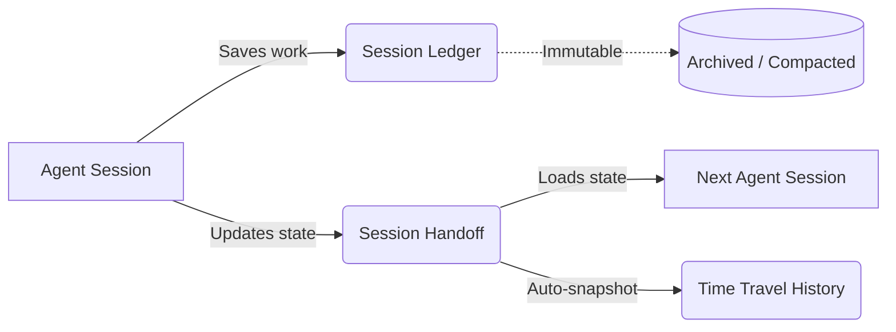
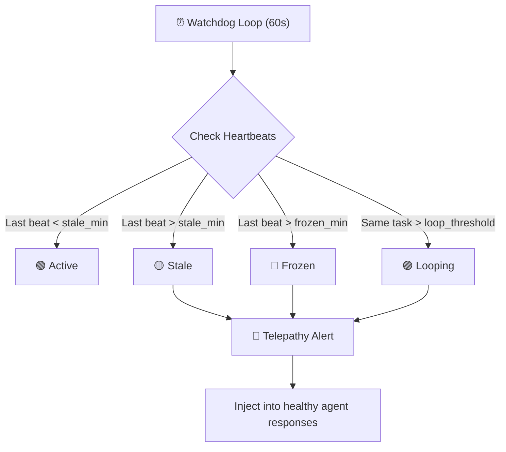
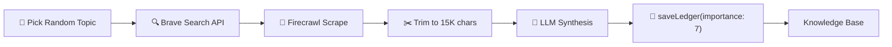
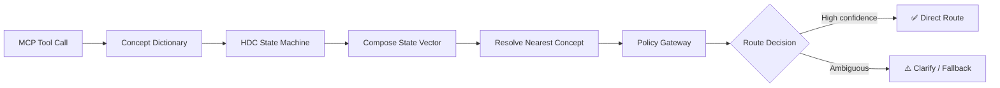

# Prism MCP Architecture: The Mind Palace Engine

> **A local-first, self-improving memory engine for AI agents.**
> 
> Prism MCP provides persistent state, semantic search, multimodal capabilities, and observability for AI agents. This document details the architectural decisions, math, and data flows powering Prism v5.4–v6.5.

---

## Table of Contents
1. [The Vector Storage Engine (v5)](#1-the-vector-storage-engine-v5)
2. [The Memory Lifecycle & OCC](#2-the-memory-lifecycle--occ)
3. [The VLM Multimodal Pipeline](#3-the-vlm-multimodal-pipeline)
4. [Telemetry & Observability (OTel)](#4-telemetry--observability-otel)
5. [The Knowledge Graph Engine](#5-the-knowledge-graph-engine)
6. [Cognitive Memory (v5.2)](#6-cognitive-memory-v52)
7. [Universal History Migration (v5.2)](#7-universal-history-migration-v52)
8. [Agent Hivemind Mode (v5.3)](#8-agent-hivemind-mode-v53)
9. [Background Purge Scheduler (v5.4)](#9-background-purge-scheduler-v54)
10. [Autonomous Web Scholar (v5.4)](#10-autonomous-web-scholar-v54)
11. [HDC Cognitive Routing (v6.5)](#11-hdc-cognitive-routing-v65)

---

## 1. The Vector Storage Engine (v5)

Agentic memory suffers from "Float32 Bloat." Saving a 768-dimensional float32 embedding for every session quickly consumes hundreds of megabytes. Prism solves this using **RotorQuant** (PlanarQuant variant — Givens 2D rotation), achieving ~7× compression (3KB → 400 bytes) locally in pure TypeScript.

### RotorQuant Compression & Asymmetric Similarity
When an agent saves a memory, Prism generates a float32 vector and immediately compresses it via a two-stage pipeline:
1. **Random QR Rotation + Lloyd-Max**: Rotates the vector to make coordinates identically distributed (`N(0, 1/d)`), then applies optimal scalar quantization.
2. **QJL Residual Correction**: Projects the quantization error through a random Gaussian matrix and stores the sign bits.

**Asymmetric Search**: During retrieval, the query vector remains uncompressed (`float32`), while the targets remain compressed. The QJL sign bits act as an unbiased estimator for the residual error. This allows Prism to achieve **>95% retrieval accuracy** while searching directly against compressed blobs.

### The 3-Tier Search Fallback
Prism guarantees search reliability across different environments via a cascading fallback:

*   **Tier 1 (Native Vector)**: Uses `sqlite-vec` or `pgvector` DiskANN indexes on raw float32 data. Blazing fast (O(log n)), used for recent/hot data.
*   **Tier 2 (JS RotorQuant)**: If native vectors are purged or the DB extension is missing, Prism falls back to calculating asymmetric cosine similarity in V8/Node.js against the 400-byte base64 blobs.
*   **Tier 3 (FTS5 Keyword)**: Full-text search fallback if embeddings completely fail.

---

## 2. The Memory Lifecycle & OCC

Prism separates memory into two distinct concepts: **Ledgers** (immutable logs) and **Handoffs** (mutable live state).



### Optimistic Concurrency Control (OCC)
In multi-agent (Hivemind) setups, multiple agents might attempt to update the `session_handoffs` state simultaneously.
*   When an agent calls `session_load_context`, it receives an `expected_version` integer.
*   When calling `session_save_handoff`, it passes this version back. 
*   If the DB version has incremented (another agent saved), the DB rejects the write. The agent catches the conflict, re-reads the context, and merges its changes.

### Deep Storage Mode ("The Purge")
To realize the storage savings of RotorQuant, v5.1 introduces **Deep Storage Purge**. 
*   **Hot Memory (< 7 days)**: Retains both `float32` and `turbo4` representations for blazing-fast Tier-1 native search.
*   **Cold Memory (> 7 days)**: A scheduled task (or tool call) executes an atomic `UPDATE ... SET embedding = NULL` on old entries. 
*   **Safety**: The purge strictly guards against deleting vectors that lack a `embedding_compressed` fallback, reclaiming ~90% of disk space without bricking semantic search.

---

## 3. The VLM Multimodal Pipeline

Agents need visual context (UI states, architecture diagrams, error screenshots). Prism handles this via the `session_save_image` tool.

1.  **The Media Vault**: Images are copied out of the user's workspace into an isolated `~/.prism-mcp/media/` vault.
2.  **Async Captioning**: To make images semantically searchable, Prism fires a background worker (`fireCaptionAsync`). This worker calls a Vision-Language Model (VLM) to generate a dense text caption of the image.
3.  **Inline Embedding**: Once the caption is generated, it is automatically vectorized and patched into the ledger. When the agent searches for "payment modal error", the visual memory surfaces purely via semantic text match.

---

## 4. Telemetry & Observability (OTel)

Prism implements enterprise-grade observability using **OpenTelemetry (W3C)**, exporting distributed traces to Jaeger, Zipkin, or Grafana Tempo.

### Context Propagation (Worker Parenting)
Node.js background tasks (like VLM captioning or embedding generation) usually break trace lineages. Prism solves this using `AsyncLocalStorage`.
*   The root `mcp.call_tool` span is injected into the async context.
*   When a fire-and-forget promise is launched, it automatically attaches to the root span without explicitly passing references.

```text
mcp.call_tool [session_save_image] (150ms)
 ├─ fs.copy_file (10ms)
 └─ worker.vlm_caption (async, outlives parent) (3500ms)
     ├─ llm.generate_vision_text (3200ms)
     └─ db.patch_ledger (30ms)
```

### Graceful Shutdown Flushes
Because MCP operates over `stdio`, a client disconnecting instantly severs the pipe. Prism intercepts `SIGINT`, `SIGTERM`, and `stdin` closure events, calling `otel.shutdown()` to force-flush the in-memory span queue to the collector before the Node process exits.

---

## 5. The Knowledge Graph Engine

Prism extracts entities, categories, and keywords from every session using LLM summarization. 

In the **Mind Palace Dashboard**, this data is hydrated into a force-directed neural graph (`vis.js`).
*   **Visual Grooming**: Users can click nodes to slide open the Node Editor panel.
*   **Surgical DB Patching**: Renaming or deleting a node fires a `POST /api/graph/node` request. The backend uses PostgREST array containment operators (`cs.{keyword}`) to find all affected ledger entries, securely and idempotently patching the JSON/Text arrays across the entire database.

---

## 6. Cognitive Memory (v5.2)

Prism v5.2 introduces neuroscience-inspired memory dynamics that make retrieval results feel more human.

### Ebbinghaus Importance Decay

Inspired by the Ebbinghaus forgetting curve, every memory's importance now *decays* over time unless reinforced:

```
effective_importance = base_importance × 0.95^(days_since_last_access)
```

*   `base_importance` — The raw importance score (0–10) set at creation or via upvote/downvote.
*   `last_accessed_at` — Updated every time a memory surfaces in search results.
*   **Reinforcement loop**: Memories that keep appearing stay important. Neglected ones naturally fade, reducing noise without manual pruning.

The decay is computed *at retrieval time* — no cron jobs, no background mutation. The stored `base_importance` never changes; only the effective score does.

### Context-Weighted Retrieval

The `context_boost` parameter on `session_search_memory` prepends the active project's name and recent context to the embedding query before vectorization. This biases results toward the current working context without requiring explicit project filters.

```
query_text = project_context + " " + user_query
embedding  = embed(query_text)  // naturally weighted
```

---

## 7. Universal History Migration (v5.2)

Prism can ingest years of session history from other AI tools to eliminate the "cold start" problem.

### Strategy Pattern Architecture

Each source format has a dedicated adapter implementing the `MigrationAdapter` interface:

*   **ClaudeAdapter** — Parses `.jsonl` streaming logs. Handles `requestId` normalization and groups `human`/`assistant` turn pairs into conversations using a 30-minute gap heuristic.
*   **GeminiAdapter** — Streams JSON arrays via `stream-json` for OOM-safe processing of 100MB+ exports.
*   **OpenAIAdapter** — Normalizes chat completion history with tool-call structures into the unified Ledger schema.

### Deduplication

Every imported turn is hashed using `SHA-256(project + timestamp + content.slice(0, 200))`. The hash is stored in the `content_hash` column. On re-import, existing hashes are skipped (idempotent), reported as `skipCount`.

### Concurrency Control

Imports use `p-limit(5)` to cap concurrent database writes, preventing SQLite WAL contention on large imports (10,000+ turns).

### Entry Points

1.  **CLI**: `npx prism-mcp-server universal-import --format claude --path ./log.jsonl --project my-project`
2.  **Dashboard**: File picker + manual path input + dry-run toggle on the Import tab.

---
*Prism MCP Architecture Guide — Last Updated: v5.4*

---

## 8. Agent Hivemind Mode (v5.3)

`PRISM_ENABLE_HIVEMIND` is a feature flag that activates a suite of multi-agent coordination and monitoring capabilities. It transforms Prism from a single-agent memory store into a collaborative workspace for teams of AI agents.

### Multi-Agent Coordination Tools

When enabled, three additional MCP tools are registered:

| Tool | Purpose |
|------|---------|
| `agent_register` | Register an agent's identity and role (`dev`, `qa`, `pm`, etc.) |
| `agent_heartbeat` | Ping the server with the agent's current task and status |
| `agent_list_team` | View all active teammates and their current tasks on the project |

### The Hivemind Watchdog

A server-side health monitor runs on a 60-second loop (configurable via `WATCHDOG_INTERVAL_MS`). It evaluates each registered agent's heartbeat history and classifies their health:



**Configuration thresholds:**
*   `WATCHDOG_STALE_MIN` — Minutes before an agent is flagged stale (default: 5)
*   `WATCHDOG_FROZEN_MIN` — Minutes before an agent is flagged frozen (default: 15)
*   `WATCHDOG_OFFLINE_MIN` — Minutes before an agent is pruned from the roster (default: 60)
*   `WATCHDOG_LOOP_THRESHOLD` — Consecutive identical heartbeats before loop detection (default: 5)

### Telepathy (Alert Injection)

When the Watchdog detects an anomaly, it doesn't just log it — it uses **Telepathy** to directly intervene. The system intercepts standard MCP tool responses (`drainAlerts()` in `hivemindWatchdog.ts`) and injects `[🐝 SYSTEM ALERT]` messages into the context of *healthy* agents. This allows active LLMs to realize their teammate is struggling and dynamically adjust behavior — for example, taking over a stalled task or escalating to the human operator.

### Dashboard Radar

The **Hivemind Radar 🐝** card in the Mind Palace Dashboard provides real-time visibility:
*   **Role icons**: 🛠️ dev, 🔍 qa, 📋 pm, 🏗️ lead, 🔒 security, 🎨 ux
*   **Health indicators**: 🟢 active, 🟡 stale, 🔴 frozen, 🟣 looping, 💤 idle
*   **Live task display** with loop count badges for stuck agents
*   Auto-refreshes every 15 seconds

**Key files:** `src/hivemindWatchdog.ts`, `src/tools/hivemindHandlers.ts`, `src/dashboard/ui.ts`

---

## 9. Background Purge Scheduler (v5.4)

Prism v5.4 introduces a fully automated maintenance loop that handles all storage hygiene tasks previously requiring manual tool calls.

### Architecture

A single `setInterval` loop runs on a configurable cadence (default: 12 hours). Tasks execute **sequentially** to avoid overloading the storage backend:


| Task | What it does | Speed |
|------|-------------|-------|
| **TTL Sweep** | Hard-deletes entries exceeding project-level retention policies | Fast (SQL DELETE) |
| **Importance Decay** | Applies Ebbinghaus curve (`0.95^days`) to old behavioral entries | Fast (SQL UPDATE) |
| **Compaction** | Summarizes old entries via LLM, archives originals | Slow (LLM call) |
| **Deep Purge** | NULLs float32 embeddings on entries with RotorQuant backups | Moderate (SQL UPDATE) |

### Non-Blocking Design

*   Each task is wrapped in its own `try/catch` — a single task failure never crashes the sweep
*   Results are accumulated into a `SchedulerSweepResult` object and served to the dashboard
*   Compaction uses dynamic `import()` to avoid circular dependencies with the LLM factory

### Configuration

```bash
PRISM_SCHEDULER_ENABLED=true          # Toggle the loop (default: true)
PRISM_SCHEDULER_INTERVAL_MS=43200000  # 12 hours between sweeps
```

**Key files:** `src/backgroundScheduler.ts`, `src/dashboard/ui.ts` (status widget)

---

## 10. Autonomous Web Scholar (v5.4)

The Web Scholar is an autonomous background research pipeline that makes Prism **self-improving**. It runs periodically or on-demand, discovers relevant articles, synthesizes insights, and injects them directly into the knowledge base.

### Pipeline Architecture



1.  **Topic Selection**: Picks a random topic from the `PRISM_SCHOLAR_TOPICS` comma-separated list
2.  **Web Search**: Queries the Brave Search API for up to `PRISM_SCHOLAR_MAX_ARTICLES_PER_RUN` (default: 3) articles
3.  **Content Extraction**: Scrapes each URL via the Firecrawl `/v1/scrape` API as markdown. Each article is capped at 15,000 characters to prevent LLM context overflow
4.  **LLM Synthesis**: Passes all scraped content to the active LLM provider with a synthesis prompt, generating a comprehensive research report
5.  **Ledger Injection**: Saves the report to the semantic ledger with `importance: 7` (auto-graduated) under the `prism-scholar` project. Future agent sessions will passively surface these insights during knowledge search

### Safety & Cost Controls

*   **Reentrancy Guard**: A module-level `isRunning` lock prevents concurrent pipeline executions from overlapping (scheduler + manual trigger)
*   **Opt-in by default**: `PRISM_SCHOLAR_ENABLED` defaults to `false`; `PRISM_SCHOLAR_INTERVAL_MS` defaults to `0` (manual-only)
*   **Content cap**: Articles are truncated to 15KB before LLM synthesis to bound token costs
*   **Graceful degradation**: Pipeline silently disables itself if `BRAVE_API_KEY` or `FIRECRAWL_API_KEY` are missing

### Configuration

```bash
PRISM_SCHOLAR_ENABLED=true          # Opt-in to enable
PRISM_SCHOLAR_INTERVAL_MS=3600000   # Run every hour (0 = manual only)
PRISM_SCHOLAR_MAX_ARTICLES_PER_RUN=3
PRISM_SCHOLAR_TOPICS=ai,agents,mcp  # Comma-separated research interests
FIRECRAWL_API_KEY=fc-xxxxx          # Required for scraping
```

### Dashboard Integration

The Background Scheduler card exposes:
*   **🧠 Scholar (Run)** button — manually triggers a research cycle
*   **Status indicator** — shows Web Scholar enabled/disabled state and interval even when the maintenance scheduler is off

### Observability

The pipeline is fully instrumented with OpenTelemetry. Each `runWebScholar()` execution creates a span with attributes:
*   `scholar.topic` — the selected research topic
*   `scholar.articles_found` / `scholar.articles_scraped` — pipeline throughput
*   `scholar.skipped_reason` — why the pipeline exited early (missing keys, no results, etc.)
*   `scholar.success` / `scholar.error` — outcome tracking

**Key files:** `src/scholar/webScholar.ts`, `src/backgroundScheduler.ts` (scheduler), `src/dashboard/server.ts` (API trigger), `src/dashboard/ui.ts` (button/status)

---

## 11. HDC Cognitive Routing (v6.5)

Prism v6.5 introduces **Hyperdimensional Computing (HDC)** as a compositional state-machine layer for cognitive routing. Instead of flat keyword lookup, the system superimposes the agent's current **state**, **role**, and **action** into a single high-dimensional vector and resolves it to a semantic concept — enabling context-aware routing decisions.

### Pipeline Architecture



1.  **Concept Dictionary** (`src/sdm/conceptDictionary.ts`) — Maps semantic tokens (e.g., `State:ActiveSession`, `Role:Dev`, `Action:Save`) to 768-dim binary hypervectors. Concepts are generated on first use and cached.
2.  **HDC State Machine** (`src/sdm/stateMachine.ts`) — Composes a superposition vector from the three input concepts using element-wise XOR binding. The result is a single 768-dim vector that encodes the *compositional meaning* of the current context.
3.  **Concept Resolution** — The composed vector is compared against all known concepts via Hamming distance. The nearest match is returned with a confidence score (inversely proportional to normalized distance).
4.  **Policy Gateway** (`src/sdm/policyGateway.ts`) — Evaluates the resolved concept against configurable thresholds to produce a route decision:
    *   **`direct`** — High confidence; route proceeds normally
    *   **`clarify`** — Moderate confidence; the system requests disambiguation
    *   **`fallback`** — Low confidence; falls back to default behavior

### Threshold Configuration

Two thresholds control route sensitivity:

```
fallback_threshold ≤ clarify_threshold ≤ 1.0
```

*   `fallback_threshold` (default: 0.3) — Below this confidence, the policy returns `fallback`
*   `clarify_threshold` (default: 0.7) — Below this confidence, the policy returns `clarify`

Thresholds can be overridden per-project via tool arguments. When provided, overrides are **persisted** in the storage layer under keys `hdc:fallback_threshold:<project>` and `hdc:clarify_threshold:<project>`.

### Phase 2 Storage Parity Rationale

Cognitive routing requires **no new storage migrations**. Thresholds are persisted via the existing `getSetting(key)` / `setSetting(key, value)` interface, which stores values as plain strings in the `prism_settings` table. This abstraction already handles SQLite and Supabase backends identically — new columns, RPCs, or migrations are unnecessary. Threshold values are encoded as decimal strings (e.g., `"0.45"`) and parsed back to `Number` on read.

### Explainability

When `PRISM_HDC_EXPLAINABILITY_ENABLED=true` (default) and the caller passes `explain: true`, the response includes:

*   `convergence_steps` — Number of iterations the state machine performed
*   `distance` — Raw Hamming distance to the matched concept
*   `ambiguity` — Whether the match was within the ambiguity zone (distance > 50% of vector dimensions)

### Observability Integration

The `recordCognitiveRoute()` function in `graphMetrics.ts` tracks:

| Metric | Description |
|--------|-------------|
| `total_routes` | Total cognitive route evaluations |
| `direct_count` / `clarify_count` / `fallback_count` | Route distribution |
| `avg_confidence` | Rolling average confidence across all routes |
| `avg_distance` | Rolling average Hamming distance |
| `ambiguous_count` | Routes flagged as ambiguous |
| `null_concept_count` | Routes where concept resolution failed |

Warning heuristics trigger when `fallback_rate > 30%` or `ambiguous_resolution_rate > 40%`.

### Feature Gating

The entire v6.5 pipeline is gated behind `PRISM_HDC_ENABLED` (default: `true`). When disabled, `session_cognitive_route` returns a clear error and records no telemetry.

### Dashboard Integration

The Mind Palace dashboard exposes:
*   **Cognitive Metrics Card** — Route distribution bar, confidence/distance averages, warning badges
*   **Cognitive Route Button** — On-demand route evaluation from the Node Editor panel

**Key files:** `src/tools/graphHandlers.ts` (`sessionCognitiveRouteHandler`), `src/sdm/conceptDictionary.ts`, `src/sdm/stateMachine.ts`, `src/sdm/policyGateway.ts`, `src/observability/graphMetrics.ts`, `src/dashboard/graphRouter.ts` (`/api/graph/cognitive-route`)

---

*Prism MCP Architecture Guide — Last Updated: v6.5*

