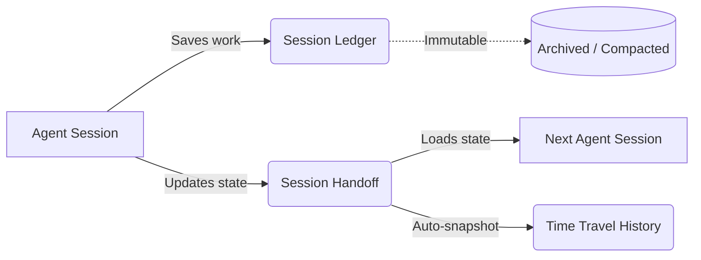

# Prism MCP Architecture: The Mind Palace Engine

> **A local-first, self-improving memory engine for AI agents.**
> 
> Prism MCP provides persistent state, semantic search, multimodal capabilities, and observability for AI agents. This document details the architectural decisions, math, and data flows powering Prism v5.1+.

---

## Table of Contents
1. [The Vector Storage Engine (v5)](#1-the-vector-storage-engine-v5)
2. [The Memory Lifecycle & OCC](#2-the-memory-lifecycle--occ)
3. [The VLM Multimodal Pipeline](#3-the-vlm-multimodal-pipeline)
4. [Telemetry & Observability (OTel)](#4-telemetry--observability-otel)
5. [The Knowledge Graph Engine](#5-the-knowledge-graph-engine)

---

## 1. The Vector Storage Engine (v5)

Agentic memory suffers from "Float32 Bloat." Saving a 768-dimensional float32 embedding for every session quickly consumes hundreds of megabytes. Prism solves this using **TurboQuant** (Google ICLR 2026), achieving ~7× compression (3KB → 400 bytes) locally in pure TypeScript.

### TurboQuant Compression & Asymmetric Similarity
When an agent saves a memory, Prism generates a float32 vector and immediately compresses it via a two-stage pipeline:
1. **Random QR Rotation + Lloyd-Max**: Rotates the vector to make coordinates identically distributed (`N(0, 1/d)`), then applies optimal scalar quantization.
2. **QJL Residual Correction**: Projects the quantization error through a random Gaussian matrix and stores the sign bits.

**Asymmetric Search**: During retrieval, the query vector remains uncompressed (`float32`), while the targets remain compressed. The QJL sign bits act as an unbiased estimator for the residual error. This allows Prism to achieve **>95% retrieval accuracy** while searching directly against compressed blobs.

### The 3-Tier Search Fallback
Prism guarantees search reliability across different environments via a cascading fallback:

*   **Tier 1 (Native Vector)**: Uses `sqlite-vec` or `pgvector` DiskANN indexes on raw float32 data. Blazing fast (O(log n)), used for recent/hot data.
*   **Tier 2 (JS TurboQuant)**: If native vectors are purged or the DB extension is missing, Prism falls back to calculating asymmetric cosine similarity in V8/Node.js against the 400-byte base64 blobs.
*   **Tier 3 (FTS5 Keyword)**: Full-text search fallback if embeddings completely fail.

---

## 2. The Memory Lifecycle & OCC

Prism separates memory into two distinct concepts: **Ledgers** (immutable logs) and **Handoffs** (mutable live state).



### Optimistic Concurrency Control (OCC)
In multi-agent (Hivemind) setups, multiple agents might attempt to update the `session_handoffs` state simultaneously.
*   When an agent calls `session_load_context`, it receives an `expected_version` integer.
*   When calling `session_save_handoff`, it passes this version back. 
*   If the DB version has incremented (another agent saved), the DB rejects the write. The agent catches the conflict, re-reads the context, and merges its changes.

### Deep Storage Mode ("The Purge")
To realize the storage savings of TurboQuant, v5.1 introduces **Deep Storage Purge**. 
*   **Hot Memory (< 7 days)**: Retains both `float32` and `turbo4` representations for blazing-fast Tier-1 native search.
*   **Cold Memory (> 7 days)**: A scheduled task (or tool call) executes an atomic `UPDATE ... SET embedding = NULL` on old entries. 
*   **Safety**: The purge strictly guards against deleting vectors that lack a `embedding_compressed` fallback, reclaiming ~90% of disk space without bricking semantic search.

---

## 3. The VLM Multimodal Pipeline

Agents need visual context (UI states, architecture diagrams, error screenshots). Prism handles this via the `session_save_image` tool.

1.  **The Media Vault**: Images are copied out of the user's workspace into an isolated `~/.prism-mcp/media/` vault.
2.  **Async Captioning**: To make images semantically searchable, Prism fires a background worker (`fireCaptionAsync`). This worker calls a Vision-Language Model (VLM) to generate a dense text caption of the image.
3.  **Inline Embedding**: Once the caption is generated, it is automatically vectorized and patched into the ledger. When the agent searches for "payment modal error", the visual memory surfaces purely via semantic text match.

---

## 4. Telemetry & Observability (OTel)

Prism implements enterprise-grade observability using **OpenTelemetry (W3C)**, exporting distributed traces to Jaeger, Zipkin, or Grafana Tempo.

### Context Propagation (Worker Parenting)
Node.js background tasks (like VLM captioning or embedding generation) usually break trace lineages. Prism solves this using `AsyncLocalStorage`.
*   The root `mcp.call_tool` span is injected into the async context.
*   When a fire-and-forget promise is launched, it automatically attaches to the root span without explicitly passing references.

```text
mcp.call_tool [session_save_image] (150ms)
 ├─ fs.copy_file (10ms)
 └─ worker.vlm_caption (async, outlives parent) (3500ms)
     ├─ llm.generate_vision_text (3200ms)
     └─ db.patch_ledger (30ms)
```

### Graceful Shutdown Flushes
Because MCP operates over `stdio`, a client disconnecting instantly severs the pipe. Prism intercepts `SIGINT`, `SIGTERM`, and `stdin` closure events, calling `otel.shutdown()` to force-flush the in-memory span queue to the collector before the Node process exits.

---

## 5. The Knowledge Graph Engine

Prism extracts entities, categories, and keywords from every session using LLM summarization. 

In the **Mind Palace Dashboard**, this data is hydrated into a force-directed neural graph (`vis.js`).
*   **Visual Grooming**: Users can click nodes to slide open the Node Editor panel.
*   **Surgical DB Patching**: Renaming or deleting a node fires a `POST /api/graph/node` request. The backend uses PostgREST array containment operators (`cs.{keyword}`) to find all affected ledger entries, securely and idempotently patching the JSON/Text arrays across the entire database.

---
*Prism MCP Architecture Guide — Last Updated: v5.1*
