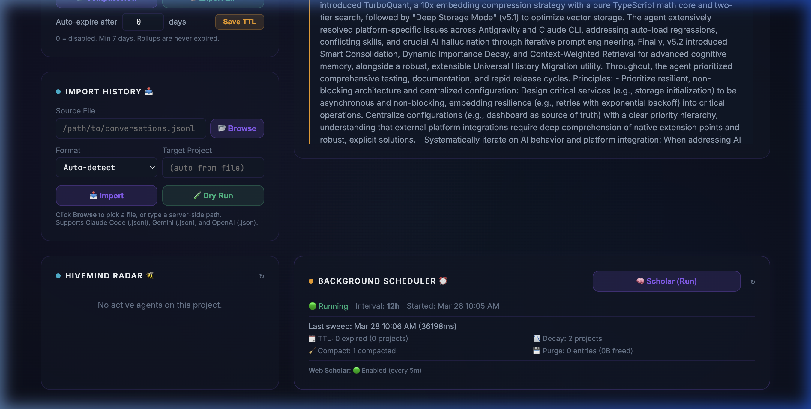
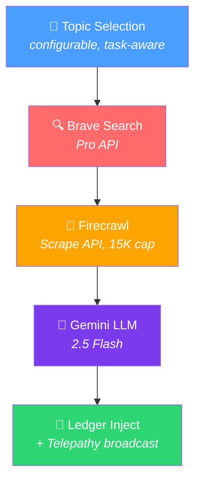

# 🧠 Web Scholar — Setup & Configuration Guide

> **Version:** 5.4.0+  
> **Status:** Production Ready  
> **Requires:** Brave API Key, Google API Key, Firecrawl API Key

The **Autonomous Web Scholar** is Prism's background research pipeline that automatically discovers, scrapes, synthesizes, and injects knowledge from the web into your agent's memory — without manual intervention.

---

## Table of Contents

- [Overview](#overview)
- [Prerequisites](#prerequisites)
- [Quick Start](#quick-start)
- [Environment Variables](#environment-variables)
- [Dashboard Controls](#dashboard-controls)
- [How It Works](#how-it-works)
- [Configuration Examples](#configuration-examples)
- [Troubleshooting](#troubleshooting)
- [Cost & Rate Limits](#cost--rate-limits)

---

## Overview

Web Scholar runs as an autonomous pipeline:

```
Topics → Brave Search → Firecrawl Scrape → LLM Synthesis → Ledger Injection → Telepathy Broadcast
```

It supports two modes:
1. **Scheduled** — Runs automatically at a configurable interval (e.g., every 5 minutes)
2. **Manual** — Triggered on-demand via the Dashboard "Scholar (Run)" button

---

## Prerequisites

You need **three API keys** to enable Web Scholar:

| # | Key | Provider | Purpose | Get It |
|---|-----|----------|---------|--------|
| 1 | `BRAVE_API_KEY` | Brave Search | Discovers relevant web articles | [brave.com/search/api](https://brave.com/search/api/) |
| 2 | `GOOGLE_API_KEY` | Google AI Studio | LLM synthesis (Gemini 2.5 Flash) | [aistudio.google.com/apikey](https://aistudio.google.com/apikey) |
| 3 | `FIRECRAWL_API_KEY` | Firecrawl | Scrapes and extracts web content | [firecrawl.dev](https://www.firecrawl.dev/) |

> [!IMPORTANT]
> All three keys are **required**. If any are missing, the Scholar pipeline will fail silently and the dashboard will show "🔴 Disabled".

---

## Quick Start

### 1. Set your API keys

Add these to your shell profile (`~/.zshrc`, `~/.bashrc`), or `.env` file:

```bash
# Required for Prism core features
export BRAVE_API_KEY="your-brave-search-api-key"
export GOOGLE_API_KEY="your-google-ai-studio-api-key"

# Required for Web Scholar
export FIRECRAWL_API_KEY="your-firecrawl-api-key"
```

### 2. Enable the Scholar

```bash
# Enable Scholar + set a 5-minute research interval
export PRISM_SCHOLAR_ENABLED=true
export PRISM_SCHOLAR_INTERVAL_MS=300000
```

### 3. Start the server

```bash
# Option A: Standard MCP server (for IDE integrations)
node dist/server.js

# Option B: Explicit local storage with dashboard
PRISM_STORAGE=local \
PRISM_SCHEDULER_ENABLED=true \
PRISM_SCHOLAR_ENABLED=true \
PRISM_SCHOLAR_INTERVAL_MS=300000 \
PRISM_DASHBOARD_PORT=3333 \
node dist/server.js
```

### 4. Verify

Open the Mind Palace Dashboard at `http://localhost:3333` and scroll to the **BACKGROUND SCHEDULER** section. You should see:

```
Web Scholar: 🟢 Enabled (every 5m)
```



---

## Environment Variables

### Required Keys

| Variable | Required | Default | Description |
|----------|----------|---------|-------------|
| `BRAVE_API_KEY` | ✅ Yes | — | Brave Search Pro API key. Powers topic discovery. |
| `GOOGLE_API_KEY` | ✅ Yes | — | Google AI Studio key. Powers Gemini LLM synthesis. |
| `FIRECRAWL_API_KEY` | ✅ Yes | — | Firecrawl API key. Powers web page scraping and content extraction. |

### Scholar Configuration

| Variable | Required | Default | Description |
|----------|----------|---------|-------------|
| `PRISM_SCHOLAR_ENABLED` | ❌ No | `false` | Set to `true` to enable the Scholar pipeline. |
| `PRISM_SCHOLAR_INTERVAL_MS` | ❌ No | `0` (manual only) | Auto-run interval in milliseconds. Set `300000` for every 5 minutes, `600000` for 10 minutes, etc. Set `0` for manual trigger only. |
| `PRISM_SCHOLAR_TOPICS` | ❌ No | `ai,agents` | Comma-separated list of research topics. Example: `ai,agents,security,performance` |
| `PRISM_SCHOLAR_MAX_ARTICLES_PER_RUN` | ❌ No | `3` | Maximum articles to process per research sweep. Controls API costs. |

### Background Scheduler (required for auto-run)

| Variable | Required | Default | Description |
|----------|----------|---------|-------------|
| `PRISM_SCHEDULER_ENABLED` | ❌ No | `false` | Enables the background scheduler (also runs TTL, decay, compaction tasks). |
| `PRISM_SCHEDULER_INTERVAL_MS` | ❌ No | `43200000` (12h) | Scheduler sweep interval for maintenance tasks. |

> [!NOTE]
> `PRISM_SCHEDULER_ENABLED` controls the maintenance scheduler. `PRISM_SCHOLAR_ENABLED` controls the research pipeline. Both can be enabled independently, but for fully automated research you want both enabled.

---

## Dashboard Controls

### Scholar (Run) Button

The **🧠 Scholar (Run)** button appears in the Background Scheduler card on the dashboard. Clicking it:

1. Sends a `POST /api/scholar/trigger` request
2. Fires the Scholar pipeline in the background (non-blocking)
3. Shows a toast notification with the result

This button works **regardless** of whether automatic scheduling is enabled — you can always trigger a manual research run.

### Status Indicators

| Indicator | Meaning |
|-----------|---------|
| 🟢 Enabled (every Xm) | Scholar is running automatically on a schedule |
| 🔴 Disabled | Scholar is not enabled (check env vars) |

---

## How It Works

### Pipeline Architecture



### Key Design Features

- **Reentrancy Guard** — Only one Scholar pipeline can run at a time (prevents duplicate research)
- **Task-Aware Topics** — When Hivemind is enabled, Scholar biases topic selection toward active agent tasks
- **Cost Control** — Content is capped at 15K characters per article; max articles per run is configurable
- **Hivemind Integration** — Registers on the Radar during execution and broadcasts findings via Telepathy

---

## Configuration Examples

### Minimal (Manual Trigger Only)

```bash
export BRAVE_API_KEY="..."
export GOOGLE_API_KEY="..."
export FIRECRAWL_API_KEY="..."
export PRISM_SCHOLAR_ENABLED=true
# PRISM_SCHOLAR_INTERVAL_MS defaults to 0 (manual only)
```

Scholar is enabled but only runs when you click "Scholar (Run)" in the dashboard.

### Standard (Auto-Research Every 5 Minutes)

```bash
export BRAVE_API_KEY="..."
export GOOGLE_API_KEY="..."
export FIRECRAWL_API_KEY="..."
export PRISM_SCHOLAR_ENABLED=true
export PRISM_SCHOLAR_INTERVAL_MS=300000
export PRISM_SCHOLAR_TOPICS="ai,agents,typescript,security"
export PRISM_SCHOLAR_MAX_ARTICLES_PER_RUN=3
export PRISM_SCHEDULER_ENABLED=true
```

### Conservative (Cost-Conscious)

```bash
export BRAVE_API_KEY="..."
export GOOGLE_API_KEY="..."
export FIRECRAWL_API_KEY="..."
export PRISM_SCHOLAR_ENABLED=true
export PRISM_SCHOLAR_INTERVAL_MS=3600000  # Every 1 hour
export PRISM_SCHOLAR_MAX_ARTICLES_PER_RUN=1
export PRISM_SCHEDULER_ENABLED=true
```

---

## Troubleshooting

### "🔴 Disabled" on Dashboard

**Cause:** One or more of these conditions:
1. `PRISM_SCHOLAR_ENABLED` is not set to `true`
2. `PRISM_SCHOLAR_INTERVAL_MS` is `0` or not set (Scholar enabled but no auto-schedule)
3. The `startScholarScheduler()` function was never called (server not started with scheduler)

**Fix:**
```bash
# Ensure all are set:
export PRISM_SCHOLAR_ENABLED=true
export PRISM_SCHOLAR_INTERVAL_MS=300000
export PRISM_SCHEDULER_ENABLED=true
```

### Scholar Runs But No Ledger Entries Appear

**Cause:** Missing API keys or API errors. Check the server logs for:
- `[WebScholar] Pipeline failed:` — followed by the specific error
- `Warning: FIRECRAWL_API_KEY environment variable is missing` — at startup

**Fix:** Verify all three API keys are set and valid:
```bash
echo "BRAVE_API_KEY=${BRAVE_API_KEY:+SET}"
echo "GOOGLE_API_KEY=${GOOGLE_API_KEY:+SET}"
echo "FIRECRAWL_API_KEY=${FIRECRAWL_API_KEY:+SET}"
```

### "Model not found" / 404 Error

**Cause:** The Gemini model name has been deprecated by Google.

**Fix:** Update `src/utils/llm/adapters/gemini.ts` — change `TEXT_MODEL` to the latest Gemini Flash model. As of v5.4.0, Prism uses `gemini-2.5-flash`. Rebuild with `npx tsc`.

### No Debug Output

Scholar uses `debugLog()` which only outputs when the `DEBUG` environment variable is set:
```bash
export DEBUG=true
```

---

## Cost & Rate Limits

### Per Scholar Run (Default: 3 Articles)

| Service | API Calls | Estimated Cost |
|---------|-----------|----------------|
| Brave Search | 1 search query | ~$0.005 |
| Firecrawl | 1-3 scrape calls | ~$0.01-0.03 |
| Gemini 2.5 Flash | 1 synthesis call | ~$0.001 |
| **Total per run** | | **~$0.02-0.04** |

### Monthly Estimates

| Interval | Runs/Month | Est. Monthly Cost |
|----------|-----------|-------------------|
| Every 5 min | ~8,640 | ~$170-345 |
| Every 30 min | ~1,440 | ~$30-58 |
| Every 1 hour | ~720 | ~$15-29 |
| Every 6 hours | ~120 | ~$2.50-5 |
| Manual only | Variable | Pay per click |

> [!TIP]
> Start with a longer interval (1 hour+) and monitor your API usage before increasing frequency. For most users, **every 30 minutes to 1 hour** strikes a good balance between freshness and cost.

---

## Related Documentation

- [Architecture Overview](ARCHITECTURE.md) — Full system design
- [README](../README.md) — Project overview and setup
- [Roadmap](../ROADMAP.md) — Upcoming features
