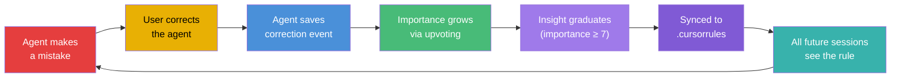

# How to Build a Self-Improving Agent with Prism MCP

> **An agent that learns from its mistakes, remembers what works, and gets better at its job over time — all running locally.**

This guide walks you through building an AI agent that uses Prism MCP's behavioral memory to create a genuine learning loop. By the end, your agent will:

1. **Remember corrections** and avoid repeating mistakes
2. **Surface learned patterns** at the start of every session
3. **Graduate insights** into permanent IDE rules
4. **Self-compact** its memory to stay efficient over months

---

## The Learning Loop



---

## Step 1: Record Corrections

When your agent gets corrected by the user, save it as a behavioral event:

```typescript
// Agent was told: "Don't use console.log, use debugLog instead"
await callTool("session_save_experience", {
  project: "my-app",
  event_type: "correction",
  context: "Adding debug logging to the auth module",
  action: "Used console.log() for debug output",
  outcome: "Corrupted MCP stdio stream — agent crashed",
  correction: "Always use debugLog() from utils/logger.ts instead of console.log()",
  confidence_score: 95
});
```

**Why `correction` matters**: Prism treats corrections specially. They're surfaced as **behavioral warnings** in every future `session_load_context` call, ensuring the agent sees them before starting work.

---

## Step 2: Behavioral Warnings (Automatic)

On the next session, when `session_load_context` is called, Prism automatically includes high-importance corrections:

```json
{
  "level": "standard",
  "project": "my-app",
  "behavioral_warnings": [
    {
      "summary": "Always use debugLog() instead of console.log(). console.log corrupts the MCP stdio stream.",
      "importance": 5
    }
  ]
}
```

The agent now sees this warning **before writing any code**, preventing the same mistake.

---

## Step 3: Upvote Important Insights

When a correction proves particularly valuable (e.g., it prevented a production bug), upvote it:

```typescript
// Found the correction's ledger ID
await callTool("knowledge_upvote", {
  id: "abc123-def456"  // The correction entry's UUID
});
// importance: 5 → 6
```

Each upvote increases the `importance` score by 1. Entries with `importance >= 7` are considered **graduated insights**.

---

## Step 4: Graduate to IDE Rules

When an insight reaches importance 7+, sync it permanently into your IDE configuration:

```typescript
await callTool("knowledge_sync_rules", {
  project: "my-app",
  target_file: ".cursorrules"  // or ".clauderules"
});
```

This writes the graduated insight into your project's rules file between sentinel markers:

```markdown
<!-- PRISM:AUTO-RULES:START -->
## Prism Graduated Insights

- Always use debugLog() instead of console.log(). console.log corrupts the MCP stdio stream.
- When adding new MCP tools, register in both server.ts tool list AND the CallTool handler switch.
<!-- PRISM:AUTO-RULES:END -->
```

**Idempotent**: Running `knowledge_sync_rules` multiple times produces the same file. User-maintained content outside the sentinel markers is never touched.

---

## Step 5: Memory Maintenance

Over months, your agent accumulates hundreds of sessions. Keep memory efficient:

### Auto-Compaction

```typescript
// Summarize old entries (keeps last 10 intact)
await callTool("session_compact_ledger", {
  project: "my-app",
  threshold: 50,      // trigger when entries > 50
  keep_recent: 10      // preserve the 10 most recent
});
```

Old entries are summarized by Gemini into a single rollup entry, and originals are archived.

### Data Retention Policy

```typescript
// Auto-expire entries older than 90 days
await callTool("knowledge_set_retention", {
  project: "my-app",
  ttl_days: 90
});
```

### Deep Storage Purge (v5.1)

```typescript
// Reclaim ~90% of vector storage for old entries
await callTool("deep_storage_purge", {
  project: "my-app",
  older_than_days: 30,
  dry_run: true  // preview first!
});
```

---

## The Full Agent Configuration

Here's a complete `.cursorrules` setup for a self-improving agent:

```markdown
## Memory Protocol

At the START of every session:
1. Call `session_load_context` for this project
2. Review any behavioral_warnings in the response
3. Apply all warnings as constraints for this session

At the END of every session:
1. Call `session_save_ledger` with a summary of work done
2. If corrected by the user, also call `session_save_experience` with event_type: "correction"
3. Call `session_save_handoff` with open TODOs for the next session

When a correction proves valuable:
1. Find its ID via `knowledge_search`
2. Call `knowledge_upvote` to increase its importance
3. When importance ≥ 7, call `knowledge_sync_rules` to persist it

Monthly maintenance:
1. Run `session_compact_ledger` to summarize old sessions
2. Run `deep_storage_purge` with dry_run: true to check storage savings
3. If savings are significant, run without dry_run
```

---

## Why This Works

| Traditional Agent | Self-Improving Agent (Prism) |
|-------------------|----------------------------|
| Forgets everything between sessions | Remembers across all sessions |
| Repeats the same mistakes | Warns itself about past corrections |
| No learning curve | Accumulates domain expertise over time |
| Configuration is static | Configuration evolves from experience |
| Memory bloats over time | Auto-compacts and purges efficiently |

The key insight: **AI agents don't need to be retrained to improve**. They need a memory system that captures corrections, surfaces them proactively, and graduates the most important ones into permanent rules.

Prism MCP provides that system — running entirely on your local machine, with zero cloud dependencies.

---

<sub>**Prism MCP v5.1** — Self-improving agent guide. Last updated: March 2026.</sub>
